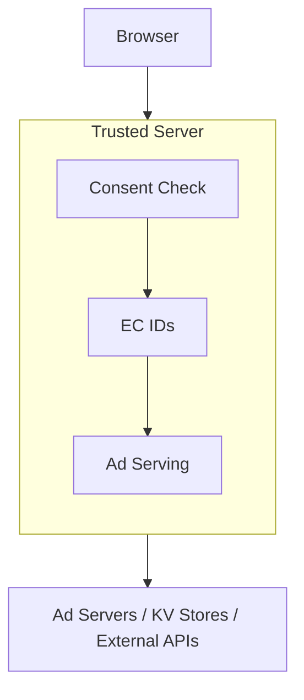

# Architecture

Understanding the architecture of Trusted Server.

## High-Level Overview

Trusted Server is built as a Rust-based edge computing application. The core logic lives in a platform-agnostic library; platform-specific adapters target different runtimes (Fastly Compute, Cloudflare Workers, Fermyon Spin, native Axum).



## Core Components

### trusted-server-core

Core library containing shared functionality:

- Edge Cookie (EC) ID generation
- Cookie handling
- HTTP abstractions
- Consent signal handling
- Ad server integrations

### trusted-server-adapter-fastly

Fastly Compute adapter (WASM binary, `wasm32-wasip1` target):

- Main application entry point for production Fastly deployment
- Fastly SDK integration (KV stores, secret stores, geo lookup)
- Compiled to WebAssembly and run via Viceroy locally or on Fastly's edge

### trusted-server-adapter-axum

Native Axum dev/test adapter (native binary):

- Local development and integration-test adapter — not a production-equivalent runtime
- Platform implementations backed by environment variables instead of Fastly stores
- Listens on `http://localhost:8787` by default, or terminates TLS on the same
  address when `TRUSTED_SERVER_TLS_CERTIFICATE_PATH` and
  `TRUSTED_SERVER_TLS_PRIVATE_KEY_PATH` are both set

**Current limitations compared to the Fastly adapter:**

| Feature                                    | Axum dev server                                                                                                                                                                                  |
| ------------------------------------------ | ------------------------------------------------------------------------------------------------------------------------------------------------------------------------------------------------ |
| KV store                                   | Unavailable — synthetic-ID and consent routes degrade gracefully                                                                                                                                 |
| Geo lookup                                 | Always returns `None`                                                                                                                                                                            |
| Config/secret-store writes                 | Return an error (read-only via env vars)                                                                                                                                                         |
| Admin key management (`/_ts/admin/keys/*`) | Returns 501 Not Implemented. Retired `/admin/keys` aliases, including trailing, descendant, and percent-encoded forms, are denied locally with 404 and are not proxied to the publisher fallback |
| Auction fan-out ordering                   | Requests run concurrently via `tokio::spawn`; `select` returns first-to-complete but does not replicate Fastly's priority-queue tie-breaking                                                     |

### trusted-server-adapter-spin

Fermyon Spin adapter (`wasm32-wasip1` component):

- Production-capable deployment target for the Spin runtime
- Platform services (config store, secret store, KV) backed by Spin component variables and the EdgeZero KV handle
- Outbound HTTP via `spin_sdk::http::send` — no configurable per-request timeout (see rustdoc)
- Single auction provider only; multi-provider fan-out requires the Fastly adapter

```bash
# Check (native)
cargo check -p trusted-server-adapter-spin

# Check (WASM component target)
cargo check-spin

# Build WASM artifact
cargo build --package trusted-server-adapter-spin --target wasm32-wasip1 --features spin --release

# Test (native host)
cargo test-spin

# Lint
cargo clippy-spin-native
cargo clippy-spin-wasm
```

## Design Patterns

### RequestWrapper Trait

Abstracts HTTP request handling to support different backends:

```rust
// Placeholder example
pub trait RequestWrapper {
    fn get_header(&self, name: &str) -> Option<String>;
    fn get_cookie(&self, name: &str) -> Option<String>;
    // ...
}
```

### Settings-Driven Configuration

External configuration via `trusted-server.toml` allows deployment-time customization without code changes.

### Consent-Aware Design

Data collection operations are subject to available consent signals (TCF v2 format, GPP, GPC). Enforcement follows built-in per-jurisdiction rules, with publisher configuration tuning jurisdiction lists, signal interpretation, and conflict resolution.

## Data Flow

1. **Request Ingress**: request arrives at Fastly edge
2. **Consent Signal Read**: any signals present on the request are decoded
3. **ID Generation**: EC ID generated when the consent evaluation permits
4. **Ad Request**: backend ad server called
5. **Response Processing**: creative processed and modified
6. **Response Egress**: response sent to browser

## Storage

### Fastly KV Store

Used for:

- Counter storage
- Domain mappings
- Configuration cache
- EC ID state

### Data Persistence

Page content and request bodies are processed in-flight and are not persisted. EC ID state and related metadata are stored in KV stores as configured.

## Performance Characteristics

- **Low Latency** - Edge execution near users
- **High Throughput** - Parallel request processing
- **Global Distribution** - Fastly's global network
- **Caching** - Aggressive edge caching

## Security

- **HMAC-based IDs** - Cryptographically secure identifiers
- **No Direct Identifiers Stored** - No name, email, or account fields are stored
- **Request Signing** - Optional request authentication
- **Content Security** - Creative scanning and modification

## Runtime Targets

| Adapter                             | Target                    | Use case                                                          |
| ----------------------------------- | ------------------------- | ----------------------------------------------------------------- |
| `trusted-server-adapter-fastly`     | `wasm32-wasip1`           | Production on Fastly Compute                                      |
| `trusted-server-adapter-cloudflare` | `wasm32-unknown-unknown`  | Production on Cloudflare Workers                                  |
| `trusted-server-adapter-spin`       | `wasm32-wasip1` component | Production on Fermyon Spin                                        |
| `trusted-server-adapter-axum`       | native                    | Local development and integration testing (see limitations above) |

The workspace has multiple WASM runtimes with runtime-specific SDKs. Use target-matched clippy aliases (`cargo clippy-fastly`, `cargo clippy-spin-native`, etc.) rather than broad `--all-features` workspace clippy — the latter is not a reliable gate across adapters.

## Next Steps

- Learn about [Configuration](/guide/configuration)
- Set up [Testing](/guide/testing)
