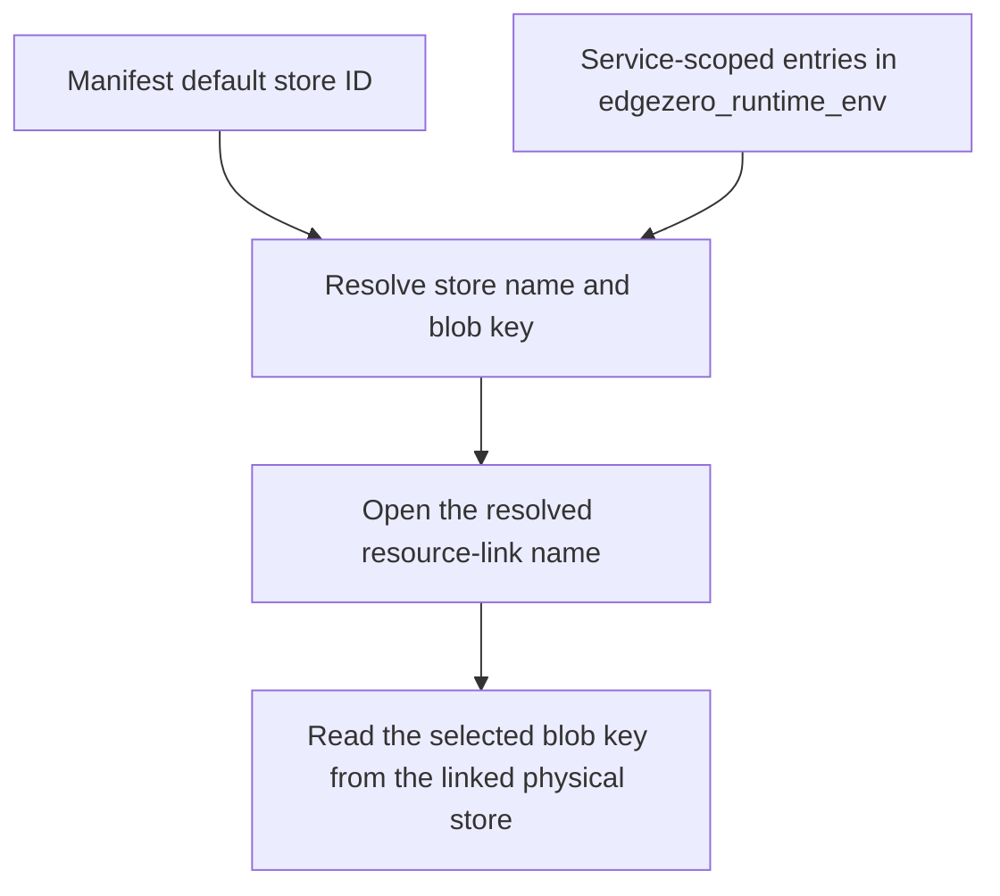

# Configuration

Learn how to configure Trusted Server for your deployment.

## Overview

Trusted Server uses a flexible configuration system based on:

1. **TOML Files** - `trusted-server.toml` for ordinary configuration and secret key names
2. **Environment Variables** - Typed CLI overrides with the `TRUSTED_SERVER__` prefix
3. **EdgeZero Stores** - Config and secret stores for the pushed blob and runtime secret values

Everything the deployment can switch on is a module, selected the same way,
with `module`, or `modules` where several run. Read
[Configuration Rules](/guide/configuration-rules) first. It is short, and it
is the pattern every section below follows:

```toml
[<type>]
module = "<name>"            # modules = [...] where several run

[<type>.<name>]                # only when the selected name has settings
setting = "value"
```

## Quick Start

### Minimal Configuration

Create `trusted-server.toml` in your project root. Generate both secret values
first with `openssl rand -base64 32`. The placeholders below are intentionally
rejected until replaced.

```toml
[publisher]
domain = "publisher.com"
cookie_domain = ".publisher.com"
origin_url = "https://origin.publisher.com"
proxy_secret = "publisher_proxy_secret"

[ec]
module = "hmac"

[ec.hmac]
passphrase = "ec_passphrase"
```

### Environment Variable Overrides

Environment variables are merged into existing TOML values by the typed
`ts config validate`, `ts config diff`, and `ts config push` flows. They are not
read by the deployed application at request time.

```bash
# Format: TRUSTED_SERVER__SECTION__FIELD
export TRUSTED_SERVER__PUBLISHER__DOMAIN=publisher.com
export TRUSTED_SERVER__PUBLISHER__ORIGIN_URL=https://origin.publisher.com
# Secret overrides, when needed, are key names, not secret values.
export TRUSTED_SERVER__PUBLISHER__PROXY_SECRET=publisher_proxy_secret
export TRUSTED_SERVER__EC__MODULE=hmac
export TRUSTED_SERVER__EC__HMAC__PASSPHRASE=ec_passphrase

# Replace the rejected placeholder values in trusted-server.toml, then validate.
ts config validate
ts config push --adapter fastly
```

### Static secret references

Static app-config credentials contain stable key names only. This includes
publisher, trusted-client-IP, EC, Tinybird, DataDome, and S3 fields:

- `publisher.proxy_secret`
- `trusted_client_ip.shared_secret`, when trusted client-IP forwarding is configured
- `ec.hmac.passphrase`, when `[ec] module = "hmac"`
- `ec.host_signals.passphrase`, when `[ec] module = "host_signals"`
- `ec.partners[*].api_token`, when inbound identify or batch sync is used
- `ec.partners[*].ts_pull_token`, when pull sync is enabled
- `analytics.tinybird.auction_token_secret`, when `[analytics] module = "tinybird"`
- `bot-protection.datadome.server_side_key_secret_name`, when protection is enabled
- `bot-protection.datadome.protection_test_bypass.credential_secret_name`, when the bypass is enabled
- `proxy.asset_routes[*].auth.access_key_id`, `secret_access_key`, and optional `session_token`

Their values belong in the logical `trusted_server_secrets` store and are
resolved only while an instance builds runtime settings. An adapter can map the
logical ID to a different physical name. For example, Fastly commonly maps
`trusted_server_secrets` to physical store `ts_secrets`.

Two accepted secret-shaped fields are deliberately different:

- `trusted_client_ip.shared_secret` is an inline value in the app-config blob;
  it is redacted by debug formatting but is not resolved from a secret store.
- `analytics.tinybird.access_token_secret` is deprecated input. It is accepted
  for migration, then discarded and omitted from serialized config; use
  `analytics.tinybird.auction_token_secret` as the store key name instead.

The four deprecated `secret_store` selectors under Tinybird, DataDome, its
protection-test bypass, and S3 route authentication are also accepted and
discarded. Store selection comes from the adapter's EdgeZero mapping.

::: warning CLI output and inline secrets
`ts config diff`, `ts config push --dry-run`, and the interactive push preview
can print deliberately inline values. Use `ts config push --no-diff` when that
output is not safe for the current terminal or CI log. The flag suppresses the
diff; it does not move inline values to a secret store.
:::

The following table records the independent lifecycle, key-identity,
serialization, runtime, and secret axes for every exceptional field:

| Path                                                         | Lifecycle  | Key identity                        | Serialization | Runtime                 | Secret handling          |
| ------------------------------------------------------------ | ---------- | ----------------------------------- | ------------- | ----------------------- | ------------------------ |
| `AssetOriginAuth.s3_sig_v4`                                  | deprecated | alias of `AssetOriginAuth.s3_sigv4` | skipped       | deserialization only    | none                     |
| `DataDomeConfig.server_side_key_secret_name`                 | canonical  | canonical                           | serialized    | active                  | store resolved           |
| `DataDomeConfig.server_side_key_secret_store`                | deprecated | canonical                           | serialized    | discarded by the module | none                     |
| `DataDomeProtectionTestBypassConfig.credential_secret_name`  | canonical  | canonical                           | serialized    | active                  | store resolved           |
| `DataDomeProtectionTestBypassConfig.credential_secret_store` | deprecated | canonical                           | serialized    | discarded by the module | none                     |
| `Ec.passphrase`                                              | canonical  | canonical                           | serialized    | active                  | store resolved           |
| `EcPartner.api_token`                                        | canonical  | canonical                           | serialized    | active                  | store resolved           |
| `EcPartner.ts_pull_token`                                    | canonical  | canonical                           | serialized    | active                  | store resolved           |
| `Publisher.proxy_secret`                                     | canonical  | canonical                           | serialized    | active                  | store resolved           |
| `S3SigV4AuthConfig.access_key_id`                            | canonical  | canonical                           | serialized    | active                  | store resolved           |
| `S3SigV4AuthConfig.secret_access_key`                        | canonical  | canonical                           | serialized    | active                  | store resolved           |
| `S3SigV4AuthConfig.secret_store`                             | deprecated | canonical                           | skipped       | normalized away         | none                     |
| `S3SigV4AuthConfig.session_token`                            | canonical  | canonical                           | serialized    | active                  | store resolved           |
| `TinybirdSettings.access_token_secret`                       | deprecated | canonical                           | skipped       | normalized away         | accepted, then discarded |
| `TinybirdSettings.auction_token_secret`                      | canonical  | canonical                           | serialized    | active                  | store resolved           |
| `TinybirdSettings.secret_store`                              | deprecated | canonical                           | skipped       | normalized away         | none                     |
| `TrustedClientIpConfig.shared_secret`                        | canonical  | canonical                           | serialized    | active                  | deliberately inline      |

Prepare an initial reference-based deployment in this order:

1. Create the physical store and configure its `trusted_server_secrets` mapping.
2. Choose a stable key name for each active credential field in the app config.
3. Write each credential value under its referenced key without exposing it in
   command arguments, shell history, logs, or CI output.
4. Run `ts config validate`, then `ts config push --adapter fastly`.
5. Start or deploy instances after the store and pushed config are both ready.

Migrate an existing deployment in this order:

1. Populate the physical store mapped from `trusted_server_secrets` with the
   existing credential values without printing them in shell history, logs, or
   CI output.
2. Replace each active credential value with a stable key name and remove the
   legacy Tinybird, DataDome, and S3 `secret_store` selectors.
3. Run `ts config validate`, then `ts config push --adapter fastly --no-diff`.
4. Restart/redeploy instances as needed to load the new values. Rotation is
   startup-scoped; changing a store value does not alter already-built state.

Keep `publisher.proxy_secret` and the selected Edge Cookie module's
passphrase stable unless intentionally rotating signed URLs or EC identifiers.
On Spin, the app-config blob is stored
under the `trusted_server_config` key in Spin's built-in `default` key-value
store. Set the corresponding CLI store mapping before pushing so the write
matches the runtime lookup:

```bash
export EDGEZERO__STORES__CONFIG__TRUSTED_SERVER_CONFIG__NAME=default
ts config push --adapter spin
```

For local Spin development, add `--local` to the push command. Also declare a
component variable for each chosen secret key name using the encoder documented
in `spin.toml`. Missing stores, keys, invalid UTF-8, and empty values fail
closed; inline plaintext fallback is not supported.

### Tinybird auction telemetry

Tinybird uses the same typed secret-reference path as the other static
credentials. Do not configure a feature-specific store:

```toml
[analytics]
module = "tinybird"

[analytics.tinybird]
api_host = "api.example.com"
auction_dataset = "auction_events_raw"
auction_token_secret = "tinybird_auction_append_token"
```

Store the APPEND token value under `tinybird_auction_append_token` in the
physical store mapped from `trusted_server_secrets`. The token is resolved once
at startup. Settings that do not select the module neither require nor resolve
the token. The legacy `analytics.tinybird.secret_store` field is accepted for
one migration release, but it is ignored and omitted from newly pushed config.

### Generate Secure Secrets

Generate values locally and write them directly to the platform secret store;
do not put the generated output in `trusted-server.toml` or the app-config blob.

```bash
openssl rand -base64 32
```

### Strict Key Validation

Trusted Server rejects unknown TOML keys in runtime configuration. Before pushing
or upgrading config, remove stale fields and typos; otherwise config loading can
fail and the service will return its startup-error response.

## Configuration Files

| File                  | Purpose                         |
| --------------------- | ------------------------------- |
| `trusted-server.toml` | Main application configuration  |
| `permissions.yaml`    | Country/region permission rules |
| `fastly.toml`         | Fastly Compute service settings |
| `.env.dev`            | Local development overrides     |

## Key Sections

11 of these sections select what runs, with `module` where one runs and
`modules` where several run, and each gives every selected name its own
`[<type>.<name>]` settings table, as
[Configuration Rules](/guide/configuration-rules) describes.

| Section                                                                                                           | Selects               | Purpose                                                                                       |
| ----------------------------------------------------------------------------------------------------------------- | --------------------- | --------------------------------------------------------------------------------------------- |
| `[ad-server]`                                                                                                     | one module            | The ad server that picks the winner                                                           |
| `[analytics]`                                                                                                     | one module            | The module that receives auction telemetry                                                    |
| `[auction]`                                                                                                       | several modules       | Auction orchestration, bidder routes, and the modules the auction runs, `prebid` among them   |
| `[cache]`                                                                                                         | nothing               | Static and rehosted asset cache policy                                                        |
| `[consent]`                                                                                                       | nothing               | Consent interpretation, forwarding, and conflict resolution                                   |
| `[creative_opportunities]`                                                                                        | nothing               | Server-side page ad opportunities and templates                                               |
| `[debug]`                                                                                                         | nothing               | Explicit non-production diagnostics                                                           |
| `[demand]`                                                                                                        | several modules       | The auction's demand sources                                                                  |
| `[device]`                                                                                                        | one module            | Device classification                                                                         |
| `[ec]`                                                                                                            | one module            | Edge Cookie identity, persistence, and partner sync                                           |
| `[[fetch]]`                                                                                                       | nothing               | Which page changes run on a page as it is fetched, and in what order                          |
| `[geo]`                                                                                                           | one module            | Which module resolves location, if any                                                        |
| `[image_optimizer]`                                                                                               | nothing               | Reusable Fastly Image Optimizer profiles                                                      |
| `[inspect]`                                                                                                       | nothing               | What the configuration page at `/_ts/config` shows                                            |
| `[permission-signal]`                                                                                             | several modules       | Which permission signals are acted on, in order                                               |
| `[proxy]`                                                                                                         | several modules       | Proxy allowlist, TLS policy, asset routes, and the first-party script proxy module            |
| `[publisher]`                                                                                                     | nothing               | Publisher domain, origin, and proxy signing key                                               |
| `[request_signing]`                                                                                               | nothing               | Outbound Ed25519 request signing                                                              |
| `[response_headers]`                                                                                              | nothing               | Headers added to Trusted Server responses                                                     |
| `[rewrite]`                                                                                                       | nothing               | First-party URL rewrite exclusions                                                            |
| `[robots-txt]`                                                                                                    | several modules       | What `/robots.txt` answers, and `X-Robots-Tag` on its responses when every crawler is refused |
| `[[serve]]`                                                                                                       | nothing               | Which page changes run on each reader's copy of a page, and in what order                     |
| `[tester_cookie]`                                                                                                 | nothing               | Optional tester-cookie endpoints                                                              |
| `[trusted_client_ip]`                                                                                             | nothing               | Authenticated front-door client-IP forwarding                                                 |
| `[<type>]`, such as `[cmp]`, `[tag]`, `[ad-tag]`, `[bot-protection]`, `[identity]`, `[audience]` or `[framework]` | one module or several | The section of a module type, selecting the modules of that type that run                     |

## Example: Production Setup

Generate and substitute every placeholder value before validation or
deployment.

```toml
[publisher]
domain = "publisher.com"
cookie_domain = ".publisher.com"
origin_url = "https://origin.publisher.com"
proxy_secret = "publisher_proxy_secret"

[ec]
module = "hmac"

[ec.hmac]
passphrase = "ec_passphrase"

[request_signing]
enabled = true

[auction.prebid]
client_side_bidders = ["example-browser-bidder"]
external_bundle_url = "https://assets.example.com/prebid/trusted-prebid.js"

[proxy]
allowed_domains = ["assets.example.com"]

[auction]
modules = ["prebid"]
enabled = true
timeout_ms = 2000

[demand]
modules = ["pbs_main"]

[demand.pbs_main]
implementation = "auction.prebid-server"
endpoint = "https://prebid.example.com/openrtb2/auction"
timeout_ms = 1200
routing = "explicit"
debug = false

[auction.bidders.example-server-bidder]
module = "pbs_main"
```

## Detailed Reference

The sections below consolidate the full configuration reference on this page.

## Environment Variable Overrides (Typed CLI)

Environment variables with the `TRUSTED_SERVER__` prefix are merged into the
base TOML configuration by `ts config validate`, `ts config diff`, and
`ts config push`. The resolved values are validated and, for `config push`,
stored in the app-config blob. Changing an environment variable requires
rerunning validation and pushing the resolved config, not rebuilding the binary.

The pinned EdgeZero loader only overrides leaves that already exist in the
parsed TOML; it does not create missing fields. Add newly introduced defaulted
fields to an existing config before relying on their environment overrides.
Secret overlays still contain key names, never secret values. Pass `--no-env`
to use file values without the overlay.

### Format

```
TRUSTED_SERVER__SECTION__SUBSECTION__FIELD
```

**Rules**:

- Prefix: `TRUSTED_SERVER`
- Separator: `__` (double underscore)
- Case: UPPERCASE
- Sections: Match TOML hierarchy
- Selected names are snake_case, so a settings table maps
  straight onto a path segment. `[demand.pbs_main] debug` is
  `TRUSTED_SERVER__DEMAND__PBS_MAIN__DEBUG`.

A setting in one of those tables overrides like any other scalar leaf:

```bash
export TRUSTED_SERVER__DEMAND__PBS_MAIN__DEBUG=true
ts config validate
```

This example changes an existing scalar leaf. Edit TOML and run `ts config
validate` followed by `ts config push` when changing an array, table, map, or
rule. A `modules` list is an array, so it cannot be overridden
this way.

## Publisher Configuration

Core publisher settings for domain, origin, and proxy configuration.

### `[publisher]`

| Field                         | Type    | Required | Description                                                                 |
| ----------------------------- | ------- | -------- | --------------------------------------------------------------------------- |
| `domain`                      | String  | Yes      | Publisher's apex domain name                                                |
| `cookie_domain`               | String  | Yes      | Domain for non-EC cookies (typically with leading dot)                      |
| `origin_url`                  | String  | Yes      | Full URL of publisher origin server                                         |
| `origin_host_header_override` | String  | No       | Outbound Host header to send while connecting to `origin_url`               |
| `proxy_secret`                | String  | Yes      | Secret-store key name for the proxy URL secret                              |
| `max_buffered_body_bytes`     | Integer | No       | Buffered-body cap / Fastly stream raw+decoded byte ceiling (default 16 MiB) |

> **Note:** EC cookies (`ts-ec`) derive their domain automatically as `.{domain}` and
> do not use `cookie_domain`. The `cookie_domain` field is used by other cookie helpers.

**Example** (replace the rejected secret placeholder before validation):

```toml
[publisher]
domain = "publisher.com"
cookie_domain = ".publisher.com"
origin_url = "https://origin.publisher.com"
# Optional: connect to origin_url but send this outbound Host header.
# origin_host_header_override = "www.publisher.com"
proxy_secret = "publisher_proxy_secret"
```

**Environment Override**:

```bash
TRUSTED_SERVER__PUBLISHER__DOMAIN=publisher.com
TRUSTED_SERVER__PUBLISHER__COOKIE_DOMAIN=.publisher.com
TRUSTED_SERVER__PUBLISHER__ORIGIN_URL=https://origin.publisher.com
TRUSTED_SERVER__PUBLISHER__ORIGIN_HOST_HEADER_OVERRIDE=www.publisher.com
TRUSTED_SERVER__PUBLISHER__PROXY_SECRET=publisher_proxy_secret
TRUSTED_SERVER__PUBLISHER__MAX_BUFFERED_BODY_BYTES=16777216
```

### Field Details

#### `domain`

**Purpose**: Primary domain for the publisher.

**Usage**:

- Used for publisher routing and logging
- Part of request context for proxy/origin handling

**Format**: Hostname without protocol or path

- ✅ `publisher.com`
- ✅ `www.publisher.com`
- ❌ `https://publisher.com`
- ❌ `publisher.com/path`

#### `cookie_domain`

**Purpose**: Domain scope for non-EC cookies.

**Usage**:

- Used by non-EC cookie helpers for domain scoping
- EC cookies (`ts-ec`) use a separate computed domain derived from `domain`

**Format**: Domain with optional leading dot

- `.publisher.com` - Shares across all subdomains
- `publisher.com` - Exact domain only

**Best Practice**: Use leading dot (`.publisher.com`) for subdomain sharing.

#### `origin_url`

**Purpose**: Backend origin server URL for publisher content.

**Usage**:

- Fallback proxy target for non-integration requests
- HTML processing rewrites origin URLs to request host
- Base for relative URL resolution

**Format**: Full URL with protocol

- ✅ `https://origin.publisher.com`
- ✅ `https://origin.publisher.com:8080`
- ✅ `http://192.168.1.1:9000`
- ❌ `origin.publisher.com` (missing protocol)

**Port Handling**: Includes port if non-standard (not 80/443).

#### `origin_host_header_override`

**Purpose**: Optional Host header to send to the publisher origin while still
connecting to the host in `origin_url`.

**Usage**:

- Connects, uses SNI, and checks certificates against `origin_url`
- Sends the configured value as the outbound HTTP `Host` header
- Useful when the origin endpoint expects a canonical publisher hostname

**Format**: Hostname with optional port, without protocol, path, query, or fragment

- ✅ `www.publisher.com`
- ✅ `www.publisher.com:8443`
- ❌ `https://www.publisher.com`
- ❌ `www.publisher.com/path`

**Default**: When omitted, Trusted Server sends the host from `origin_url`.

#### `proxy_secret`

**Purpose**: Secret-store key name for the HMAC-SHA256 value used to sign proxy URLs.

The referenced value is resolved from `trusted_server_secrets` at startup.
Generate it with a cryptographically secure random source; at least 32 random
bytes are recommended. Keep that value confidential, rotate it only
intentionally, and never put it in the TOML file or pushed app-config blob.

**Usage**:

- Signs `/first-party/proxy` URLs
- Signs `/first-party/click` URLs
- Validates incoming proxy requests
- Prevents URL tampering

::: danger Security Warning
Changing `proxy_secret` invalidates all existing signed URLs. Plan rotations carefully and use graceful transition periods.
:::

#### `max_buffered_body_bytes`

**Purpose**: Upper bound on how much of a publisher origin body the rewrite
pipeline holds in memory, being the post-rewrite output buffer on buffered adapters,
and the per-stream raw/decoded byte ceiling on the Fastly streaming path.

**Usage**:

- On **buffered adapters** (Axum, Cloudflare, Spin) it caps the _decoded,
  post-rewrite_ output buffer for a publisher response processed in full. It
  also bounds how much decoded gzip output may sit in the heap at any one
  moment, so a decompression bomb is rejected mid-decode rather than after its
  full expansion. That second bound is per-step, not a total: a gzip-encoded
  response passes or fails on the same post-rewrite output size as the identity,
  deflate and brotli versions of the same body.
- On the **Fastly streaming path** the origin body is preserved as a stream, so
  the same value caps the stream twice over: the cumulative _raw_ (still
  compressed) bytes pulled from origin, and the cumulative _decoded_ bytes
  emitted by the decompressor. The decoded cap is enforced _during_
  decompression, so a decompression bomb is rejected before its expansion is
  materialized rather than after.

**Behavior when exceeded**:

- On **buffered adapters** the response fails before any bytes are committed.
- On the **streaming path** the response headers are already committed when
  either cap trips, so the body is **truncated mid-stream** and the error is
  logged, and the client receives a short (incomplete) body rather than a `5xx`.
  Size the cap above your largest expected decoded page so legitimate responses
  are never truncated.

**Default**: `16777216` (16 MiB). On the Fastly streaming path this is now the
sole ceiling: origin bodies are streamed rather than materialized in full, so
the previous ~10 MiB raw-body limit no longer applies.

**Minimum**: Must be at least `1`. A value of `0` is rejected at startup because
a zero-byte cap fails every non-empty publisher response.

**Environment Override**:

```bash
TRUSTED_SERVER__PUBLISHER__MAX_BUFFERED_BODY_BYTES=16777216
```

## Trusted Client IP Configuration

Use this optional section when a trusted CDN service forwards requests to the
Fastly service running Trusted Server. It lets Trusted Server use the reader's
address instead of the immediate fronting edge node's address. Only the Fastly
adapter honours this section; the Cloudflare, Spin, and Axum adapters validate
it but keep using their own runtime client address.

### `[trusted_client_ip]`

| Field           | Type   | Required | Description                                                      |
| --------------- | ------ | -------- | ---------------------------------------------------------------- |
| `ip_header`     | String | Yes      | Header containing exactly one reader IP address                  |
| `auth_header`   | String | Yes      | Header containing exactly one shared-secret value                |
| `shared_secret` | String | Yes      | Key in `trusted_server_secrets` for the front-door shared secret |

All three fields are required when the section exists. When the section is
absent, Trusted Server continues to use the immediate peer address, and
`ts config push` omits the section from the published config blob so instances
running an older binary keep accepting the blob.

::: warning Deploy the code before pushing the config
Once the section is configured, the pushed blob carries it, and `Settings`
rejects unknown fields. A binary that predates trusted client-IP support fails
to load a blob containing this section and returns its startup-error response.
Upgrade every instance before pushing a config that enables the section, and
restore a config without the section before rolling instances back. Getting
this order wrong takes the service down rather than degrading it.
:::

```toml
[trusted_client_ip]
ip_header = "x-ts-client-ip"
auth_header = "x-ts-client-ip-auth"
shared_secret = "trusted_client_ip_shared_secret"
```

Prefer a dedicated `x-` name for `ip_header`, as shown. `fastly-client-ip` is
also accepted and suits a fronting service dedicated to Trusted Server, but on
a service carrying other traffic a dedicated name means the front door never
modifies `Fastly-Client-IP`, so other consumers of that header keep working
unchanged. See [Fastly Setup](/guide/fastly#cdn-fronted-client-ip) for the
front-door configuration this section depends on.

The front door must overwrite both headers on every request it forwards to
Trusted Server, and must remove client-supplied copies on its other routes.
Trusted Server resolves `shared_secret` from `trusted_server_secrets` at startup.
It accepts the forwarded address only when the request has exactly one
`auth_header` value that matches the resolved secret byte-for-byte and exactly
one `ip_header` value that parses directly as IPv4 or IPv6. Values are not
trimmed or normalized. Missing, empty, duplicate, non-UTF-8, mismatched, or malformed
values do not reject the request; Trusted Server safely falls back to the
immediate peer address. Both configured headers are removed before routing.

Header names are validated case-insensitively. `ip_header` must be
`fastly-client-ip` or start with `x-`, while `auth_header` must start with `x-`.
The names must differ. Neither field may use a header name reserved for
Trusted Server's own internal signals (for example `x-forwarded-for`,
`x-geo-info-available`, `x-ts-ec`, `x-ts-tls-protocol`, or `x-ts-tls-cipher`);
the full reserved set is the internal-header list that Trusted Server strips
before forwarding to third parties. These restrictions exclude standard
sensitive headers such as `Host`, `Content-Length`, `Cookie`, and
`Authorization`, as well as every Trusted Server internal header. Choose
dedicated `x-` names that no other application or routing logic uses, because
Trusted Server removes the configured headers before routing.

Generate the referenced secret value with a cryptographically secure random
generator, encode it as hex or base64url, and store the same value only in the
front door and the physical store mapped from `trusted_server_secrets`. Put only
the key name in Trusted Server configuration. The resolved value must contain at
least 32 ASCII graphic bytes (`!` through `~`) with no whitespace, controls, DEL,
or non-ASCII bytes.

Independently of this section, the Fastly adapter treats `fastly-client-ip` as
client-spoofable and strips it at request entry, so Trusted Server no longer
forwards an inbound `Fastly-Client-IP` to the publisher origin. This applies
even when `[trusted_client_ip]` is absent. Check whether the origin reads that
header before deploying.

Startup fails closed if the configured key is missing, empty, invalid UTF-8, or
resolves to an invalid shared-secret value. Every adapter removes the configured
IP and authentication headers before routing, although only Fastly uses them for
client-IP resolution.

**Environment Overrides**:

```bash
TRUSTED_SERVER__TRUSTED_CLIENT_IP__IP_HEADER=x-ts-client-ip
TRUSTED_SERVER__TRUSTED_CLIENT_IP__AUTH_HEADER=x-ts-client-ip-auth
TRUSTED_SERVER__TRUSTED_CLIENT_IP__SHARED_SECRET=trusted_client_ip_shared_secret
```

Because the typed environment overlay cannot create a missing section, add
`[trusted_client_ip]` and all three fields to the TOML before using these
overrides.

## Tester Cookie Configuration

Settings for the optional tester-cookie endpoints. This feature is disabled by
default and should only be enabled for intentional QA or troubleshooting flows.

### `[tester_cookie]`

| Field     | Type    | Required | Description                                        |
| --------- | ------- | -------- | -------------------------------------------------- |
| `enabled` | Boolean | No       | Enables routes to set and clear `ts-tester` cookie |

When enabled, `GET /_ts/set-tester` returns `204 No Content` and sets:

```http
Set-Cookie: ts-tester=true; Domain=<publisher.cookie_domain>; Path=/; Secure; SameSite=Lax
Cache-Control: no-store, private
```

`GET /_ts/clear-tester` returns `204 No Content` and clears the cookie:

```http
Set-Cookie: ts-tester=; Domain=<publisher.cookie_domain>; Path=/; Secure; SameSite=Lax; Max-Age=0
Cache-Control: no-store, private
```

When disabled, both routes return `404 Not Found` and do not set a cookie.

::: warning
The cookie is scoped with `[publisher].cookie_domain`, not the EC-specific
computed domain. Keep `cookie_domain` aligned with the browser scope where your
QA tooling expects to read `ts-tester`.
:::

**Example**:

```toml
[tester_cookie]
enabled = true
```

**Environment Override**:

```bash
TRUSTED_SERVER__TESTER_COOKIE__ENABLED=true
```

## Inspect Configuration

A deployment publishes the settings it is running at
[`/_ts/config`](/guide/api-reference#get-ts-config-and-get-ts-config-json), to
anyone who asks. Every secret is masked, and so is every value that is
sensitive by default. This section is where a publisher changes those
defaults.

### `[inspect]`

| Field    | Type             | Required | Description                                                                             |
| -------- | ---------------- | -------- | --------------------------------------------------------------------------------------- |
| `config` | Boolean          | No       | Whether the configuration is published. Default `true`. `false` answers `404 Not Found` |
| `show`   | Array of strings | No       | Values masked by default that are shown instead. A secret cannot be shown               |
| `hide`   | Array of strings | No       | Values masked as well as the defaults                                                   |

Each entry of `show` and `hide` is a path pattern, being keys joined by `.`,
with `[]` for every element of a list and `[N]` for one, such as
`publisher.origin_url`, `proxy.asset_routes[].origin_url` or
`proxy.asset_routes[0].prefix`. A pattern names the values at exactly its own
depth.

A masked value shows as `XXXX`, and the page lists every masked path.

| What                                                                      | Masked     | Can `show` reveal it             |
| ------------------------------------------------------------------------- | ---------- | -------------------------------- |
| A secret, meaning a value the settings loader fills from the secret store | Always     | No                               |
| `publisher.origin_url` and `publisher.origin_host_header_override`        | By default | Yes                              |
| `proxy.asset_routes[].origin_url`                                         | By default | Yes                              |
| `ec.ec_store` and `auction.creative_store`                                | By default | Yes                              |
| Anything `hide` names                                                     | When named | It is the publisher's own choice |

A pattern that would not be honored as written refuses the configuration,
both when a deployment is validated and when the settings load. That is a
pattern that matches no value, a `show` that names a secret, a pattern another
pattern of the same list already covers, a `show` that a `hide` covers, a
pattern that changes nothing the page shows, and any pattern at all beside
`config = false`.

**Example**:

```toml
[inspect]
show = ["publisher.origin_url"]
hide = ["response_headers"]
```

## Attestation Configuration

A deployment can serve evidence of who operates it and which build it runs,
signed with a key that only the operator's build carries. Without this section
the deployment serves no evidence and the address belongs to the publisher's
origin. [Attestation](/guide/attestation) describes the evidence, the signing
keys and how a relying party checks it.

### `[attestation]`

| Field        | Type   | Required | Description                                                                                                                                                                                                                                                                                                                  |
| ------------ | ------ | -------- | ---------------------------------------------------------------------------------------------------------------------------------------------------------------------------------------------------------------------------------------------------------------------------------------------------------------------------- |
| `endpoint`   | String | No       | Where the page answers, with the JSON form at the same path plus `.json`. Default `/_ts/attestation`. An absolute path of two or more segments, 64 characters at most, of lower case letters, digits, `_` and `-`, the first segment starting with `_`, not ending `.json` and not an address the deployment already answers |
| `operator`   | String | Yes      | Who the evidence says operates the deployment, 1 to 64 characters                                                                                                                                                                                                                                                            |
| `context`    | String | Yes      | The text signed ahead of the evidence, 1 to 64 characters with no control characters. A verifier must use exactly the same text                                                                                                                                                                                              |
| `verify_url` | String | Yes      | An `https` address with a host, where the page sends a reader to check the claim                                                                                                                                                                                                                                             |

The section refuses any other field, so a configuration naming a signing key
is refused. Keys are compiled into the build from the file the build input
`TRUSTED_SERVER_ATTESTATION_KEYS` names, and a build given none answers `503`
at the endpoint and nothing else changes.

**Example**:

```toml
[attestation]
operator = "Example Operator"
context = "example-attestation:v1"
verify_url = "https://verifier.example/verify?host=publisher.example"
```

## EC Configuration

Settings for generating privacy-preserving Edge Cookie identifiers. The `ec_store` KV store is the only KV-backed EC lifecycle store; it holds identity graph state, minimal consent metadata, source-domain keyed partner UIDs, and withdrawal tombstones. Live consent is interpreted from request cookies, headers, geolocation, and policy defaults, not separate KV persistence.

### Migrating from `consent_store`

The legacy `[consent].consent_store` setting has been removed. Trusted Server uses a strict configuration schema, so TOML and JSON/app-config that still contain `consent_store` fail during configuration loading and prevent normal application state from being built. This is not partial consent degradation: user routes return adapter-specific 5xx startup-error responses until the field is removed. Run `ts config validate` before `ts config push` to catch the stale field before deployment.

Legacy consent-store records are not read or migrated into `ec.ec_store`. Their payload schema is not authoritative EC lifecycle state, so do not copy those records into the identity store. You may retain the old store unchanged for a defined rollback window, then unlink its platform resource binding and delete it. No browser-cookie or EC identity-store migration is required.

### `[ec]`

| Field                     | Type           | Required | Description                                                                                                                                                                                                                                                                                                       |
| ------------------------- | -------------- | -------- | ----------------------------------------------------------------------------------------------------------------------------------------------------------------------------------------------------------------------------------------------------------------------------------------------------------------- |
| `module`                  | String or null | No       | Name of the active Edge Cookie module: `"hmac"` (built-in), `"host_signals"` (opt-in), `"none"` (explicitly stateless), or the name of a module a crate outside core supplies. Omit to run statelessly with no Edge Cookie. The `"client_fixed"` demonstration module needs the `client-fixed-demo` build feature |
| `resolve_allowed_origins` | Array          | No       | Extra exact origins allowed to POST the client resolve endpoint, beyond `https://{publisher.domain}`                                                                                                                                                                                                              |
| `ec_store`                | String or null | No       | Fastly KV store name for EC identity graph and withdrawal state                                                                                                                                                                                                                                                   |
| `pull_sync_concurrency`   | Integer        | No       | Maximum concurrent pull-sync requests per organic response                                                                                                                                                                                                                                                        |
| `cluster_trust_threshold` | Integer        | No       | Cluster size threshold for identity trust decisions                                                                                                                                                                                                                                                               |
| `cluster_recheck_secs`    | Integer        | No       | Legacy compatibility setting, because cluster rechecks no longer use timestamps                                                                                                                                                                                                                                   |
| `partners`                | Array          | No       | Static partner registry entries                                                                                                                                                                                                                                                                                   |

Each module that has settings is configured in its own `[ec.<name>]` table, and the `module` selector names which table is active. A table may set `implementation = "<id>"` to say which module it configures, which makes the table name a label of your choosing, so `module = "primary"` with `[ec.primary]` holding `implementation = "hmac"` configures the built-in module under a name that means something to your deployment. A module from a crate is named by its folder below `crates/`, so it may be written in full, as `edgecookie.<name>`, or with that type folder left off, and core's own modules such as `hmac` take bare names. A name is parts joined by `.`, each of lower case letters, digits, `_` or `-`.

A module has a table only when it has settings of its own. Both modules that derive an identifier at the edge take a passphrase, so selecting `hmac` or `host_signals` without its table fails at startup, while the `client_fixed` demonstration module needs no table at all. A table the selector does not name also fails at startup, so a stale table cannot sit unnoticed.

`ec_store`, `partners` and the cluster thresholds are settings of the job
rather than of one module, so they sit directly in `[ec]` whichever module
is selected.

A crate outside core declares each module it supplies under a name, and
`module` selects it by that name. The crate's own module has to be selected
in the section of its type as well, because only a selected module runs. A
name written in full has more than one part, so a module selected that way
takes its settings under a label, as `[ec.primary]` with
`implementation = "<name>"`.

### `[ec.hmac]`

The built-in HMAC-over-client-IP module, named `hmac`.

`passphrase` is a key name in `trusted_server_secrets`, and the resolved value
must be at least 32 bytes. Keep it stable to preserve EC identifier continuity.

| Field        | Type   | Required                    | Description                                                |
| ------------ | ------ | --------------------------- | ---------------------------------------------------------- |
| `passphrase` | String | Yes when `hmac` is selected | Secret-store key name whose resolved value is the HMAC key |

### `[ec.host_signals]`

The built-in module that derives the identifier from the host's TLS JA4 and
HTTP/2 signals together with the client address, so it needs a host that
supplies those signals. It takes a `passphrase` on the same terms as
`[ec.hmac]`.

::: tip Partner keying
`source_domain` is the canonical partner key. It matches incoming OpenRTB EID `source` values and is also used as the EC KV `ids` map key.
:::

`api_token` is optional. Set it to a key in `trusted_server_secrets` only when
the partner calls the inbound identify or batch-sync APIs. A partner without
`api_token` remains available for source-domain lookup, bidstream EIDs, and
outbound pull sync, but cannot authenticate to those inbound APIs.

**Example**:

```toml
[ec]
module = "hmac"
ec_store = "ec_identity_store"

[ec.hmac]
passphrase = "ec_passphrase"

[[ec.partners]]
name = "Mocktioneer SSP"
source_domain = "mocktioneer.example"
bidstream_enabled = true
# api_token = "partner_api_token"  # only for inbound identify or batch sync
# ts_pull_token = "partner_ts_pull_token"  # required when pull sync is enabled
```

**Environment Override**:

```bash
TRUSTED_SERVER__EC__MODULE=hmac
TRUSTED_SERVER__EC__HMAC__PASSPHRASE=ec_passphrase
TRUSTED_SERVER__EC__EC_STORE=ec_identity_store
```

These `TRUSTED_SERVER__` overrides apply where deployment tooling merges environment values into the published configuration (for example test harnesses building an app-config blob). The running server reads its settings from the platform config store, so module selection changes take effect when a new configuration is pushed, not per request.

### Field Details

#### `module`

**Purpose**: Names the active Edge Cookie module. Omit to run statelessly with no Edge Cookie.

**Validation**: Application startup fails if the name is not a module name (parts joined by `.`, each of lower case letters, digits, `_` or `-`), if it names a key the `[ec]` section reads as its own setting, if the selected module has no `[ec.<name>]` table where it needs one, if it names a module this build does not have, or if a table the selector does not name is configured. `ts config validate` does not run these checks, so start an instance to confirm a change to `[ec]`.

#### `hmac.passphrase`

**Purpose**: Secret-store key name whose resolved value is the HMAC key for EC ID generation, read when `module = "hmac"`.

**Security**:

- The key name is stored in app config, and the value is stored in `trusted_server_secrets`
- Keep the value stable unless intentionally rotating EC identifiers
- Do not place the value in environment overlays or the pushed blob

**Validation**: Application startup fails if the resolved value is:

- Empty
- Shorter than 32 characters

## Device Configuration

Selects how a request is classified into the coarse device signals the Edge Cookie bot gate uses, mirroring the Edge Cookie module selection. These signals serve identifier gating and bot detection, not bid enrichment.

### `[device]`

| Field    | Type           | Required | Description                                                                                                                                                                                                                            |
| -------- | -------------- | -------- | -------------------------------------------------------------------------------------------------------------------------------------------------------------------------------------------------------------------------------------- |
| `module` | String or null | No       | Name of the device-detection module: `builtin` (the default, User-Agent only, no host-specific call), `fastly` to add the host's TLS (JA4) and HTTP/2 probabilistic identifiers, or the name of a module a crate outside core supplies |

The default `builtin` module classifies from the User-Agent alone and makes no host-specific call, so the default path stays host-neutral. Neither `builtin` nor `fastly` has settings, and `[device]` holds no module settings table. A module from a crate at `crates/device/<name>` is written `<name>` or `device.<name>`, and the crate's own module has to be selected in the section of its type as well. Naming a module this deployment does not run fails at startup, with the device modules it does run.

**Example**:

```toml
[device]
module = "builtin" # or "fastly" to add TLS and HTTP/2 evidence
```

**Environment Override**:

```bash
TRUSTED_SERVER__DEVICE__MODULE=builtin
```

## Geo Configuration

Selects how a client IP is resolved into geolocation (country, region, coordinates), mirroring the Edge Cookie module selection. The resolved country also feeds the [permission model](/guide/permission-model).

### `[geo]`

| Field                        | Type           | Required        | Description                                                                                                                                                                                                |
| ---------------------------- | -------------- | --------------- | ---------------------------------------------------------------------------------------------------------------------------------------------------------------------------------------------------------- |
| `module`                     | String or null | No              | Name of the geo module: `platform` to use the host's own geo lookup, `none` (or omit it) to resolve no location and make no host geo call, or the name of a module a crate outside core supplies           |
| `assume_single_jurisdiction` | Boolean        | See description | With no geo module, every request resolves at the top of the `permissions.yaml` rules tree. A deployment that runs an Edge Cookie module without a geo module acknowledges that by setting this to `true`. |

`assume_single_jurisdiction` is a setting of the job rather than of one
module, so it sits directly in `[geo]`.

No module is the default, so a default deployment is not tied to any host geo service. A module from a crate at `crates/geo/<name>` is written `<name>` or `geo.<name>`, and the crate's own module has to be selected in the section of its type as well. Naming a module this deployment does not run fails at startup, with the geo modules it does run. A failed geo lookup at request time resolves every permission to the requires-signal floor and is logged at error level, so an outage is handled protectively.

**Example**:

```toml
[geo]
module = "platform"
```

**Environment Override**:

```bash
TRUSTED_SERVER__GEO__MODULE=platform
```

## Permission Signal Configuration

Which permission signals Trusted Server acts on, and in what order. Signals
compose rather than select, because a request can carry a TCF string and a
Global Privacy Control header at once and both have something to say, so this
type takes a list. The order is the policy, because the last module with an
opinion decides.

### `[permission-signal]`

| Field     | Type          | Required | Description                                                                                                |
| --------- | ------------- | -------- | ---------------------------------------------------------------------------------------------------------- |
| `modules` | Array[String] | No       | The modules to act on, in order. Omit it to act on every module this build links, in the order shown below |

The modules that ship are `gpc` (the `Sec-GPC` request header),
`gpp` (a GPP US sale opt-out), `us-privacy` (a US Privacy string
sale opt-out) and `tcf` (TCF v2). Each is a crate under
`crates/permission-signal`, outside the core.

A module that is not on the list does not run, and there is no separate
switch to turn one off. An empty list acts on nothing, leaving every
permission at its country and region baseline. An unknown or repeated name
refuses startup. None of the four has settings, so none needs a
`[permission-signal.<name>]` table.

**Example**:

```toml
[permission-signal]
modules = ["gpc", "gpp", "us-privacy", "tcf"]
```

See [Permission Signals](/guide/permission-signals) for what each module
reads and how to add a scheme.

## Module Permissions

A module advertises the technical permissions its data use requires, and Trusted Server runs the module only when every required permission is set. This separates legal policy from the core, so the deployer brings the policy that decides how permissions are established. See the [Permission Model](/guide/permission-model) for the concept, the permission vocabulary, and how a request resolves.

### Country and region rules (`permissions.yaml`)

The country and region permission rules are defined in a human-editable permissions YAML document, compiled into the build (not loaded at runtime). The repository sample is `config/permissions/sample.yaml`, which is for testing and evaluation only and is neither a production policy nor legal advice. Edit or replace the compiled-in file and rebuild to change the policy. There is no `[permissions]` block in `trusted-server.toml`. It defines named **groups** (baselines such as `gdpr-eu`, `gdpr-uk`, `us-opt-out`) and **rules** that map a country or country/state to a group, with an optional `permissions` map that overrides single Data Uses (`granted`, `requires_signal`, or `denied`). A request that matches no rule resolves at the top of the rules tree. See the [Permission Model](/guide/permission-model) for the schema and the repository sample.

## Consent Configuration

`[consent]` controls request-local interpretation and forwarding of privacy
signals. It does not create a second consent database. Set `consent_store` to a
KV store name only when consent should persist with the EC identity graph.

### `[consent]`

| Field                                          | Type           | Default                     | Contract                                                    |
| ---------------------------------------------- | -------------- | --------------------------- | ----------------------------------------------------------- |
| `mode`                                         | String         | `"interpreter"`             | `interpreter` decodes signals; `proxy` forwards raw strings |
| `check_expiration`                             | Boolean        | `true`                      | Check TCF timestamps                                        |
| `max_consent_age_days`                         | Integer        | `395`                       | Clamped to `1..=3650`                                       |
| `consent_store`                                | String or null | `null`                      | Optional KV store for EC-linked consent persistence         |
| `gdpr.applies_in`                              | Array[String]  | EU/EEA and UK codes         | Observability only; does not synthesize consent             |
| `us_states.privacy_states`                     | Array[String]  | Checked built-in state list | Jurisdictions with active comprehensive privacy laws        |
| `us_privacy_defaults.notice_given`             | Boolean        | `true`                      | Publisher policy used for GPC-only requests                 |
| `us_privacy_defaults.lspa_covered`             | Boolean        | `false`                     | Publisher LSPA posture                                      |
| `us_privacy_defaults.gpc_implies_optout`       | Boolean        | `true`                      | Treat `Sec-GPC: 1` as sale opt-out                          |
| `conflict_resolution.mode`                     | String         | `"restrictive"`             | `restrictive`, `newest`, or `permissive`                    |
| `conflict_resolution.freshness_threshold_days` | Integer        | `30`                        | Age difference required by `newest`                         |

```toml
[consent]
mode = "interpreter"
check_expiration = true
max_consent_age_days = 395

[consent.conflict_resolution]
mode = "restrictive"
freshness_threshold_days = 30
```

`applies_in` and `privacy_states` are policy inputs. Review them against the
publisher's operating jurisdictions instead of assuming the built-in lists are
legal advice.

## Response Headers

Custom headers added to all responses.

### `[response_headers]`

**Purpose**: Add custom HTTP headers to every response.

**Format**: Key-value pairs

**Example**:

```toml
[response_headers]
X-Custom-Header = "custom value"
X-Publisher-ID = "pub-12345"
X-Environment = "production"
Cache-Control = "public, max-age=3600"
```

**Environment Override**:

Override an existing header leaf by preserving its TOML key punctuation in the
environment path. Shell assignment syntax cannot contain hyphens, so use `env`:

```bash
env 'TRUSTED_SERVER__RESPONSE_HEADERS__X-CUSTOM-HEADER=updated value' \
  ts config validate
```

The overlay cannot add a header or replace the whole `response_headers` table.
Edit TOML, validate, and push again for those changes.

**Use Cases**:

- Custom measurement headers
- Cache control overrides
- Debugging identifiers
- CORS headers (if needed)

::: warning Header Precedence
Custom headers may be overwritten by application logic. Standard headers (`Content-Type`, `Content-Length`) are controlled by the application.
:::

### Headers that describe the deployment

`X-Served-By`, `X-Cache` and `X-Cache-Hits` name the node that answered and say how a cache treated the request. They arrive on a response from the publisher's origin or from a cache on the way to it. On a publisher's page they tell a reader nothing, and tell something probing the site how it is built.

Every adapter removes the three from a response before it finalizes it, unless the request was for a path beneath `/_ts`, which is where a deployment is asked about itself. The removal comes before `[response_headers]` is applied, so a header of one of those names set there is still sent.

## robots.txt Configuration

What `/robots.txt` answers. With no `[robots-txt]` section the publisher keeps their own file and `/robots.txt` reaches the origin like any other path.

### `[robots-txt]`

| Field          | Type                    | Required | Description                                                                                                                                                                                                                |
| -------------- | ----------------------- | -------- | -------------------------------------------------------------------------------------------------------------------------------------------------------------------------------------------------------------------------- |
| `modules`      | String or Array[String] | Yes      | What makes the file, in order. `refuse_all` refuses every crawler, `allow_all` allows every crawler everywhere, and any other name is a module that supplies robots.txt rules. A single name is the same as a list of one. |
| `always_allow` | Array[String]           | No       | Paths kept open to every crawler refused the whole site, each starting with `/`. A narrower rule still applies, so `Disallow: /ads` closes off `/ads.txt`.                                                                 |
| `sitemap`      | String                  | No       | Added as a `Sitemap:` line.                                                                                                                                                                                                |
| `top_text`     | String                  | No       | The publisher's own text, placed above the rules.                                                                                                                                                                          |
| `bottom_text`  | String                  | No       | The publisher's own text, placed below the rules.                                                                                                                                                                          |

A module with settings of its own reads them from its own block, `[robots-txt.<name>]`, where `<name>` is the name `modules` selects it by. Trusted Server does not read those blocks.

**How the file is made.** Modules contribute rules and Trusted Server writes the file, so these hold whatever a module returns.

1. With `refuse_all` selected the file is the refusal and nothing else, whatever else is selected, and every response the deployment finalizes carries `X-Robots-Tag: noindex, nofollow`.
2. A path in `always_allow` stays open to every crawler a module's rules refuse the whole site to, `*` included. A narrower rule is kept as the module gave it, so `Disallow: /ads` still closes off `/ads.txt`.
3. The rules appear in the order `modules` names them, between `top_text` above and the `Sitemap` line and `bottom_text` below.
4. A module's answer is held in the key-value store and served until the module's own refresh is due. A module that cannot answer has its last answer served past its age, for as long as the store keeps it, which is 30 days where the store can give an entry a lifetime. With no answer held at all the file is `503` with `Retry-After`, never an empty file, which a crawler would read as permission to crawl everything.
5. Spin's key-value store gives an entry no lifetime, so there an answer is kept until it is replaced, and an answer held for settings that have since changed stays until it is deleted from the store.
6. A deployment whose key-value store cannot be opened holds nothing, so there every request for the file asks each module.

**Which responses carry the header.** An adapter writes `X-Robots-Tag` last when it finalizes a response, replacing any tag already there, so neither an origin page nor `[response_headers]` can loosen it. That covers every route, the publisher fallback and the error path. A response sent before that step does not carry it. On every adapter but Fastly that is the `404` or `405` the router gives a request it does not route. On Fastly it is the two debug endpoints under `/_ts/debug` and a failure before the settings are read.

**Refused when the settings load**: `modules` absent, empty or naming one thing twice, a key that is not a setting, and a block for a module `modules` does not name. A name that nothing the deployment runs supplies is refused at startup.

**A publisher who sells advertising almost certainly wants `/ads.txt` in `always_allow`.** Google's help for publishers says "The ads.txt file for a domain may be ignored by crawlers if the robots.txt file on a domain disallows one of the following", and lists first "The crawling of the URL path on which an ads.txt file is posted" ([AdSense Help](https://support.google.com/adsense/answer/7679060)). A file that refuses everything disallows that path, so a refusal without the allowance can leave the publisher's `ads.txt` unread.

**Example**:

```toml
[robots-txt]
modules = ["refuse_all"]
always_allow = ["/ads.txt"]
```

## Request Signing

Configuration for Ed25519 request signing.

### `[request_signing]`

| Field     | Type    | Required            | Description                     |
| --------- | ------- | ------------------- | ------------------------------- |
| `enabled` | Boolean | No (default: false) | Enable request signing features |

**Example**:

```toml
[request_signing]
enabled = true
```

The service reads its keys from the stores linked as `jwks_store` and
`signing_keys`, so the section holds no store id. The ids are given to
[`ts keys`](./cli.md#request-signing-keys) on its command line, and a
configuration that still carries `config_store_id` or `secret_store_id` is
refused when it is validated and when the service starts.

**Environment Override**:

```bash
TRUSTED_SERVER__REQUEST_SIGNING__ENABLED=true
```

### Store Setup

**Config Store** (for public keys):

```bash
# Create store
fastly config-store create --name=jwks_store

# Get store ID
fastly config-store list
```

**Secret Store** (for private keys):

```bash
# Create store
fastly secret-store create --name=signing_keys

# Get store ID
fastly secret-store list
```

**Local Dev Setup** (`fastly.toml`):

```toml
[local_server.config_stores]
  [local_server.config_stores.jwks_store]
    file = "test-data/jwks_store.json"

[local_server.secret_stores]
  [local_server.secret_stores.signing_keys]
    file = "test-data/signing_keys.json"
```

See [Request Signing](/guide/request-signing) and [Key Rotation](/guide/key-rotation) for usage.

## URL Rewrite Configuration

Control which domains are excluded from first-party rewriting.

### `[rewrite]`

| Field             | Type          | Required         | Description               |
| ----------------- | ------------- | ---------------- | ------------------------- |
| `exclude_domains` | Array[String] | No (default: []) | Domains to skip rewriting |

**Example**:

```toml
[rewrite]
exclude_domains = [
    "*.cdn.trusted-partner.com",  # Wildcard
    "first-party.publisher.com",  # Exact match
    "localhost",                  # Development
]
```

**Environment Override**:

EdgeZero v0.0.4 cannot replace this array or address its elements by index. Edit
`exclude_domains` in TOML, then validate and push the file again.

### Pattern Matching

**Wildcard Patterns** (`*`):

```toml
"*.cdn.example.com"
```

Matches:

- ✅ `assets.cdn.example.com`
- ✅ `images.cdn.example.com`
- ✅ `cdn.example.com` (base domain)
- ❌ `cdn.example.com.evil.com` (different domain)

**Exact Patterns** (no `*`):

```toml
"api.example.com"
```

Matches:

- ✅ `api.example.com`
- ❌ `www.api.example.com`
- ❌ `api.example.com.evil.com`

### Use Cases

**Trusted Partners**:

```toml
exclude_domains = ["*.approved-cdn.com"]
```

**First-Party Resources**:

```toml
exclude_domains = ["assets.publisher.com", "static.publisher.com"]
```

**Development**:

```toml
exclude_domains = ["localhost", "127.0.0.1", "*.local"]
```

**Performance** (already first-party):

```toml
exclude_domains = ["*.publisher.com"]  # Skip unnecessary proxying
```

See [Creative Processing](/guide/creative-processing#exclude-domains) for details.

## Proxy Configuration

Controls first-party proxy security settings and path-based asset routes.

### `[proxy]`

| Field               | Type          | Required             | Description                                                 |
| ------------------- | ------------- | -------------------- | ----------------------------------------------------------- |
| `allowed_domains`   | Array[String] | No (default: `[]`)   | Hosts permitted for signing, initial fetches, and redirects |
| `certificate_check` | Boolean       | No (default: `true`) | Verify TLS certificates when proxying HTTPS origins         |
| `asset_routes`      | Array[Table]  | No (default: `[]`)   | Path prefixes proxied directly to configured origins        |
| `modules`           | Array[String] | No (default: `[]`)   | The proxy modules that run, such as `js_asset_proxy`        |

**Example**:

```toml
[proxy]
allowed_domains = [
  "assets.example.com",  # Exact match
  "*.cdn.example.com",   # Wildcard: cdn.example.com and all subdomains
]
```

**Environment Override**:

EdgeZero v0.0.4 cannot replace this array or address its elements by index. Edit
`allowed_domains` in TOML, then validate and push the file again.

### Field Details

#### `allowed_domains`

**Purpose**: Allowlist of target hosts permitted for `/first-party/sign` and `/first-party/proxy`. When `auction.prebid.external_bundle_url` is configured, this list must cover its host and any HTTPS redirect targets.

**Behavior**: Trusted Server checks the parsed host before signing a target, before fetching the initial proxy target, and before following each HTTP redirect (301/302/303/307/308). A host that does not match the list is blocked with a 403 error.

**Default - open mode**: When `allowed_domains` is absent or empty and no external Prebid bundle is configured, every valid host is allowed for signing, initial fetches, and redirects. Configuring an external Prebid bundle with an empty list fails deploy validation. Open mode supports zero-config development but should not be used in production.

**Pattern Matching**:

| Pattern              | Matches                                                            | Does not match           |
| -------------------- | ------------------------------------------------------------------ | ------------------------ |
| `assets.example.com` | `assets.example.com`                                               | `sub.assets.example.com` |
| `*.cdn.example.com`  | `cdn.example.com`, `static.cdn.example.com`, `a.b.cdn.example.com` | `evil-cdn.example.com`   |

- `"example.com"` matches that host exactly and nothing else.
- `"*.example.com"` matches the base domain and any subdomain at any depth.
- Matching is case-insensitive; entries are normalized to lowercase at startup.
- Blank entries are ignored.
- The `*` wildcard requires a dot boundary: `*.example.com` does **not** match `evil-example.com`.

::: danger Production Recommendation
Always configure `allowed_domains` in production. Without an explicit allowlist, clients can sign and fetch valid URLs for arbitrary hosts, including redirect targets.

```toml
[proxy]
allowed_domains = [
  "assets.example.com",
  "*.cdn.example.com",
]
```

:::

See [First-Party Proxy](/guide/first-party-proxy#proxy-allowlist) for usage details.

#### `certificate_check`

**Purpose**: Control TLS certificate verification for HTTPS proxy and asset-route origins.

**Default**: `true`

Set this to `false` only for local development with self-signed certificates.

### `[[proxy.asset_routes]]`

Asset routes proxy selected first-party paths to an alternate asset origin without requiring signed `/first-party/proxy` URLs.

| Field             | Type   | Required | Description                                     |
| ----------------- | ------ | -------- | ----------------------------------------------- |
| `prefix`          | String | Yes      | Request path prefix to match                    |
| `origin_url`      | String | Yes      | Absolute `http` or `https` origin URL           |
| `path_pattern`    | String | No       | Regex matched against the incoming request path |
| `target_path`     | String | No       | Replacement path used with `path_pattern`       |
| `auth`            | Table  | No       | Optional origin authentication                  |
| `image_optimizer` | Table  | No       | Optional route-level Image Optimizer settings   |

**Example**:

```toml
[[proxy.asset_routes]]
prefix = "/assets/"
origin_url = "https://assets.example.com"
```

**Path rewrite example**:

```toml
[[proxy.asset_routes]]
prefix = "/.image/"
origin_url = "https://assets-cdn.example.com"
path_pattern = "^/\\.image/(.*)/[^/]+\\.([^/.]+)$"
target_path = "/image/upload/$1.$2"
```

**Behavior**:

- Only `GET` and `HEAD` requests use asset routes.
- Built-in and integration routes take precedence.
- The longest matching asset-route prefix wins.
- `path_pattern` and `target_path` must be configured together.
- `origin_url` must not include userinfo, a path, a query string, or a fragment.
- Unsafe origin response headers such as `Set-Cookie` are stripped before the response reaches the browser.

### `[proxy.asset_routes.auth]`

The first supported origin auth type is `s3_sigv4`.

| Field               | Type   | Required | Default             | Description                                                  |
| ------------------- | ------ | -------- | ------------------- | ------------------------------------------------------------ |
| `type`              | String | Yes      | none                | Must be `s3_sigv4`                                           |
| `region`            | String | Yes      | none                | AWS region used in the SigV4 credential scope                |
| `access_key_id`     | String | No       | `access_key_id`     | Default-store secret reference for the AWS access key ID     |
| `secret_access_key` | String | No       | `secret_access_key` | Default-store secret reference for the AWS secret access key |
| `session_token`     | String | No       | unset               | Optional secret key containing a session token               |
| `origin_query`      | String | No       | route default       | `preserve` or `strip`                                        |

**Example**:

```toml
[[proxy.asset_routes]]
prefix = "/.image/"
origin_url = "https://bucket.s3.us-east-1.amazonaws.com"

[proxy.asset_routes.auth]
type = "s3_sigv4"
region = "us-east-1"
origin_query = "strip"
access_key_id = "s3_access_key_id"
secret_access_key = "s3_secret_access_key"
# session_token = "s3_session_token"
```

S3 auth uses header-based AWS SigV4 with `UNSIGNED-PAYLOAD`. It is scoped to read-only asset requests and expects `origin_url` to use the S3 host that AWS validates. Credential references resolve from `trusted_server_secrets` at startup, and request signing performs no secret-store reads.

Effective `origin_query` precedence is auth-level `origin_query`, then enabled Image Optimizer `origin_query`, then the route default.

### `[proxy.asset_routes.image_optimizer]`

Route-level Image Optimizer configuration selects a reusable profile set.

| Field          | Type    | Required         | Default              | Description                                                                 |
| -------------- | ------- | ---------------- | -------------------- | --------------------------------------------------------------------------- |
| `enabled`      | Boolean | No               | `true`               | Enable Image Optimizer for the route                                        |
| `region`       | String  | Yes when enabled | none                 | Fastly IO processing region, such as `us_east`                              |
| `profile_set`  | String  | Yes when enabled | none                 | Name under `[image_optimizer.profile_sets.*]`                               |
| `origin_query` | String  | No               | `strip` when enabled | `preserve` or `strip`; effective `preserve` is rejected while IO is enabled |

**Example**:

```toml
[proxy.asset_routes.image_optimizer]
enabled = true
region = "us_east"
profile_set = "default_images"
```

### `[image_optimizer.profile_sets.<name>]`

Profile sets convert small request query controls into a closed set of Image Optimizer parameters.

| Field                | Type   | Required | Default       | Description                                      |
| -------------------- | ------ | -------- | ------------- | ------------------------------------------------ |
| `base_params`        | String | No       | `""`          | Params applied before profile-specific params    |
| `default_profile`    | String | No       | `default`     | Profile used when no profile is requested        |
| `unknown_profile`    | String | No       | `use_default` | `use_default` or `reject`                        |
| `profile_param`      | String | No       | `profile`     | Query parameter containing the profile name      |
| `aspect_ratio_param` | String | No       | `ar`          | Query parameter containing aspect ratio          |
| `debug_param`        | String | No       | `_io_debug`   | Query parameter that disables IO when set to `1` |

Profile values live under `[image_optimizer.profile_sets.<name>.profiles]` and use query-string syntax.

```toml
[image_optimizer.profile_sets.default_images]
base_params = "quality=70&resize-filter=bicubic"
default_profile = "default"
unknown_profile = "use_default"
profile_param = "profile"
aspect_ratio_param = "ar"
debug_param = "_io_debug"

[image_optimizer.profile_sets.default_images.profiles]
default = "width=1920"
medium = "format=auto&width=828"
thumbnail = "width=150&crop=1:1,smart"
```

Supported profile parameters are `quality`, `resize-filter`, `format`, `width`, `height`, and `crop`. Unknown profile parameters fail configuration validation.

### `[image_optimizer.profile_sets.<name>.aspect_ratios]`

| Field      | Type          | Required | Description                                         |
| ---------- | ------------- | -------- | --------------------------------------------------- |
| `allowed`  | Array[String] | No       | Allowed query values such as `1-1` or `16-9`        |
| `profiles` | Array[String] | No       | Defined profiles that accept aspect-ratio overrides |

```toml
[image_optimizer.profile_sets.default_images.aspect_ratios]
allowed = ["1-1", "16-9", "4-3"]
profiles = ["medium", "thumbnail"]
```

### `[image_optimizer.profile_sets.<name>.crop_offsets]`

| Field          | Type           | Required | Default                | Description                                  |
| -------------- | -------------- | -------- | ---------------------- | -------------------------------------------- |
| `enabled`      | Boolean        | No       | `true`                 | Enable offset bucketing                      |
| `x_param`      | String         | No       | `x`                    | Query parameter for x-axis offset            |
| `y_param`      | String         | No       | `y`                    | Query parameter for y-axis offset            |
| `buckets`      | Array[Integer] | No       | `[10, 30, 50, 70, 90]` | Offset buckets in `0..=100`                  |
| `default`      | Integer        | No       | `50`                   | Offset used when input is missing or invalid |
| `when_missing` | String         | No       | `smart`                | `smart` or `none` when neither offset exists |

```toml
[image_optimizer.profile_sets.default_images.crop_offsets]
enabled = true
x_param = "x"
y_param = "y"
buckets = [10, 30, 50, 70, 90]
default = 50
when_missing = "smart"
```

See [Asset Routes](/guide/asset-routes) for request flow, S3 auth details, and Image Optimizer behavior.

## Analytics Configuration

`[analytics]` selects the module that receives auction telemetry, the way every
other section selects its module. `module = "tinybird"` sends auction events
directly to the Tinybird Events API, with its settings in
`[analytics.tinybird]`. Without the section nothing is sent. Access-log
emission is not wired.

### `[analytics]`

| Field    | Type   | Default | Contract                                                                                         |
| -------- | ------ | ------- | ------------------------------------------------------------------------------------------------ |
| `module` | String | none    | Required when the section is present. `tinybird`, or the same name in full, `analytics.tinybird` |

**Refused when the settings load**: a section that selects no module, a module
this build does not have, and a key `[analytics.tinybird]` does not know.

A configuration that still carries `[tinybird]` is refused with directions.
Move its settings to `[analytics.tinybird]` unchanged, and select the module
with `[analytics] module = "tinybird"`, which replaces the `enabled` line. A
stored configuration written by an earlier version carries the `[tinybird]`
table even where telemetry was off, so push the configuration again with this
version.

### `[analytics.tinybird]`

| Field                  | Type           | Default                | Contract                                                   |
| ---------------------- | -------------- | ---------------------- | ---------------------------------------------------------- |
| `api_host`             | String         | `""`                   | Required; regional host without scheme, port, or path      |
| `auction_dataset`      | String         | `"auction_events_raw"` | 1–128 ASCII letters, digits, or `_`                        |
| `auction_token_secret` | String or null | `null`                 | Store key, required; resolved value must be nonempty       |
| `access_enabled`       | Boolean        | `false`                | Reserved; `true` fails startup because no emitter is wired |
| `access_dataset`       | String         | `"access_logs_raw"`    | Reserved access-log dataset name                           |
| `access_sample_rate`   | Number         | `0.0`                  | `0.0..=1.0`; reserved while access emission is disabled    |
| `max_body_bytes`       | Integer        | `1048576`              | At least `1024` bytes                                      |

`secret_store` and `access_token_secret` are deprecated compatibility inputs.
Both are removed during normalization; neither reaches runtime or serialized
output. New configurations use only `auction_token_secret`, whose value is
resolved through `trusted_server_secrets`.

The complete example appears in
[Tinybird auction telemetry](#tinybird-auction-telemetry).

## Cache Configuration

Static and rehosted asset cache upgrades are operator-controlled. By default,
Trusted Server leaves arbitrary publisher-origin assets under origin cache
control. Add `[[cache.asset_rules]]` entries only for paths that are known to be
content-addressed or otherwise safe for the configured TTL.

### `[[cache.asset_rules]]`

Rules are evaluated in file order; the first enabled matching rule wins.
Disabled rules never match, and their matcher and policy validation is deferred
until they are enabled. Rule IDs are always normalized and must remain nonempty
and unique, including for disabled placeholders.

| Field                            | Type          | Required | Description                                                                        |
| -------------------------------- | ------------- | -------- | ---------------------------------------------------------------------------------- |
| `id`                             | String        | Yes      | Unique operator-facing rule identifier                                             |
| `enabled`                        | Boolean       | No       | Whether the rule participates in matching (default `false`)                        |
| `preset`                         | String        | Matcher  | Built-in preset such as `nextjs-static`                                            |
| `path_prefix`                    | String        | Matcher  | Request path prefix                                                                |
| `path_glob`                      | String        | Matcher  | Single glob matched against the request path                                       |
| `path_globs`                     | Array[String] | Matcher  | Multiple globs matched against the request path                                    |
| `path_regex`                     | String        | Matcher  | Regex matched against the request path                                             |
| `extensions`                     | Array[String] | Matcher  | Case-insensitive file extensions                                                   |
| `fingerprint_style`              | String        | No       | Required bundler fingerprint convention before matching                            |
| `visibility`                     | String        | No       | `public` or `private` (default `public`)                                           |
| `browser_ttl_seconds`            | Integer       | Policy   | Browser `max-age`; required for private rules and positive with `immutable = true` |
| `edge_ttl_seconds`               | Integer       | Policy   | Public rules only: TTL emitted through the runtime-specific shared-cache directive |
| `stale_while_revalidate_seconds` | Integer       | No       | Optional `stale-while-revalidate`                                                  |
| `stale_if_error_seconds`         | Integer       | No       | Optional `stale-if-error`                                                          |
| `immutable`                      | Boolean       | No       | Add `immutable` for a validated content-addressed rule                             |

An enabled rule must configure exactly one matcher. Public rules must configure
at least one of `browser_ttl_seconds` or `edge_ttl_seconds`; private rules must
configure `browser_ttl_seconds` and must not configure `edge_ttl_seconds`.
`path_glob` and `path_globs` are mutually exclusive. `immutable = true`
additionally requires a positive browser TTL and either the content-addressed
`nextjs-static` preset, `hex`, or `esbuild-base32`.

The filename fingerprint check examines the suffix immediately before the final
extension and requires a nonempty filename prefix separated by `.`, `-`, `_`,
or `~`. The accepted immutable conventions are:

- `hex`: hexadecimal suffixes of at least eight characters containing a letter,
  such as `app.0123abcd.js`;
- `esbuild-base32`: eight-character uppercase Base32 suffixes, such as
  `app-VRTVD5R5.js`.

`vite-base64-url` remains available for non-immutable cache rules, but it cannot
prove content addressing. Ordinary names such as `hero-Portrait.jpg` can match
its eight-character Base64URL shape. A matching rule whose selected fingerprint
style fails emits a debug log with the rule ID and rejected path.

Glob patterns are case-sensitive. `*` matches within a single path component,
while `**` matches recursively: `/assets/*.js` matches `/assets/app.js` but not
`/assets/vendor/app.js`; `/assets/**/*.js` matches both.

**Next.js preset example** (disabled until the publisher confirms
`/_next/static/` is content-addressed):

```toml
[[cache.asset_rules]]
id = "nextjs-static"
enabled = false
preset = "nextjs-static"
visibility = "public"
browser_ttl_seconds = 31536000
edge_ttl_seconds = 31536000
immutable = true
```

**Publisher allowlist example** (enable only for an unambiguous immutable
filename convention):

```toml
[[cache.asset_rules]]
id = "publisher-fingerprinted-assets"
enabled = false
path_globs = [
  "/assets/**/*.js",
  "/assets/**/*.css",
  "/assets/**/*.png",
  "/assets/**/*.webp",
]
fingerprint_style = "hex"
visibility = "public"
browser_ttl_seconds = 31536000
edge_ttl_seconds = 31536000
immutable = true
```

If `[cache]` is omitted or no enabled rule matches, Trusted Server preserves the
origin cache policy for publisher-origin assets. On the publisher pass-through
path, an origin `private` or `no-store` directive vetoes a matching rule. Other
origin cache directives, including `no-cache`, are replaced by the configured
policy. `Vary` is preserved, so do not assign a public immutable rule to paths
that vary by cookies or other user-specific request state.

On a configured Fastly asset-rehost route, a matching rule is authoritative
over the third-party origin's cache defaults, including `no-store`, because
Trusted Server owns the rehosted copy. A later Trusted Server or operator-applied
`private` or `no-store` directive still vetoes public policy reapplication and
removes shared-cache headers.

TS-owned validated hash URLs such as `/static/tsjs=...js?v=<hash>` use their
built-in cache policy and do not require an asset rule. Shared-cache keys for
`/static/tsjs=` must preserve `v`; otherwise a matching immutable response can
collide with the missing or mismatched version's short-TTL response.

`edge_ttl_seconds` only emits the selected runtime's shared-cache directive for
public rules. The runtime or service must also enable and consume that
directive. The checked-in Cloudflare manifests intentionally do not enable
Workers Cache: the Worker serves the full publisher gateway, not an isolated
static-only entrypoint. Emitting `Cloudflare-CDN-Cache-Control` alone must not
be treated as permission to cache every response. Any future Workers Cache
opt-in must isolate or explicitly allowlist cacheable traffic. Fastly synthetic
and final egress responses still require explicit runtime cache integration,
tracked in [#908](https://github.com/IABTechLab/trusted-server/issues/908).

## Integration Configurations

A page integration is a module, selected in the section of its type, and
each one that has settings gets its own `[<section>.<name>]` table. A
module's name is `<type>.<name>`, which is the path under `crates/` of the
crate the module lives in. There is no `enabled` flag and no `[integration]`
table, because a module no section selects does not run, and an `enabled`
key left in a module's table refuses startup. The full rule set is in
[Configuration Rules](/guide/configuration-rules). Every module that deploy
validation knows is listed below.

| Section                       | Reference                                                          |
| ----------------------------- | ------------------------------------------------------------------ |
| `[bot-protection.datadome]`   | [DataDome](/guide/integrations/datadome)                           |
| `[cmp.didomi]`                | [Didomi](/guide/integrations/didomi)                               |
| `[tag.google-tag-manager]`    | [Google Tag Manager](/guide/integrations/google_tag_manager)       |
| `[ad-tag.google]`             | [GPT](/guide/integrations/gpt)                                     |
| `[ad-tag.google.diagnostics]` | [GPT diagnostics](/guide/integrations/gpt-diagnostics)             |
| `[proxy.js_asset_proxy]`      | [JS Asset Proxy](#js-asset-proxy-integration) (no dedicated guide) |
| `[identity.lockr]`            | [lockr](/guide/integrations/lockr)                                 |
| `[framework.nextjs]`          | [Next.js](/guide/integrations/nextjs)                              |
| `[cmp.osano]`                 | [Osano](/guide/integrations/osano)                                 |
| `[audience.permutive]`        | [Permutive](/guide/integrations/permutive)                         |
| `[auction.prebid]`            | [Prebid](/guide/integrations/prebid)                               |
| `[cmp.sourcepoint]`           | [Sourcepoint](/guide/integrations/sourcepoint)                     |
| `[auction.testing.testlight]` | [Testlight](/guide/integrations/testlight)                         |

### Selecting the modules that run

```toml
[auction]
modules = ["prebid"]

[ad-tag]
modules = ["google"]

[framework]
module = "nextjs"
```

The modules this repository ships, by section, are `[cmp]` `didomi`,
`sourcepoint` and `osano`; `[tag]` `google-tag-manager`; `[ad-tag]` `google`
and `google.diagnostics`; `[bot-protection]` `datadome`; `[identity]`
`lockr`; `[audience]` `permutive`; `[framework]` `nextjs`; `[auction]`
`prebid` and `testing.testlight`; and `[proxy]` `js_asset_proxy`. A name
this build does not have refuses startup, and the message lists the ones it
does. A `[<section>.<name>]` table for a module its section does not select
refuses startup too, as does a section that selects nothing, so a table left
behind after a module is switched off is caught rather than sitting unread.

`auction-protocol.openrtb`, `auction.prebid-server`, `auction.aps` and
`ad-server.mock` supply demand and ad server implementations only. They are
not page integrations, so a section that names one refuses startup like any
name no module supplies. Their settings live in `[demand.<name>]` and
`[ad-server.<name>]`.

### Placing page changes

A module changes a page through a middleware, and a middleware runs only on
the pages where an entry names it. Selecting the module makes its middleware
available, and the `[[fetch]]` and `[[serve]]` entries say which pages each
one runs on and in what order.

The two lists are the two phases of a page. A middleware runs in the phase
its module built it for, and an entry of the other list that names it refuses
startup.

| Phase       | Runs                                                                           | Told about the reader | Stored in a shared template |
| ----------- | ------------------------------------------------------------------------------ | --------------------- | --------------------------- |
| `[[fetch]]` | On the page as the origin sent it, once for each fetch                         | No                    | Yes                         |
| `[[serve]]` | On each reader's copy, whether the page came from the store or from the origin | Yes                   | No                          |

An entry of either list has the same three fields.

| Field        | Type             | Required | Description                                                                            |
| ------------ | ---------------- | -------- | -------------------------------------------------------------------------------------- |
| `media_type` | String           | Yes      | The media type the entry covers. Only `text/html` is accepted                          |
| `path`       | String           | No       | A prefix of the request path, compared as written. Absent, the entry covers every path |
| `middleware` | Array of strings | Yes      | The middleware to run, in order, each handed the page as the one before it left it     |

A page takes the first entry that covers it and runs that entry's middleware
alone. Entries are therefore written from the longest path to the entry with
no path, and a folder is written with its closing slash, because `/news` also
begins `/newsletter`.

```toml
[[fetch]]
media_type = "text/html"
path = "/news/"
middleware = ["tag.example.cleanup", "tag.example"]

[[fetch]]
media_type = "text/html"
middleware = ["tag.example"]

[[serve]]
media_type = "text/html"
middleware = ["tag.example.reader"]
```

A fetch middleware runs on the page as the origin sent it. It is told nothing
about the reader, because what it leaves is what a
[shared template](#shared-template-assembly-assembly-mode-esi) stores for
every reader, and the entries are part of what selects a stored template, so
changing them never serves a page built under the old ones.

A serve middleware runs on one reader's copy, after the fetch middleware and
after a stored page is assembled for that reader. It is told what the
module's own request hooks left on that reader's request, and nothing it
writes is stored. The markup it adds to the head goes straight before the
script bundle, after the fetch middleware's.

A middleware takes its settings from its module's own `[<section>.<name>]`
table. An entry carries none and switches nothing on.

The modules this repository ships supply the middleware below. A deployment
that runs several of them names them all in one entry's list, because a page
takes one entry, and the order written is the order they run in. The table
is in the order the modules register, which is the order `ts audit` writes
the names in and the order `trusted-server.example.toml` shows them in.

| Middleware                    | Phase       | What it changes                                                                                                                                                                                                   |
| ----------------------------- | ----------- | ----------------------------------------------------------------------------------------------------------------------------------------------------------------------------------------------------------------- |
| `auction.prebid`              | `[[fetch]]` | Writes `window.__tsjs_prebid` and the tag that loads the bundle into the head, and removes an element whose `src` or `href` matches `script_patterns`                                                             |
| `js_asset_proxy`              | `[[fetch]]` | Points each configured script at its first-party path and removes one that is blocked. It is asked about an address as the middleware named before it left it, so name it ahead of one that moves the same script |
| `testing.testlight`           | `[[fetch]]` | Points a `src` or `href` that names `testlight.js` at the shim, when `rewrite_scripts` is set                                                                                                                     |
| `framework.nextjs`            | `[[fetch]]` | Moves the origin's address to the publisher's in the data Next.js writes into a page, being the `__NEXT_DATA__` script and the React Server Components payload scripts                                            |
| `audience.permutive`          | `[[fetch]]` | Points a `src` or `href` that is the Permutive SDK's address at `/integrations/permutive/sdk`, when `rewrite_sdk` is set                                                                                          |
| `identity.lockr`              | `[[fetch]]` | Points a `src` or `href` that is the lockr SDK's address at `/integrations/lockr/sdk`, when `rewrite_sdk` is set                                                                                                  |
| `cmp.didomi`                  | `[[fetch]]` | Writes `window.__tsjs_didomi` into the head, which hands the browser module the path Didomi is served under                                                                                                       |
| `cmp.sourcepoint`             | `[[fetch]]` | Writes `window.__tsjs_sourcepoint` into the head and, when `rewrite_sdk` is set, the trap on `window._sp_`, and points a `src` or `href` on Sourcepoint's CDN at `/integrations/sourcepoint/cdn`                  |
| `tag.google-tag-manager`      | `[[fetch]]` | Points Google Tag Manager and Google Analytics addresses at `/integrations/google_tag_manager`, in `src` and `href` attributes and in the text of inline scripts                                                  |
| `bot-protection.datadome`     | `[[fetch]]` | Points a `src` or `href` that is a DataDome script's address at `/integrations/datadome`, when `rewrite_sdk` is set                                                                                               |
| `bot-protection.datadome.tag` | `[[serve]]` | Writes DataDome's client tag into the head, unless the request filter marked the request, `inject_client_side_tag` is off or no `client_side_key` is set                                                          |
| `ad-tag.google`               | `[[fetch]]` | Writes the `tsjs.adInit` bootstrap into the head and, when `rewrite_script` is set, points a `src` or `href` that is the GPT script's address at `/integrations/gpt/script`                                       |
| `ad-tag.google.diagnostics`   | `[[serve]]` | For a request that activated diagnostics, writes the bootstrap ahead of the script bundle and the tag that loads the diagnostics module straight after it                                                         |

An entry that could not do what it says refuses the configuration, both when
a deployment is validated and when the settings load. That is a media type
other than `text/html`, a path that does not start with `/` or that holds a
`*`, a `?` or a `#`, an entry that names no middleware or names one twice, a
key an entry does not read, and an entry that an earlier one already covers.
An entry naming a middleware that no running module supplies refuses startup,
and the message lists the names that could be written. A middleware that no
entry of its phase names changes no page, and startup logs a warning that
names it.

The sections below give each module's settings, and the integration guides
describe what each one does.

### DataDome Integration

**Section**: `[bot-protection.datadome]`

The [DataDome guide](/guide/integrations/datadome) explains request behavior
and exclusion-rule syntax. This table covers every canonical top-level field:

| Field                                  | Type           | Default                          | Contract                                                        |
| -------------------------------------- | -------------- | -------------------------------- | --------------------------------------------------------------- |
| `sdk_origin`                           | URL            | `https://js.datadome.co`         | Browser SDK origin                                              |
| `api_origin`                           | URL            | `https://api-js.datadome.co`     | Browser signal API origin                                       |
| `cache_ttl_seconds`                    | Integer        | `3600`                           | `60..=86400` seconds                                            |
| `rewrite_sdk`                          | Boolean        | `true`                           | Rewrite matching SDK URLs                                       |
| `enable_protection`                    | Boolean        | `false`                          | Call the Protection API before route matching                   |
| `server_side_key_secret_name`          | String or null | `null`                           | Secret-store key required when protection is enabled            |
| `protection_api_origin`                | URL            | `https://api-fastly.datadome.co` | Protection API origin                                           |
| `timeout_ms`                           | Integer        | `1500`                           | `1..=10000` milliseconds                                        |
| `protection_excluded_methods`          | Array[String]  | `["OPTIONS"]`                    | Methods that bypass protection                                  |
| `protection_excluded_asns`             | Array[Integer] | `[]`                             | Client ASNs that bypass protection                              |
| `protection_excluded_ip_cidrs`         | Array[String]  | `[]`                             | Inline client-IP CIDRs that bypass protection                   |
| `protection_excluded_ip_cidr_sources`  | Array[Object]  | `[]`                             | Config-store sources of client-IP CIDRs that bypass protection  |
| `protection_ip_list_cache_ttl_seconds` | Integer        | `300`                            | `1..=86400` seconds                                             |
| `protection_exclusion_rules`           | Array[Object]  | Static-asset path-regex rule     | Ordered typed exclusion rules                                   |
| `protection_test_bypass`               | Object or null | `null`                           | Access-controlled test bypass; disabled when present by default |
| `enable_graphql_support`               | Boolean        | `false`                          | Reserved; `true` is accepted but ignored in v1                  |
| `client_side_key`                      | String         | `""`                             | Key used for browser-tag injection                              |
| `inject_client_side_tag`               | Boolean        | `true`                           | Inject only when `client_side_key` is nonempty                  |
| `client_side_tag_url`                  | String         | `/integrations/datadome/tags.js` | Root-relative or HTTPS injection URL                            |
| `client_side_configuration`            | JSON value     | `{ "ajaxListenerPath": true }`   | Value assigned to `window.ddoptions`                            |

Each `protection_excluded_ip_cidr_sources` item requires `key` and defaults
`config_store` to `datadome-ip-bypass`. Each
`protection_exclusion_rules` item requires `id` (legacy alias `name`), defaults
`enabled` to `true`, defaults `methods` to every method, and selects one typed
matcher: `path_exact`, `path_prefix`, `path_regex`,
`query_param_non_empty`, `asn`, `ip_cidr`, or `ip_cidr_source`.

When `protection_test_bypass` is present, its `enabled` field defaults to
`false`; `credential_secret_name` identifies the secret-store key and becomes
required only when the bypass is enabled. The resolved credential must contain
at least 32 bytes.

The deprecated `server_side_key_secret_store` and nested
`credential_secret_store` inputs are accepted and discarded. Do not add them
to new configurations.

### Didomi Integration

**Section**: `[cmp.didomi]`

| Field        | Type           | Default                          | Contract                                                            |
| ------------ | -------------- | -------------------------------- | ------------------------------------------------------------------- |
| `proxy_path` | String or null | `/integrations/didomi/consent`   | No trailing slash, repeated slash, dot segment, or unsafe character |
| `sdk_origin` | URL            | `https://sdk.privacy-center.org` | SDK upstream                                                        |
| `api_origin` | URL            | `https://api.privacy-center.org` | API upstream                                                        |

See [Didomi](/guide/integrations/didomi) for the routed endpoint shapes.

### Google Tag Manager Integration

**Section**: `[tag.google-tag-manager]`

| Field                  | Type    | Default                            | Contract                                            |
| ---------------------- | ------- | ---------------------------------- | --------------------------------------------------- |
| `container_id`         | String  | Required                           | `GTM-` followed by 4–20 uppercase letters or digits |
| `upstream_url`         | URL     | `https://www.googletagmanager.com` | Script upstream                                     |
| `cache_max_age`        | Integer | `900`                              | `60..=86400` seconds                                |
| `max_beacon_body_size` | Integer | `65536`                            | `1024..=1048576` bytes                              |

See [Google Tag Manager](/guide/integrations/google_tag_manager).

### GPT Integration

**Section**: `[ad-tag.google]`

| Field                     | Type           | Default                 | Contract                                               |
| ------------------------- | -------------- | ----------------------- | ------------------------------------------------------ |
| `gam_attribution_enabled` | Boolean        | `false`                 | Add page-level `ts=true` targeting                     |
| `script_url`              | URL            | Google's secure GPT URL | Bootstrap source                                       |
| `cache_ttl_seconds`       | Integer        | `3600`                  | `60..=86400` seconds                                   |
| `rewrite_script`          | Boolean        | `true`                  | Rewrite matching GPT script URLs                       |
| `slim_prebid_url`         | String or null | `null`                  | Optional tsjs-prebid bundle loaded after `window.load` |

See [GPT](/guide/integrations/gpt).

### GPT Diagnostics Integration

**Section**: `[ad-tag.google.diagnostics]`

The module has nothing to set, so naming `google.diagnostics` in
`[ad-tag] modules` is the whole configuration and it needs no table. Once it
is selected the standalone diagnostics tag is available, but individual
browser sessions still require the activation flow in
[GPT diagnostics](/guide/integrations/gpt-diagnostics).

### JS Asset Proxy Integration

**Section**: `[proxy.js_asset_proxy]`

Serves explicitly configured third-party JavaScript assets from first-party
paths. Each asset maps one exact publisher-facing path to one exact HTTPS
upstream URL and can independently enable proxying, disable proxying, or block
matching script tags in publisher HTML. There is no dedicated integration
guide; the registered routes appear in the
[API reference](/guide/api-reference#integration-endpoints).

| Field               | Type    | Default | Contract                                      |
| ------------------- | ------- | ------- | --------------------------------------------- |
| `cache_ttl_seconds` | Integer | None    | Optional downstream cache TTL for every asset |
| `assets`            | Array   | `[]`    | Asset mappings; at least one is required      |

Each `[[proxy.js_asset_proxy.assets]]` entry:

| Field               | Type    | Default   | Contract                                                  |
| ------------------- | ------- | --------- | --------------------------------------------------------- |
| `path`              | String  | Required  | Exact first-party request path served by Trusted Server   |
| `origin_url`        | String  | Required  | Exact upstream JavaScript URL fetched and match-rewritten |
| `proxy`             | String  | `enabled` | `enabled`, `disabled`, or `blocked` (removes script tags) |
| `cache_ttl_seconds` | Integer | None      | Optional per-asset downstream cache TTL override          |

Rewriting and removing script tags is the middleware `js_asset_proxy`, which
runs on the pages a `[[fetch]]` entry names it for. It knows a script by the
address it is handed, which is the address as the middleware named before it
left it, so name it ahead of a middleware that moves the address of a script
it is to proxy or block. See [Placing page changes](#placing-page-changes).

### lockr Integration

**Section**: `[identity.lockr]`

| Field               | Type            | Default                                             | Contract                            |
| ------------------- | --------------- | --------------------------------------------------- | ----------------------------------- |
| `app_id`            | String          | Required                                            | Nonempty lockr application ID       |
| `api_endpoint`      | URL             | `https://identity.loc.kr`                           | API origin                          |
| `sdk_url`           | URL             | `https://aim.loc.kr/identity-lockr-trust-server.js` | SDK source                          |
| `cache_ttl_seconds` | Integer         | `3600`                                              | `60..=86400` seconds                |
| `rewrite_sdk`       | Boolean         | `true`                                              | Rewrite matching lockr SDK URLs     |
| `rewrite_sdk_host`  | Boolean or null | `null`                                              | Deprecated compatibility input      |
| `origin_override`   | URL or null     | `null`                                              | Optional upstream `Origin` override |

The SDK rewrite is the middleware `identity.lockr`, which runs on the pages
a `[[fetch]]` entry names it for. See
[Placing page changes](#placing-page-changes) and
[lockr](/guide/integrations/lockr).

### Prebid Integration

`[auction.prebid]` owns browser behavior only. The server endpoint, the
demand source timeout, routing, debug and test controls, consent forwarding,
bidder-param overrides, and notification suppression belong to a `[demand]`
source with `implementation = "auction.prebid-server"`.

| Browser field                        | Type          | Default                                                                | Description                                                                    |
| ------------------------------------ | ------------- | ---------------------------------------------------------------------- | ------------------------------------------------------------------------------ |
| `account_id`                         | String        | `None`                                                                 | Optional account value injected into browser Prebid configuration              |
| `timeout_ms`                         | Integer       | `1000`                                                                 | Browser Prebid.js timeout; independent of every demand source timeout          |
| `debug`                              | Boolean       | `false`                                                                | Browser Prebid.js debug flag; independent of a demand source's debug           |
| `client_side_bidders`                | Array[String] | `[]`                                                                   | Bidders kept on native browser adapters                                        |
| `excluded_gam_ad_unit_path_suffixes` | Array[String] | `[]`                                                                   | GAM suffixes excluded from Trusted Server refresh auctions                     |
| `script_patterns`                    | Array[String] | `["/prebid.js", "/prebid.min.js", "/prebidjs.js", "/prebidjs.min.js"]` | Publisher Prebid script paths intercepted by Trusted Server                    |
| `external_bundle_url`                | String        | Required                                                               | HTTPS publisher-specific Prebid.js bundle URL                                  |
| `external_bundle_sha256` / `*_sri`   | String        | `None`                                                                 | Optional bundle integrity and cache metadata                                   |
| `bundle.modules.bidder`              | Array[String] | Required and non-empty                                                 | Exact bidder module stems used by `ts prebid client`                           |
| `bundle.modules.user_id`             | Array[String] | Curated preset when omitted                                            | Exact User ID module stems used by `ts prebid client`                          |
| `bundle.modules.analytics`           | Array[String] | `[]`                                                                   | Exact analytics module stems used by `ts prebid client`                        |
| `managed_user_ids`                   | Array[Table]  | `[]`                                                                   | Prebid User ID modules Trusted Server installs and keeps installed (see below) |

Server-side bidder codes are derived from validated `[auction.bidders.*]`
routes and injected into the browser. There is no second server bidder list in
`[auction.prebid]`. A browser bidder stays client-side only when named in
`client_side_bidders` and its adapter is present in the generated bundle.

**Example**:

```toml
[auction]
modules = ["prebid"]

[auction.prebid]
timeout_ms = 1000
debug = false
client_side_bidders = ["rubicon"]
external_bundle_url = "https://assets.example.com/prebid/trusted-prebid.js"
script_patterns = ["/prebid.js", "/prebid.min.js"]

[[auction.prebid.managed_user_ids]]
name = "sharedId"

[auction.prebid.managed_user_ids.storage]
type = "cookie"
name = "_sharedid"
expires = 15
refresh_in_seconds = 1800

[proxy]
allowed_domains = ["assets.example.com"]

[auction.prebid.bundle.modules]
bidder = ["rubiconBidAdapter"]
user_id = ["sharedIdSystem"]
analytics = ["atsAnalyticsAdapter"]

[demand]
modules = ["pbs_main"]

[demand.pbs_main]
implementation = "auction.prebid-server"
endpoint = "https://prebid.example.com/openrtb2/auction"
routing = "explicit"
debug = false
test_mode = false
consent_forwarding = "both"
bid_param_overrides = { example-server = { placement = "example-placement" } }

[[demand.pbs_main.bid_param_override_rules]]
when.bidder = "example-server"
when.zone = "header"
set = { placement = "example-header-placement" }

[demand.pbs_main.notifications]
suppress_all = false
suppress_seats = ["example-seat"]

[auction.bidders.example-server]
module = "pbs_main"
```

**Environment override**:

```bash
env 'TRUSTED_SERVER__AUCTION__PREBID__TIMEOUT_MS=1000' \
  'TRUSTED_SERVER__DEMAND__PBS_MAIN__DEBUG=true' \
  ts config validate
```

Environment overlays only replace existing scalar leaves. Keep the `modules`
lists, `client_side_bidders`, bidder-parameter overrides and rules in TOML,
then validate and push the edited file.

**Managed User ID modules**:

Each `[[auction.prebid.managed_user_ids]]` entry names a Prebid
`userSync.userIds` module that Trusted Server installs on the page and
reinstates whenever publisher JavaScript replaces the User ID configuration.
Trusted Server does not interpret module-specific fields; every registered
module uses the same vendor-neutral surface. The managed `name` must match a
`configNames` entry in the checked-in `user_id_modules.json` registry:

| Field                        | Type    | Default                        | Description                                                                          |
| ---------------------------- | ------- | ------------------------------ | ------------------------------------------------------------------------------------ |
| `name`                       | String  | Required                       | Prebid `userSync.userIds` entry name, for example `sharedId`. Unique across entries  |
| `params`                     | Table   | `{}`                           | Module-specific parameters, forwarded to Prebid unchanged                            |
| `storage.type`               | String  | `cookie`                       | Browser storage: `cookie` or `html5`                                                 |
| `storage.name`               | String  | Required when `storage` exists | Cookie or local-storage key the module reads and writes                              |
| `storage.expires`            | Integer | Prebid's own default           | Storage lifetime in days; must be at least 1. Any per-module ceiling is the module's |
| `storage.refresh_in_seconds` | Integer | Prebid's own default           | Seconds before the module may refresh the stored value; must be at least 1           |

The module must be present in the built bundle. Name it under
`[auction.prebid.bundle.modules].user_id`, or omit that list to take the
generator's default preset. `ts prebid client` resolves each managed `name`
through the checked-in `user_id_modules.json` registry, rejects unknown names,
ambiguous names, and two names that resolve to the same module, and confirms the
required modules in the newly generated
manifest. A failure identifies the managed name or required module and does not
update the configured bundle hash or SRI. The browser diagnostic remains a
fallback for externally hosted, stale, or modified bundles. Trusted Server core
does not interpret module-specific `params`; it forwards them to Prebid.js
unchanged.

Persisting a resolved ID into the Edge Cookie identity graph additionally
requires a matching `[[ec.partners]]` entry whose `source_domain` equals the
module's OpenRTB EID source.

`managed_user_ids` is an array of tables, so it cannot be set through a
`TRUSTED_SERVER__` environment variable; the scalar overlay only replaces leaves
the published TOML already declares. See
[Managed User ID modules](/guide/integrations/prebid#managed-user-id-modules)
for consent, timing, privacy, degraded behavior, and validation guidance.

**Script Pattern Matching**:

The `script_patterns` configuration determines which Prebid scripts are intercepted and replaced with empty JavaScript responses. This prevents client-side Prebid.js from loading when using server-side bidding.

- **Suffix matching**: `/prebid.min.js` matches any URL ending with that path
- **Wildcard patterns**: `/static/prebid/*` matches paths under that prefix
- **Disable interception**: Set `script_patterns = []` to keep client-side Prebid

See [Prebid Integration](/guide/integrations/prebid) for full details.

**Server Bid Param Override Surfaces**:

These fields belong in the `[demand.<name>]` table of a `auction.prebid-server`
demand source:

- `bid_param_overrides`: static per-bidder shallow-merge overrides;
- `bid_param_zone_overrides`: per-bidder, per-zone shallow-merge overrides; and
- `bid_param_override_rules`: canonical ordered rules with `when` matchers and
  `set` objects.

Compatibility-shaped fields are normalized into the same runtime engine.
Explicit rules run after compatibility-derived rules, so later rules win on
conflicts.

### Next.js Integration

**Section**: `[framework.nextjs]`

| Field                        | Type          | Default                   | Contract                                           |
| ---------------------------- | ------------- | ------------------------- | -------------------------------------------------- |
| `rewrite_attributes`         | Array[String] | `["href", "link", "url"]` | Nonempty set of structured payload keys to rewrite |
| `max_combined_payload_bytes` | Integer       | `10485760`                | Maximum combined RSC payload size in bytes         |

**Example**:

```toml
[framework]
module = "nextjs"

[framework.nextjs]
rewrite_attributes = ["href", "link", "url", "src"]
max_combined_payload_bytes = 10485760
```

**Environment Override**:

```bash
TRUSTED_SERVER__FRAMEWORK__NEXTJS__MAX_COMBINED_PAYLOAD_BYTES=10485760
```

Edit `rewrite_attributes` in TOML because the overlay cannot replace arrays.

### Osano Integration

**Section**: `[cmp.osano]`

Osano has nothing to set, so `[cmp] module = "osano"` is the whole
configuration and it needs no table.

**Example**:

```toml
[cmp]
module = "osano"
```

The Osano mirror runs in the browser, so consent cookies it writes are available to Trusted Server on requests after the page where Osano consent APIs become ready. See [Osano Integration](/guide/integrations/osano) for details.

### Permutive Integration

**Section**: `[audience.permutive]`

| Field                     | Type    | Default                                | Contract                                     |
| ------------------------- | ------- | -------------------------------------- | -------------------------------------------- |
| `organization_id`         | String  | Required                               | Nonempty Permutive organization ID           |
| `workspace_id`            | String  | Required                               | Nonempty Permutive workspace ID              |
| `project_id`              | String  | `""`                                   | Optional project ID; reserved for future use |
| `api_endpoint`            | URL     | `https://api.permutive.com`            | Permutive API URL                            |
| `secure_signals_endpoint` | URL     | `https://secure-signals.permutive.app` | Secure Signals URL                           |
| `cache_ttl_seconds`       | Integer | `3600`                                 | `60..=86400` seconds                         |
| `rewrite_sdk`             | Boolean | `true`                                 | Rewrite Permutive SDK references             |

**Example**:

```toml
[audience]
module = "permutive"

[audience.permutive]
organization_id = "org-12345"
workspace_id = "ws-67890"
project_id = "proj-abcde"
api_endpoint = "https://api.permutive.com"
secure_signals_endpoint = "https://secure-signals.permutive.app"
cache_ttl_seconds = 7200
rewrite_sdk = true
```

### Sourcepoint Integration

**Section**: `[cmp.sourcepoint]`

| Field               | Type           | Default                        | Contract                                                          |
| ------------------- | -------------- | ------------------------------ | ----------------------------------------------------------------- |
| `rewrite_sdk`       | Boolean        | `true`                         | Rewrite matching Sourcepoint URLs                                 |
| `cdn_origin`        | URL            | `https://cdn.privacy-mgmt.com` | HTTP(S) URL whose host is exactly `cdn.privacy-mgmt.com`          |
| `auth_cookie_name`  | String or null | `null`                         | 1–64 letters, digits, `_`, or `-`; built-in cookies need no entry |
| `cache_ttl_seconds` | Integer        | `3600`                         | `60..=86400` seconds                                              |

See [Sourcepoint](/guide/integrations/sourcepoint).

### Testlight Integration

**Section**: `[auction.testing.testlight]`

| Field             | Type    | Default                            | Contract                            |
| ----------------- | ------- | ---------------------------------- | ----------------------------------- |
| `endpoint`        | URL     | Required                           | Testlight auction endpoint          |
| `timeout_ms`      | Integer | `1000`                             | `10..=60000` milliseconds           |
| `shim_src`        | String  | `/static/tsjs=tsjs-unified.min.js` | Nonempty script source for the shim |
| `rewrite_scripts` | Boolean | `false`                            | Rewrite Testlight script references |

**Example**:

```toml
[auction]
modules = ["testing.testlight"]

[auction.testing.testlight]
endpoint = "https://testlight.example/openrtb2/auction"
timeout_ms = 1500
rewrite_scripts = true
```

## Auction Configuration

An auction is configured by three tables. `[demand]` selects the demand sources
and gives each its settings, `[ad-server]` selects the ad server that picks the
winner, and `[auction]` holds the settings that belong to the auction itself,
including `[auction.bidders.<code>]`, the only client-visible bidder route map.
`[auction] modules` selects the page modules the auction runs, such as
`prebid`, and never a demand source or the ad server.

### `[auction]`

| Field                  | Type    | Default            | Description                                                    |
| ---------------------- | ------- | ------------------ | -------------------------------------------------------------- |
| `enabled`              | Boolean | `false`            | Enable the auction orchestrator                                |
| `sanitize_creatives`   | Boolean | `false`            | Strip executable markup from winning-bid `adm` before delivery |
| `rewrite_creatives`    | Boolean | `true`             | Rewrite winning-bid `adm` through first-party endpoints        |
| `timeout_ms`           | Integer | `2000`             | Logical auction budget in milliseconds                         |
| `creative_store`       | String  | `"creative_store"` | Deprecated, because creatives are delivered inline             |
| `allowed_context_keys` | Array   | `[]`               | Request context keys admitted into the auction                 |
| `modules`              | Array   | `[]`               | The page modules the auction runs, such as `prebid`            |

Creative markup delivered by `POST /auction` and the publisher SSAT/page-bids
path is processed by two independent passes. With `sanitize_creatives = true`
(opt-in, default `false`), executable markup (`script`/`object`/`embed`/`form`
and event handlers) is stripped together with its inner content. This blanks
script-based creatives, so enable it only when creatives render in a context
that shares the publisher's origin. With `rewrite_creatives = true` (the
default), eligible absolute or protocol-relative resource and click URLs not
excluded by rewrite configuration are converted to signed first-party
endpoints, and any bidder-supplied `<base>` element is removed. The
`POST /auction` path emits root-relative endpoints and injects the creative TSJS
runtime exactly once, whether or not the bidder supplied a `<body>`, since bare
fragments are the common `adm` shape. The foreign-origin SSAT renderer emits
absolute endpoints and does not inject that bundle. With both disabled, `adm`
ships exactly as the bidder returned it, except that a creative larger than the
1 MiB per-creative cap is rejected in every mode and its `adm` is dropped.
Accepted external URLs are not host allowlisted by the sanitizer. Neither
setting affects HTML or CSS fetched through `/first-party/proxy`. See
[Creative Processing](/guide/creative-processing#auction-rewrite-control).

::: warning Existing configs, upgrade sequencing, and rollback
Default values are omitted from stored JSON. Non-default values
(`sanitize_creatives = true`, `rewrite_creatives = false`) are serialized, and
older `AuctionConfig` schemas reject unknown fields.

**Upgrading:** binaries that predate `sanitize_creatives` reject a blob that
carries it, so in a rolling deployment upgrade the binary **first**, then push
a config with `sanitize_creatives = true` if you want sanitization. Between the
binary upgrade and the config push, sanitization is off (the new default).
During that interval the creative iframe sandbox is the only isolation for
`/auction` markup. There is no mixed-version-safe value that keeps the old
unconditional sanitization: omission means "sanitize" on old code and "don't"
on new code, while an explicit `true` fails startup on old code.

**Rolling back:** before reverting to a binary that does not know a field,
remove that field's non-default value (and any environment override), run
`ts config validate`, push the resulting default-compatible blob, and only then
roll back the binary.

**Environment overlays:** The pinned EdgeZero loader cannot create missing TOML
leaves. Existing configs must add **both** leaves under `[auction]`
(`rewrite_creatives` and `sanitize_creatives`) before
`TRUSTED_SERVER__AUCTION__REWRITE_CREATIVES` /
`TRUSTED_SERVER__AUCTION__SANITIZE_CREATIVES` can take effect. An override for a
missing leaf is silently ignored.
:::

### Demand sources

::: danger Breaking migration from `[auction.providers]`
`[auction] providers` and `[auction.providers.<id>]` are gone, and a
configuration still carrying either is refused with a message naming where the
setting moved to. Server-owned fields under `[integrations.prebid]` and
`[integrations.aps]` are gone with them.

Move each provider to a `[demand.<name>]` table. `protocol` disappears,
because every implementation states its own wire format. `profile` becomes
`implementation`, so `"standard"` becomes `"openrtb"`, `"prebid-server"`
becomes `"prebid_server"`, and `"aps"` stays `"aps"`. Everything that was
inside `profile_config` moves up into the table itself, flat beside
`endpoint`, `timeout_ms`, `routing` and `notifications`. Demand source names
that carried a hyphen, such as `pbs-main`, become snake_case, such as `pbs_main`,
and so does every `[auction.bidders.<code>] module` value that points at
one.

For Prebid Server, move `server_url` to `endpoint` and the server timeout to
`timeout_ms`. Origin-only legacy `server_url` values compile to
`/openrtb2/auction`, query parameters survive, and configured non-root custom
endpoint paths remain exact. Browser timeout, debug, bundle, script
interception, refresh exclusions and `client_side_bidders` stay under
`[auction.prebid]`. Configure timeout or debug under both owners when both
browser and server behavior should retain the old value.

For APS, move the endpoint and timeout to the table, then move account,
inventory, debug and creative controls up beside them. `rendering_mode` moves
out of `[integrations.aps]` into the same table.

Only bidder codes listed in `[auction.bidders]` are folded into Trusted Server
requests. Unlisted publisher bids remain native browser demand.

The old and new blobs are mutually incompatible. Activate the new binary and
the new-shape config together. A binary-first or config-first rolling
deployment will put one version on a schema it rejects. Roll back by restoring
the old binary and old-schema blob together.
:::

`[demand] modules` lists the demand sources, in a list because several run.
Each table name is the demand source's identity for configuration, backend
correlation, health, response metadata and telemetry, and must be snake_case.
Every demand table carries an `implementation` line naming the
implementation by its module path, such as `auction.prebid-server`, which is
how two Prebid Servers run side by side under names of their own.

**Example**:

```toml
[auction]
enabled = true
sanitize_creatives = false
rewrite_creatives = true
timeout_ms = 2000

[demand]
modules = ["pbs_main", "aps_main"]

[demand.pbs_main]
implementation = "auction.prebid-server"
endpoint = "https://prebid.example.com/openrtb2/auction"
routing = "explicit"
timeout_ms = 1200
debug = false
test_mode = false
consent_forwarding = "both"

[demand.pbs_main.notifications]
suppress_all = false
suppress_seats = ["example-seat"]

[demand.aps_main]
implementation = "auction.aps"
endpoint = "https://aps.example.com/e/pb/bid"
routing = "all_eligible"
account_id = "example-aps-account"
debug = false
allow_script_creatives = false

[auction.bidders.example-server]
module = "pbs_main"

[ad-server]
module = "mock"

[ad-server.mock]
endpoint = "https://adserver.example.com/decide"
timeout_ms = 500
```

Every `[demand.<name>]` table takes these four settings, whichever
implementation it names:

| Setting         | Required | Default                | Description                                                                                                                     |
| --------------- | -------- | ---------------------- | ------------------------------------------------------------------------------------------------------------------------------- |
| `endpoint`      | Yes      | None                   | Absolute HTTPS URL with a host and no credentials or fragment. Plain HTTP is accepted only to `127.0.0.1`, `::1` or `localhost` |
| `timeout_ms`    | No       | Implementation default | This source's logical budget before the remaining-auction cap                                                                   |
| `routing`       | No       | `explicit`             | `explicit`, or `all_eligible` where the implementation allows it                                                                |
| `notifications` | No       | No suppression         | Common `nurl`/`burl` suppression after response normalization                                                                   |

Every other key in the table belongs to the implementation, which rejects any
key it does not know.

| Implementation             | Default timeout    | `all_eligible` | Its own settings                                                                                                                                |
| -------------------------- | ------------------ | -------------- | ----------------------------------------------------------------------------------------------------------------------------------------------- |
| `auction-protocol.openrtb` | the auction budget | yes            | `request_ext`, `imp_ext`                                                                                                                        |
| `auction.prebid-server`    | 1000 ms            | no             | `debug`, `test_mode`, `debug_query_params`, `consent_forwarding`, `bid_param_overrides`, `bid_param_zone_overrides`, `bid_param_override_rules` |
| `auction.aps`              | 800 ms             | yes            | `account_id` (required), `debug`, `allow_script_creatives`, `inventory_domain`, `inventory_page_origin`, `rendering_mode`                       |

An explicit `timeout_ms` overrides the implementation default. Runtime uses
`min(source timeout, auction time remaining)` for launch decisions and OpenRTB
`tmax`.

`routing = "explicit"` sends only slots carrying a bidder assigned to that
source, plus trusted stored-request routes. `routing = "all_eligible"` sends
every banner-compatible slot to the source, regardless of bidder routes. It
does not disclose bidder parameters assigned to another source. APS commonly
uses `all_eligible` to preserve its whole-inventory participation. The
`auction.prebid-server` implementation rejects `all_eligible` because every PBS
impression must carry routed bidder or stored-request demand.

APS `rendering_mode` is `trusted_server` by default, which renders through
Trusted Server's opaque static renderer route. Set `publisher_native` only for
a controlled publisher-origin friendly-frame cohort.

### Ad server

`[ad-server] module` names the one ad server that picks the winner, as a
string rather than a list, and `[ad-server.<name>]` holds its settings. With no
ad server the orchestrator selects the highest decoded CPM per slot and
applies floors locally. With one configured, normalized demand responses are
sent to it, and Trusted Server falls back to local ranking when the ad server
cannot run.

The one implementation this repository ships is `ad-server.mock`, written
`mock` in `[ad-server]`, for
development and testing.

| Setting                | Required | Default | Description                                                         |
| ---------------------- | -------- | ------- | ------------------------------------------------------------------- |
| `endpoint`             | Yes      | None    | Decision endpoint URL, on the same scheme rule as a demand endpoint |
| `timeout_ms`           | No       | `500`   | Request timeout, 1 to 60000                                         |
| `price_floor`          | No       | None    | Minimum acceptable CPM                                              |
| `context_query_params` | No       | `{}`    | Maps auction context keys to decision-URL query parameters          |

```toml
[ad-server]
module = "mock"

[ad-server.mock]
endpoint = "https://adserver.example.com/decide"
timeout_ms = 500

[ad-server.mock.context_query_params]
example_segments = "segments"
```

The word mediator is gone. It is "ad server" in prose and `ad-server` in
configuration, `[debug.auction_html_comment_options] include_mediator_response`
is now `include_adserver_response`, and the auction response metadata that read
`parallel_mediation` now reads `parallel_adserver`.

### Bidder routes and bounds

Each `[auction.bidders.<bidder-id>]` maps one client-visible bidder ID to
exactly one demand source, named by its `[demand]` table name. A route naming
a source `[demand] modules` does not select is refused. Bidder IDs must be
nonempty, no more than 128 UTF-8 bytes, contain no control characters or
surrounding whitespace, and cannot be the reserved exact ID `trustedServer`.
Browser `trustedServer.bidderParams` accepts at most 128 bidder entries, and
its optional `zone` is at most 256 UTF-8 bytes.

For the `auction-protocol.openrtb` implementation, `request_ext` and `imp_ext` must be JSON
objects. Each object is limited to 16 KiB serialized, eight container levels,
and 256 keys at any one object level. Reserved driver, implementation and
signing fields cannot be overwritten.

Common notification suppression uses exact returned OpenRTB seat values, not
bidder route IDs:

```toml
[demand.pbs_main.notifications]
suppress_all = false
suppress_seats = ["example-seat"]
```

`suppress_seats` permits at most 128 unique nonempty entries, each at most 128
UTF-8 bytes and without ASCII control characters.

### Validation timing and target limits

`ts config validate` and ordinary deploy validation compile the complete
target-independent plan from `[demand]`, `[ad-server]` and `[auction.bidders]`.
That covers unselected tables, names that are not snake_case, an
implementation this build does not have, endpoint scheme and host, timeouts,
routing modes, notification bounds, bidder route ownership, signing structure,
and any setting the chosen implementation rejects. Target-specific checks are
deferred to adapter startup. Startup uses the same compiled plan and
additionally validates backend-name prediction and collisions, and demand
fan-out capability.

Fastly and Axum support several configured demand sources. Cloudflare and Spin
currently reject an enabled auction with more than one, because those adapters
do not support concurrent fan-out. A disabled auction may keep a dormant
multi-source plan without target rejection.

A target-aware pre-write `ts config push --adapter <target>` callback is **not
available in this tree** because the required EdgeZero callback is not yet
available. Until it lands, push performs target-independent validation and
adapter startup is the mandatory target-aware gate. Do not treat a successful
push as proof that a Cloudflare or Spin multi-source plan can start.

### Deadline behavior

Configured timeouts are logical budgets, not hard wall-clock guarantees. No
current adapter claims an abortable total-request deadline across demand
sources. Already-launched work may complete after the logical budget and a
completed late response can remain eligible. Once the logical auction budget is
exhausted, Trusted Server starts no additional demand or ad server network
work, then finishes local decision and delivery. An auction can therefore
exceed its configured wall-clock timeout.

Creative sanitization is opt-in. `sanitize_creatives = true` strips executable
markup before delivery. `rewrite_creatives = false` skips first-party URL
rewriting and creative TSJS injection. See
[Creative Processing](/guide/creative-processing#auction-rewrite-control).

**Environment overrides** replace scalar leaves that already exist in TOML:

```bash
env 'TRUSTED_SERVER__AUCTION__ENABLED=true' \
  'TRUSTED_SERVER__AUCTION__SANITIZE_CREATIVES=false' \
  'TRUSTED_SERVER__AUCTION__REWRITE_CREATIVES=true' \
  'TRUSTED_SERVER__AUCTION__TIMEOUT_MS=2000' \
  'TRUSTED_SERVER__DEMAND__PBS_MAIN__ENDPOINT=https://prebid.example.com/openrtb2/auction' \
  'TRUSTED_SERVER__DEMAND__PBS_MAIN__TIMEOUT_MS=900' \
  ts config validate
```

A selector list is an array, so `[demand] modules` and a section's
`modules` cannot be changed by an overlay. Edit the TOML, then
validate and push.

## Creative Opportunities Configuration

### `[creative_opportunities]`

Defines the ad slots the trusted server offers on a page: which pages each slot
appears on (`page_patterns`), its supported sizes (`formats`), and the GAM ad
unit it maps to (`gam_unit_path`).

`enabled` is the dedicated server-side ad-template switch. It defaults to `true`
for compatibility with existing configurations. Set it to `false` to stop
publisher HTML and SPA page-bids template delivery while retaining the slot
configuration and direct `POST /auction` endpoint.

#### Publisher document cache policy

For a successful GET publisher document, Trusted Server applies the
browser-only `Cache-Control: private, max-age=60` policy from
[#1007](https://github.com/IABTechLab/trusted-server/issues/1007) when the
server-side ad stack is structurally inactive. Trusted Server also applies this
policy to a subsequent `304 Not Modified` response so revalidation cannot
restore the origin freshness policy. This includes an absent
`[creative_opportunities]` section, `enabled = false`, no slot matching the
path, or a disabled auction. The `private` directive prevents shared caches
that use `Cache-Control` from storing the document. The policy replaces the
origin browser cache policy except when the origin sends `private` or
`no-store`, which are preserved. Bot, prefetch, and consent-denied requests
also retain the origin policy because they can produce a request-specific
representation for the same URL. Error responses and non-document requests
retain the origin policy.

Trusted Server leaves origin validators and CDN-specific cache headers
unchanged. Those headers continue to control supporting CDNs independently of
the browser-only policy. If a response using the generated inactive-stack
policy later carries `Set-Cookie`, cookie privacy finalization replaces it with
`Cache-Control: private, max-age=0` and removes the CDN-specific cache headers.

```toml
[creative_opportunities]
enabled = true # set to false to disable server-side ad templates
gam_network_id = "123456789"
price_granularity = "dense"

# Shared placeholder value for the site root ("/"). See {section} below.
section_root = "home"
# Which path segment names the section, 0-based. Default 0 (first segment).
# Set to 1 for locale-prefixed URLs such as "/en/news/article".
# section_segment = 0

[[creative_opportunities.slot]]
id = "ad-header"
gam_unit_path = "/{network_id}/example/{section}"
# List each section landing page as well as its subtree: `/news/*` matches
# `/news/article` but NOT `/news`, because the glob requires the trailing separator.
page_patterns = ["/", "/news", "/news/*", "/reviews", "/reviews/*"]
formats = [{ width = 728, height = 90 }]
```

The same switch can be overridden through the typed CLI environment overlay.
Because EdgeZero only replaces TOML leaves that already exist, first add
`enabled = true` to the `[creative_opportunities]` block in the base config
before using this override. See [Environment Variable Overrides (Typed
CLI)](#environment-variable-overrides-typed-cli) for the general overlay rules.

```bash
TRUSTED_SERVER__CREATIVE_OPPORTUNITIES__ENABLED=false
```

> [!WARNING]
> Setting `enabled = false` writes this field into the pushed configuration blob.
> Binaries released before this setting reject the unknown field and fail to load
> settings, which makes every request fail. Before rolling back to an older binary,
> restore `enabled` to its default, re-push and finalize the configuration, then
> roll back the binary.

### Shared template assembly (`assembly_mode = "esi"`)

`inline` remains the default. `esi` is opt-in per deployment, covered by the
`template-cache-local-test.sh` harness and by rendered-document byte-identity tests, and
originated in
[IABTechLab/trusted-server#1009](https://github.com/IABTechLab/trusted-server/issues/1009).
Enable it deliberately and verify with the harness first; the keys below are the safety
contract that makes it safe to do so.

`assembly_mode` controls how initial-page slot and bid state is delivered:

- `inline` (default) transforms every origin response and injects the current
  reader's slots and bids directly.
- `esi` opts into a reader-neutral transformed-template cache on Fastly. The
  cache stores identity bytes containing one inert, versioned comment. On an
  authorized cold miss, Fastly replaces that comment in a private working copy
  with one synthetic ESI include and resolves it from the already-built reader
  state using the pinned `stackpop/esi` parser. No HTTP fragment request occurs.
  Warm hits use an exact byte split instead, preserving the fast article-prefix
  stream while the auction finishes.

This is deliberately not general publisher-controlled ESI. A transformed origin
document containing any `<esi:` directive bypasses the template cache and the parser, while the
ordinary byte seam still produces the reader's complete response. The stored shared template
object never contains executable ESI markup.

Only Fastly currently supplies the Core Cache backend used by the shared template cache. Other adapters accept
the mode but safely fall back to the inline transform on every request. This is
not a top-level HTTP cache hit: Compute still runs and the final assembled
response is always `Cache-Control: private, no-store`.

All keys below belong directly under `[creative_opportunities]`. They are
one feature contract: `assembly_mode` selects how creative-opportunity state is
delivered, while the other keys constrain when and how long that mode may share
its template.
They are not a general top-level HTTP-cache configuration.

```toml
[creative_opportunities]
assembly_mode = "esi"

# Every request header, except Accept-Encoding, that the publisher origin can
# name in Vary for these documents. Names are validated and de-duplicated.
template_cache_vary = [
  "rsc",
  "next-router-state-tree",
  "next-router-prefetch",
  "next-router-segment-prefetch",
]

# Safety ceiling for the shared template. Defaults to 60; valid range 1–86400.
# The origin's remaining edge freshness may make the actual lifetime shorter.
template_cache_max_age_seconds = 1200

# Optional bounded variant and personal-session policies; omitted means empty.
template_cache_key_cookies = ["ab_bucket"]
template_cache_bypass_cookies = ["session"]

# Default false. With the lists above, false still bypasses every request that
# carries any other cookie, including the TS identity cookie. Set true only
# after proving those unlisted cookies do not change origin HTML.
origin_is_cookie_independent = false
```

The cache fails closed. A template is stored only for a `GET` with a processable
`200 text/html` origin response, a supported content encoding, and explicit
positive shared freshness. `private`, `no-store`, `no-cache`, exhausted or
malformed freshness, `Set-Cookie`, `Vary: *`, `Vary: Cookie`, uncovered `Vary`
names, response-bound CSP nonces, pass-through or ambiguous authorization,
diagnostics sessions, range or conditional requests, positive or malformed
request `max-age`, `min-fresh`, and unsupported CDN-specific cache policy fields
all bypass the template cache. Fastly
`Surrogate-Control` is the narrow exception: the template cache accepts exactly one positive
`max-age` plus optional valid `stale-while-revalidate` and `stale-if-error`
delta-seconds. Restrictive, duplicated, malformed, or unknown directives fail
closed. Stale windows never extend template-cache freshness. Freshness follows Fastly edge
precedence: `Surrogate-Control: max-age`, then `Cache-Control: s-maxage`,
`Cache-Control: max-age`, then `Expires`. Restrictive directives in either policy
still refuse sharing. Origin `Age` and apparent age from `Date` are deducted, time
spent transforming the page continues consuming freshness, and the remaining
lifetime is capped by `template_cache_max_age_seconds`.

A browser reload commonly sends `Cache-Control: max-age=0`. TS may reuse a fresh
reader-neutral shared template for that reload, but it still builds a new private
response and runs a new per-reader auction. Explicit `no-cache`, `no-store`,
positive or malformed request `max-age`, range, and conditional requests still bypass the template cache.
Check `X-TS-Template-Cache: hit` to verify template reuse.

Authorization has one narrow exception. A request carrying exactly the same
single Basic credential that Trusted Server just validated at the edge may share
a template; pass-through, repeated, appended, or replaced values still bypass.
Trusted Server does not remove the validated header, so it remains forwarded to
the publisher origin. If the origin uses that credential to select response
content, it must declare `Vary: Authorization`; that response is deliberately not
stored as a shared template.

`template_cache_vary` is necessary because lookup occurs before the origin can
return `Vary`. Presence, empty values, repeated raw field values, host/scheme,
origin identity, complete template-shaping settings, TSJS content, and schema
version all participate in an opaque SHA-256 cache key. `Accept-Encoding` does
not: the stored template is decoded identity and the assembled result is encoded
for each reader with `Vary: Accept-Encoding`. This assumes the origin's
`Accept-Encoding` variants differ only by HTTP content coding, as normal
compression negotiation does. Do not enable ESI for an origin that changes the
document's meaning based on `Accept-Encoding`. Never put `Cookie` or
`Authorization` in `template_cache_vary`; startup rejects both because raw cookie
or credential values are not reader-neutral template dimensions. An origin
`Vary: Cookie` always refuses storage, including when a named cookie policy is
configured or `origin_is_cookie_independent` is `true`.
Every other name the origin emits in `Vary`
must appear in the configured list; an uncovered name safely refuses template
storage.

The optional cookie lists control both template lookup and storage:

- `template_cache_key_cookies` includes each named cookie's presence and value in
  the template key. Use bounded, reader-neutral variants such as experiment arms
  or region buckets, never account IDs, session tokens, or TS identity IDs. Missing
  and empty values select different variants. Multiple names form a combined variant.
- `template_cache_bypass_cookies` forces inline processing whenever any named
  cookie is present, including an empty value such as `session=`. This applies
  regardless of the independence assertion or any key cookies in the request.
- When either list is nonempty, `origin_is_cookie_independent` applies only to
  unlisted cookies. The safe default, `false`, bypasses requests containing any
  unlisted cookie; `true` asserts that those cookies do not change origin HTML.
  TS identity and consent cookies have no implicit exception.
- When both lists are omitted or empty, the existing all-cookie behavior remains:
  `false` bypasses every request carrying a `Cookie` header; `true` asserts that
  all cookies are irrelevant to origin HTML.

Cookie names match exactly and case-sensitively: `session` and `Session` are
different names. Use nonempty ASCII HTTP token names; whitespace, `;`, `=`, and
non-ASCII characters are invalid. Configuration rejects invalid names, duplicates
within a list, overlap between lists, and TS identity cookies (`ts-ec`, `ts-eids`,
`sharedId`) in the key list. Identity cookies may be listed for bypass. Wildcards,
prefixes, and regular expressions are not supported. With either list nonempty, parsing of all
`Cookie` fields after existing request preparation bypasses duplicate key-cookie names,
invalid names, and malformed key-cookie values. When independence is `true`,
duplicate unlisted names are allowed if every value passes framing checks, and
unlisted values may also contain commas and balanced double quotes, supporting
compact JSON cookies such as `g_state` and comma-separated experiment metadata.
Unmatched quotes, whitespace within values, backslashes, controls, non-ASCII bytes,
and comma-separated fragments resembling another `name=value` cookie still bypass.
The origin must parse semicolon-separated cookies independently and treat these
unlisted values as opaque. If its parser stops at a nonstandard value or changes
how later key cookies are interpreted, the independence assertion is not valid.
Cookies are forwarded unchanged by this policy; their values are not exposed in
cache diagnostics. There is no value allowlist or cardinality limit, so operators
must ensure keyed values stay bounded and account for every origin HTML dependency.

If a downstream CDN translates `ab_bucket=A` into `X-Exp-Variant: A` after the
request passes TS, configure both dimensions:

```toml
[creative_opportunities]
assembly_mode = "esi"
# Retain any other header dimensions required by the origin.
template_cache_vary = ["x-exp-variant"]
template_cache_key_cookies = ["ab_bucket"]
template_cache_bypass_cookies = ["session"]
# Only after verifying that all remaining cookies leave origin HTML unchanged.
origin_is_cookie_independent = true
```

The cookie dimension separates experiment arms at TS even when the header is
absent there; the header dimension covers the origin's `Vary: X-Exp-Variant`.
Configuring the header alone cannot distinguish these readers. TS cannot verify
the downstream mapping or discover other inputs selecting origin HTML. During a
canary, check correct content for each arm, absent and empty experiment values,
and session-bearing requests, as well as cache diagnostics.

The lists can also be used independently within `[creative_opportunities]`. For
experiment-only HTML, omit the bypass list:

```toml
template_cache_vary = ["x-exp-variant"]
template_cache_key_cookies = ["ab_bucket"]
origin_is_cookie_independent = true
```

For anonymous sharing with a logged-in population, omit the key list:

```toml
template_cache_bypass_cookies = ["session"]
origin_is_cookie_independent = true
```

Both examples require the same assertion that unlisted cookies do not change
origin HTML and retain all other ESI eligibility and header-coverage requirements.

For a canary, inspect `X-TS-Template-Cache`. Its bounded values are `hit`,
`miss-stored`, `miss-store-error`, `miss-reserved`, `bypass-request`,
`bypass-response`, `unsupported`, `invalid`, and `backend-error`. No URL, header
value, or cache key is exposed. `invalid` and `backend-error` fail open to a
fresh origin response; they do not fail the page. The corresponding
`template_cache` logs provide server-side observability for this path.

`X-TS-Assembly` identifies how the private response was assembled:

- `esi-parser`, an authorized cold miss assembled by the repaired parser;
- `byte-seam`, a warm template-cache hit using the streaming byte seam;
- `byte-seam-fallback`, a cold response safely assembled by byte seam because
  the platform parser was unavailable or rejected the document.

The two headers together are the reliable verification signal. Timing alone can
vary with the origin, auction, compression, browser connection reuse, and local
proxy buffering.

Rollback must preserve configuration compatibility:

1. Change `assembly_mode` to `inline` and deploy/push that configuration.
2. Before rolling back to a binary that predates these fields, remove
   `assembly_mode`, `template_cache_vary`, `template_cache_max_age_seconds`,
   `template_cache_key_cookies`, `template_cache_bypass_cookies`,
   `origin_is_cookie_independent`, and `origin_readthrough_enabled`, then push the
   cleaned configuration. Older binaries
   use `deny_unknown_fields` and intentionally reject unknown keys, even empty lists.
   When rolling back only the named-cookie feature to a binary that supports ESI,
   remove both cookie-list fields and keep `origin_is_cookie_independent = false`
   or disable ESI if the origin depends on cookies. Keeping `true` after removing
   the lists loses variant separation and session bypass.
   Remove `origin_readthrough_enabled` even when rolling it back: `false` still
   serializes the field and older binaries reject it.
3. Purge the template cache with `ts cache purge --service-id <id> --all`, or
   `--page <url>` for a single reader-facing URL. Use its exact scheme, host, and
   port: `http://example.com/article` and `https://example.com/article` have different
   purge keys. A success acknowledges invalidation of the requested key, not that an
   object existed. The command asks Fastly to purge, through the `fastly` CLI with the
   token in `FASTLY_API_TOKEN`, and `--all` clears the `ts-template` surrogate key.
   Waiting out the bounded origin-derived lifetime also works. With readthrough
   caching enabled, `--all` also purges tagged origin documents, so the next requests
   refetch those documents from the origin. Check whether the origin can absorb that
   load before purging during a traffic peak.

Run `scripts/template-cache-local-test.sh esi` before a rollout and
`scripts/template-cache-local-test.sh inline` as its control. The harness uses a temporary
manifest, never edits the tracked `fastly.toml`, verifies cold/warm origin
counts and response integrity, and executes the generated GPT module against
the served seam to require a real `defineSlot` call. Both modes also exercise a
cookie-selected origin: A/B isolation without a client variant header, absent
versus empty buckets, ignored compact JSON and comma-list cookies, and session
bypass on warm and cold URLs. Each request checks the selected HTML, cache
diagnostics, private response policy, winning-bid assembly, and origin fetch count.

### Origin readthrough caching

`origin_readthrough_enabled` controls a **different cache** from everything above.
The template cache stores Trusted Server's own transformed HTML. Readthrough is the
platform's own cache sitting in front of the publisher origin, and it stores the
origin's bytes.

```toml
[creative_opportunities]
# Default false. Enable only after `ts origin probe-shareability` passes on every
# axis and every verdict.
origin_readthrough_enabled = true
```

Left at the default, the existing caching policy is preserved: ad-serving requests
bypass the origin cache, while other publisher requests (including ordinary assets)
keep the platform's default caching behavior. Setting it to `true` applies request
shareability instead: eligible ad-serving requests can use the cache, while
ineligible non-ad requests bypass it. Eligible requests are `GET`s with a `Host`,
no disqualifying authorization or cookie, and no remaining conditional or range
semantics.

**Document requests only.** The gate answers a question about pages — whether the
origin's HTML may be shared between readers — so it applies to document requests
(`Sec-Fetch-Dest: document` and equivalents, or a navigation when that header is
absent). Subresources keep the platform default whether the flag is on or off.
Judging them on shareability would bypass the edge cache for every cookie-bearing
or conditional asset request, which is most repeat-visitor asset traffic, and would
tag every cached asset with `ts-template`, turning the template rollback purge into
an origin-wide asset flush.

#### This cache has far weaker guarantees than the template cache

Read this before enabling it. The template cache refuses storage on inspection of
the origin's _response_ — `Set-Cookie`, a CSP nonce, missing positive freshness, an
uncovered `Vary`, and the rest of the list above. **Readthrough has none of those
refusals**, and cannot: the decision is made before the origin replies, and no
post-response hook is reachable on the Fastly adapter.

What that means concretely, for each refusal the template cache performs:

| Template-cache refusal      | Covered on readthrough?                           |
| --------------------------- | ------------------------------------------------- |
| No positive freshness       | **No** — probe verdict only                       |
| Origin `Set-Cookie`         | **No** — probe verdict only                       |
| Response CSP nonce          | **No** — probe verdict only                       |
| Origin marks it unshareable | Yes — the platform honours `private` / `no-store` |
| Non-`200` status            | Yes — the platform honours status                 |
| Uncovered `Vary`            | Yes — the platform keys on the origin's `Vary`    |
| Not HTML                    | Not applicable; readthrough caches per origin     |

Every row marked **No** is an accepted risk carried by the operator, not by the
code. An origin that personalises HTML without saying so in its headers can
cross-serve one reader's page to another, including session fixation through a
cached `Set-Cookie`. That last case is the sharpest: readthrough admits requests
carrying _no_ cookie, which is exactly the first-time visitor an origin issues a
session cookie to.

`origin_is_cookie_independent = true` also widens this gate: cookie-bearing
requests with unlisted cookies can become readthrough-eligible. Named bypass
cookies and malformed cookie policies still refuse admission. Configuring any
`template_cache_key_cookies` disables readthrough, even when those cookies are
absent: the platform cache does not include their variant values in its key.
The template cache continues to separate those variants. On the template cache,
an origin's `Vary: Cookie` still overrides the independence assertion. On readthrough there is no such
response-side guard. Setting both flags is the highest-risk configuration and
requires a cookie-axis probe pass specifically.

#### You cannot verify this locally

Viceroy does not implement the readthrough cache. Measured with the gate enabled, the
request judged shareable, and a stub origin answering `Cache-Control: public, max-age=60`
with no `Set-Cookie`, two identical navigations still produced two origin fetches. The
local harness can therefore show the _decision_ this gate makes, and never its effect.

The first evidence either way comes from a deployed service. Treat any local timing as
saying nothing about this setting.

#### Enablement

1. Run `ts origin probe-shareability --url <representative URLs>`. Publisher cookies a
   real reader carries go in `TRUSTED_SERVER_PROBE_COOKIES` as one cookie header value
   (`name=value; name=value`), and a bot-wall admission cookie in
   `TRUSTED_SERVER_PROBE_ADMISSION_COOKIE`. Both are environment-only, never flags:
   these are credentials, and an argument is visible to every process on the host
   through `ps` and lands in shell history. Each `--url` must be HTTPS; plain HTTP is
   accepted only for a loopback development origin. Admission-cookie runs are
   diagnostic only: every request carries that cookie, so cookieless responses remain
   untested and the safety gate fails. Rerun against the origin without it before
   enabling caching.
2. **Every axis and every verdict must pass.** Do not enable on a partial pass.
   The probe checks status and safety headers on every sampled response, including
   repeats. Each axis compares what a cache would store — the body **and** the policy
   headers replayed with it, such as `Content-Security-Policy` — so an origin that
   serves one document under two policies fails just as a varying document does.
   Crawler user agents and prefetch requests are their own axes: neither
   classification blocks readthrough, so an origin that answers a bot or a prefetch
   with a different document without declaring `Vary` would otherwise have that
   document cross-served to a reader. Any `Age` header, including `Age: 0`, blocks the verdict because a
   fresh cached response can hide origin personalization. Pass `--vary-header <name>=<value>`
   for each representative value of an additional request header, for example
   `--vary-header x-exp-variant=A --vary-header x-exp-variant=B`. Each value is compared
   against the absent baseline and the other supplied values, both with and without RSC.
   Bare `--vary-header <name>` samples `1` for compatibility; it cannot establish safety
   for categorical values the origin actually uses. Supply every relevant variant.
   A declared `Vary` can explain a user-agent, RSC,
   or custom-header difference only when every response declares it. Cookie
   differences and different decoded gzip/identity documents always fail, because
   the template cache requires those representations to be identical.
   Navigation samples send HTML `Accept` and navigation Fetch Metadata and must
   return `text/html`. RSC uses an explicit same-origin fetch profile, permitting
   HTML fallback or `text/x-component`. A separate fetch control keeps `RSC`
   variation independent of `Accept` and Fetch Metadata changes. If navigation
   and fetch controls differ, all changed profile headers must be declared in
   `Vary`; this conservative check cannot attribute a combined-profile difference
   to one header. `Vary: *`, revalidation directives, and unreadable safety headers
   always fail.
   The probe is the only response-safety control on the readthrough path.
3. Read the probe's stated limits. It runs from one client address, so
   personalisation keyed on the reader's IP — geo, rate class — is invisible to
   it, as are `Accept-Language` and client-hint variants it does not vary.
4. Set `origin_readthrough_enabled = true` and push the configuration.
5. Watch the `origin_cache_shareable` breakdown in publisher summary telemetry.
   Its denominator is matching-slot candidates, including skipped auctions; it
   does not measure every publisher origin fetch or a site-wide admission rate.
   See the [telemetry population and query](https://github.com/IABTechLab/trusted-server/blob/main/tinybird/README.md#the-denominator-is-matching-slot-candidates-not-all-requests).
   The predicate estimates eligibility in that population before or after enablement,
   not actual cache hits.
6. Confirm the origin's own hit rate and page correctness before widening to more
   URLs.

#### Rollback

1. Set `origin_readthrough_enabled = false` and push. This takes effect on the
   next request with no deploy and restores the previous policy: ad-serving
   requests bypass, while non-ad traffic keeps the platform default. It does not
   disable origin caching globally.
2. Purge tagged objects with `ts cache purge --service-id <service-id> --all`,
   or `--page <reader-url>` for one exact reader-facing URL. Both the template cache
   and opted-in origin readthrough objects carry the page key and `ts-template`
   purge-all key. The readthrough tags use the original reader URL, before origin
   rewriting, and work in both inline and ESI assembly modes.
3. Objects stored by older versions without readthrough tags remain unreachable
   through these purge keys and must expire on the origin's TTL. Changing the
   origin's TTL does not shorten an already-cached object's lifetime.
4. **Use `--all` on multi-host or dual-scheme deployments.** The template cache keys
   on scheme and host, so purging each spelling you serve covers it. Readthrough does
   not line up the same way: reader URLs that rewrite to one origin URL — `http://`
   and `https://`, or `www.` and the apex on one service — share a single stored
   object, tagged with the reader URL of whichever request filled it first. A
   `--page https://example.com/a` can therefore leave an `http://`-tagged object in
   place, and the next template miss refetches through it and re-stores the stale page
   into the freshly purged template cache. If you serve one page under more than one
   reader-facing spelling, purge with `--all`.

The Fastly SDK attaches these tags to cached objects; production hit and purge
behavior still requires validation on a deployed service, since Viceroy does not
implement readthrough caching.

### `gam_unit_path` templating

`gam_unit_path` is a template. A publisher whose ad unit varies by site section
expresses that in **one** slot rule instead of one rule per (slot × section).

Supported placeholders:

| Placeholder    | Resolves to                                                             |
| -------------- | ----------------------------------------------------------------------- |
| `{network_id}` | `gam_network_id`                                                        |
| `{slot_id}`    | the slot's `id`                                                         |
| `{section}`    | non-empty path segment at `section_segment` (default: first; see below) |

A template with **no** placeholders is used verbatim. A slot with **no**
`gam_unit_path` falls back to `/<network_id>/<slot_id>`. Both preserve the
pre-templating behavior, so existing static configs are unchanged.

Trusted Server conservatively caps the whole rendered dynamic path at 100 UTF-8
bytes, informed by Google's [100-character per-ad-unit-code
limit](https://support.google.com/admanager/answer/1628457?hl=en). If a
request-specific substitution would exceed the dynamic limit, only that slot is
omitted before auction dispatch; the response itself still succeeds. Trusted
Server logs a warning containing the slot ID and request path. Explicit static
paths and absent/default paths retain legacy behavior and are not subject to this
dynamic-only limit.

### `{section}` derivation

`{section}` is derived from the request path at request time:

- It is the non-empty path segment at `section_segment` (0-based, default `0`).
  With the default, `/news/article-123` → `news`. A site that prefixes a locale
  sets `section_segment = 1`, so `/en/news/article` → `news` rather than `en`.
- It is sanitized: each run of characters outside `[A-Za-z0-9_-]` becomes a
  single `_`, and the request-derived result is capped at 100 ASCII bytes.
- Casing is preserved. [Google documents GAM ad-unit codes as
  case-insensitive](https://support.google.com/admanager/answer/10477476?hl=en),
  so do not lowercase the value.
- The path is used **raw, and is not percent-decoded**. So `/new%20s` →
  `new_20s` (only `%` is disallowed; `2` and `0` are kept), never the decoded
  `new_s`. This keeps `{section}` consistent with how `page_patterns` match the
  same raw path.
- When the path has no segment at that index, being the site root (`/`, or
  repeated slashes) or a path shorter than `section_segment`, `{section}` is
  `section_root`. So with `section_segment = 1`, the path `/en` renders the root
  section rather than reusing the locale.

`section_root` is **required** whenever any slot's template uses `{section}`,
and must match `[A-Za-z0-9_-]+`. There is no default: the home-section name is
publisher-specific. Startup fails if `{section}` is used without a valid
`section_root`. Startup rejects a blank `gam_network_id` only when an absent
path/default or a `{network_id}` template consumes it; static paths and
templates without `{network_id}` do not consume it. A
`[creative_opportunities]` block with `enabled = false` or no slots is
inactive, so no publisher templates are delivered and its `gam_network_id` is
not checked when no slot uses it.

Both knobs are config-driven, so the URL→section convention stays with the
publisher: `section_segment` selects which segment names the section, and
`section_root` names the section when there is none.

During typed/startup finalization, after templates parse successfully, every
placeholder-bearing dynamic template that omits `section_segment` has
`section_segment = 0` materialized, so an older binary rejects the pushed blob
loudly. Static and absent paths remain compatible with the legacy config schema
only when both `section_root` and `section_segment` are omitted. Before rolling
back below this feature, replace or remove dynamic paths, remove both
`section_root` and `section_segment`, re-push and finalize the config, then
roll back the binary.

Example resolution for `gam_unit_path = "/{network_id}/example/{section}"` with
`gam_network_id = "123456789"`, `section_root = "home"`, and the
`page_patterns` shown above:

| Request path    | `gam_unit_path`              |
| --------------- | ---------------------------- |
| `/`             | `/123456789/example/home`    |
| `/news`         | `/123456789/example/news`    |
| `/news/article` | `/123456789/example/news`    |
| `/reviews/x`    | `/123456789/example/reviews` |

The same config with `section_segment = 1` and locale-prefixed patterns
(`["/en", "/en/news", "/en/news/*"]`):

| Request path       | `gam_unit_path`           |
| ------------------ | ------------------------- |
| `/en`              | `/123456789/example/home` |
| `/en/news`         | `/123456789/example/news` |
| `/en/news/article` | `/123456789/example/news` |

An **unmatched route**, a path matched by no slot's `page_patterns`, produces
no slot at all, so no template is rendered for it.

Startup validation rejects a malformed template: an unknown placeholder (e.g.
`{oops}`), an unmatched or nested `{`, a stray `}`, or an empty `gam_unit_path`.

## Debug Configuration

Every debug switch defaults to `false`. These controls expose request,
auction, TLS, or creative data and are for controlled non-production use only.

### `[debug]`

| Field                                                     | Type          | Default                                | Contract                                                         |
| --------------------------------------------------------- | ------------- | -------------------------------------- | ---------------------------------------------------------------- |
| `ja4_endpoint_enabled`                                    | Boolean       | `false`                                | Expose `GET /_ts/debug/ja4` on Fastly                            |
| `auction_html_comment`                                    | Boolean       | `false`                                | Insert an auction diagnostic comment before `</body>`            |
| `inject_adm_for_testing`                                  | Boolean       | `false`                                | Enable the direct GAM-replace test path and raw `debug_bid` data |
| `auction_html_comment_options.include_provider_responses` | Boolean       | `true`                                 | Include provider response summaries                              |
| `auction_html_comment_options.include_adserver_response`  | Boolean       | `true`                                 | Include the ad server's response summary                         |
| `auction_html_comment_options.include_bids`               | Boolean       | `true`                                 | Include provider bid arrays                                      |
| `auction_html_comment_options.metadata_keys`              | Array[String] | `error_type`, `http_status`, `message` | Must be a subset of this fixed allowlist                         |
| `auction_html_comment_options.verbosity`                  | String        | `"redacted"`                           | `redacted`, `upstream`, or `full`                                |
| `auction_html_comment_options.format`                     | String        | `"compact"`                            | `compact` or `pretty`                                            |

The default options table is omitted from serialized config for rollback
compatibility. A non-default table is serialized and therefore requires every
running binary to understand it. `upstream` and `full` can expose
identity-bearing provider data; `inject_adm_for_testing` carries raw creative
markup. Do not enable them in production.

```toml
[debug]
ja4_endpoint_enabled = false
auction_html_comment = false
inject_adm_for_testing = false
```

## Fastly Runtime Config Store

After the EdgeZero cutover, the Fastly adapter always dispatches through the
EdgeZero entry point. The former `edgezero_enabled` and `edgezero_rollout_pct`
canary keys are no longer read.

`[stores.config].default` in `edgezero.toml` supplies the logical config store
ID and default blob key, currently `trusted_server_config`. Fastly has no
process environment. Its entry point reads service-scoped overrides from the
`edgezero_runtime_env` Config Store before opening the app-config store:



For this logical ID, the runtime selectors are:

```text
EDGEZERO__SERVICES__<SERVICE_ID>__STORES__CONFIG__TRUSTED_SERVER_CONFIG__NAME
EDGEZERO__SERVICES__<SERVICE_ID>__STORES__CONFIG__TRUSTED_SERVER_CONFIG__KEY
```

The runtime ignores unscoped entries. Missing or blank selectors fall back to
the logical ID. A resource link must exist under the resolved name, not always
under `trusted_server_config`.

### Initial setup with a service-specific store

Fastly store names are account-level. Choose a physical name that is not used
by another service. The default physical name is safe only if the service owns
that store exclusively.

Create the Fastly service and an editable service version before provisioning
non-default mappings. Select its ID through top-level `service_id` in
`fastly.toml` or `FASTLY_SERVICE_ID`. If both are set, they must agree. Do not
reuse the checked-in service ID for your deployment. Without a service ID,
provisioning rejects non-default mappings before creating resources.

The following example is for initial setup before the service receives traffic.
Replace the service ID and choose your own physical store name:

```bash
export FASTLY_SERVICE_ID="<service-id>"
export EDGEZERO__STORES__CONFIG__TRUSTED_SERVER_CONFIG__NAME=example_config

ts provision --adapter fastly --dry-run
ts provision --adapter fastly
```

Provisioning creates the stores and persists the selected name in the
service-scoped `edgezero_runtime_env` entry. Keep all intended store-name
overrides set when provisioning, including any [secret-store mapping](/guide/fastly#secret-stores).
Provisioning reconciles mappings for all declared stores, so omitting a previous
override can remove it.

For an existing service, Fastly does not reapply `[setup]` entries. Follow the
provisioner's resource-link instructions. Both the app-config store and the
runtime-env store must be linked to the same editable version. For this example:

```bash
fastly resource-link create --service-id "$FASTLY_SERVICE_ID" --version latest --autoclone \
  --resource-id <config-store-id> --name example_config
fastly resource-link create --service-id "$FASTLY_SERVICE_ID" --version latest --autoclone \
  --resource-id <runtime-env-store-id> --name edgezero_runtime_env

ts config push --adapter fastly --dry-run
ts config push --adapter fastly
fastly compute publish --service-id "$FASTLY_SERVICE_ID" --version latest
```

Look up each store ID by its name before linking. Confirm the push dry run names
`example_config`, not the account-level default. Publish the application to the
linked version only after seeding its config store; a missing or invalid blob
makes application startup fail closed. Do not activate a new service's empty
version before uploading the application. If your deployment separates upload
from activation, activate the prepared version with
`fastly service-version activate --service-id "$FASTLY_SERVICE_ID" --version <version>`
only after both the code and config are ready.

Keep the `__NAME` override in your deployment environment for **every subsequent
push**. The CLI reads its process environment, not the service's persisted
runtime mapping. Omitting the override can write to the wrong physical store.
Reject empty values in deployment scripts rather than relying on the fallback.

For a live service, changing entries in its active `edgezero_runtime_env` store
changes runtime selection immediately, independently of service-version
activation. Do not use the initial-setup sequence to migrate a live mapping.
Prepare and seed the destination and make its resource link available to the
active version before switching the selector, or use an isolated staged runtime
configuration.

An existing deployment may instead link a service-specific physical store under
the logical name `trusted_server_config`, with no runtime `__NAME` override.
That alias works, but the CLI still needs the physical-name override on every
push. Do not add a runtime override unless a link under the newly selected name
also exists.

### Selecting another blob key

A normal push writes at the logical store ID. A runtime `__KEY` override does
not change that write destination. To select another production key, first push
with `ts config push --adapter fastly --key <key>`, then set the matching
service-scoped `__KEY` entry in `edgezero_runtime_env`. Changing that entry affects
the active service immediately. Do not point the production selector at a
staging key; staged deployments need their own runtime-env store.

### One blob for each host

One Fastly service can serve several publishers, each from an application
config of its own. Write `{host}` in the `__KEY` selector and the runtime
replaces it with the host of each request before it reads any settings, so
every host reads the blob stored under its own name.

Push a blob for each host the service answers for, then set the selector.

```bash
ts config push --adapter fastly --key www.publisher-a.example --app-config publisher-a.toml
ts config push --adapter fastly --key www.publisher-b.example --app-config publisher-b.toml

fastly config-store-entry update --upsert \
  --store-id <runtime-env-store-id> \
  --key "EDGEZERO__SERVICES__${FASTLY_SERVICE_ID}__STORES__CONFIG__TRUSTED_SERVER_CONFIG__KEY" \
  --value '{host}'
```

The selector takes effect on the active service as soon as it is written, as
any entry of its `edgezero_runtime_env` store does, so the blobs come first.

| A request for                                               | Reads the blob at         | Is answered                      |
| ----------------------------------------------------------- | ------------------------- | -------------------------------- |
| `www.publisher-a.example`                                   | `www.publisher-a.example` | From publisher A's config        |
| `WWW.Publisher-A.example:443` or `www.publisher-a.example.` | `www.publisher-a.example` | From publisher A's config        |
| `www.publisher-b.example`                                   | `www.publisher-b.example` | From publisher B's config        |
| A host with no blob                                         | None                      | `421 Misdirected Request`        |
| A `Host` that is not a host name, or no `Host`              | None                      | `421 Misdirected Request`        |
| `/health`, for any host                                     | None                      | `200`, before any config is read |

A host with no blob is never answered from the logical store ID or from
another host's blob, because a shared fallback is how a host nobody configured
comes to be served another publisher's site. A host name is letters, digits
and hyphens in labels joined by single dots. Nothing else is looked up, so a
request cannot name the logical store ID or a part of a stored blob, each of
which carries an underscore.

- A publisher with several names has a blob under each. `www.publisher.example`
  and `publisher.example` are two keys, and what each serves is for the
  publisher to decide.
- The selector may carry text around the placeholder, such as `{host}_staging`.
  Each key is then pushed in full, with `--key www.publisher-a.example_staging`.
- Every blob resolves its secret references in the one secret store the service
  maps, so each publisher's blob names keys of its own.
- Request signing keys belong to the service, so every publisher on it signs
  with the same keys.
- `ts deploy --staging` points a staged version's selector at
  `<logical-store-id>_staging`, which carries no placeholder. A staged version
  therefore reads that one blob for every host and never a production blob.
- Only the Fastly adapter reads the placeholder. The Axum, Cloudflare and Spin
  adapters read one application config.

`./scripts/config-by-host-local-test.sh` serves two publishers from one local
Viceroy instance. It checks that each host is answered from its own blob and
that a host with none is refused.

### Local development

The repository's Viceroy configuration uses the default logical app-config name
and key. Clear production overrides for the local push:

```bash
env -u EDGEZERO__STORES__CONFIG__TRUSTED_SERVER_CONFIG__NAME \
  -u EDGEZERO__STORES__CONFIG__TRUSTED_SERVER_CONFIG__KEY \
  ts config push --adapter fastly --local
```

`--local` writes under `[local_server.config_stores.<resolved-name>]` in the
tracked `fastly.toml`. If you customize Viceroy's service-scoped runtime selectors,
keep that local name and the pushed key aligned with them. Review the generated
diff and do not commit deployment-specific app-config entries. Credentials belong
in secret stores; the app-config blob contains their key references.

### Rollback

Rollback to the legacy entry point is no longer controlled by runtime config
keys. Use the normal deployment rollback path to restore a pre-cleanup service
version if that is required.

## Validation

Configuration is checked at two gates.
[Configuration Rules](/guide/configuration-rules#what-is-checked-before-a-request-is-served)
sets out which rule is caught where. In short, `ts config validate`,
`ts config diff` and `ts config push` check everything that can be decided
from the file, and startup checks the rest and runs the first set again.

### Checked when the configuration is validated or pushed

**Publisher**:

- All fields non-empty
- `origin_url` is a valid URL

**EC Validation**:

- `module`, when set, is a module name and has the `[ec.<name>]` table its
  implementation needs, and no unselected table is left configured, or startup
  fails
- The `hmac.passphrase` key name is non-empty at push time, the resolved
  passphrase is at least 32 bytes at runtime, and a known placeholder value is
  rejected after resolution
- The complete auction plan compiles from `[demand]`, `[ad-server]` and
  `[auction.bidders]`, so an unselected table, a name that is not a module name,
  an implementation this build does not have, a bad endpoint, an out-of-range
  timeout, an unsupported routing mode, a route naming an unselected demand
  source, or a setting the implementation rejects, all fail here

**Secrets**:

- Every secret setting holds a key name and no secret value

**Integrations**:

- Each integration validates its own block, selected or not, so a typo in a
  block that is switched off is still caught

**Page changes**:

- Every `[[fetch]]` and `[[serve]]` entry covers `text/html`, has a path no
  earlier entry of its list already covers, and names at least one
  middleware, each once

### Checked when the service starts

Everything above runs again on the loaded configuration, and these join it:

- The `[ec]`, `[geo]`, `[device]` and `[permission-signal]` selections. A name
  this build does not have, a missing settings table, or a table the selector
  does not name, stops the service on its next start. A passing
  `ts config validate` is not proof that a change to those four will start
- The middleware each `[[fetch]]` and `[[serve]]` entry names. A name no
  running module supplies, or one named in the phase it does not run in,
  stops the service on its next start, because which middleware a build has
  is only known where its modules are registered
- Resolved secret values, so a passphrase shorter than 32 bytes or a
  placeholder fails here
- The compiled `permissions.yaml` policy, and the `assume_single_jurisdiction`
  acknowledgment an Edge Cookie module needs when no geo module is selected
- The checks only the host can make, being backend name prediction and
  collisions, and whether the adapter can call more than one demand source at
  once

### Validation Errors

**Error Format**:

```
Configuration error: [demand.pbs_main] endpoint must be HTTPS, or HTTP to 127.0.0.1, ::1 or localhost, with a host and no credentials or fragment
```

## Best Practices

### Configuration Management

**Development**:

```toml
# trusted-server.dev.toml
[publisher]
domain = "localhost"
origin_url = "http://localhost:3000"
proxy_secret = "publisher_proxy_secret"
```

**Staging and production**:

- Provision the same key names in the target `trusted_server_secrets` store.
- Keep only the key names in `trusted-server.toml` and environment overlays.
- Push the config after provisioning and restart/redeploy after rotation.

### Secret Management

**Do**:

- ✅ Store values in the platform secret store
- ✅ Rotate values deliberately and restart/redeploy instances
- ✅ Generate values locally without printing them to logs
- ✅ Use different values per environment when appropriate
- ✅ Keep stable key names for rotation

**Don't**:

- ❌ Commit secret values to version control
- ❌ Put secret values in environment overlays
- ❌ Put secret values in config diff output or app-config blobs
- ❌ Treat missing secret-store keys as inline values
- ❌ Use default/placeholder values
- ❌ Share secrets across environments
- ❌ Log secret values
- ❌ Expose in error messages

### File Organization

**Recommended Structure**:

```
trusted-server.toml          # Base config
trusted-server.dev.toml      # Development overrides
.env.development             # Dev environment vars
.env.staging                 # Staging environment vars
.env.production              # Production environment vars (not in git)
.env.example                 # Example template (in git)
```

**.gitignore**:

```
.env.production
.env.staging
.env.local
*.secret
```

## Troubleshooting

### Common Issues

**"Failed to build configuration"**:

- Check TOML syntax (trailing commas, quotes)
- Verify all required fields present
- Check environment variable format

**"Configuration field '...' is set to a known placeholder value"**:

- Confirm the referenced key exists in `trusted_server_secrets`
- Ensure the resolved value is non-empty and not a known placeholder
- Do not replace the key name with a plaintext value in the app config
- Rotate the value in the platform secret store, then restart/redeploy

**"Integration configuration could not be parsed"**:

- Check JSON syntax in env vars
- Verify indexed arrays (0, 1, 2...)
- Check field names match exactly

**Environment Variables Not Applied**:

- Run the override through `ts config validate`, `ts config diff`, or `ts config push`
- Verify the target leaf already exists in `trusted-server.toml`; the pinned EdgeZero loader does not create missing fields
- Verify prefix: `TRUSTED_SERVER__`
- Check separator: `__` (double underscore)
- Confirm the variable is exported: `echo $VARIABLE_NAME`
- Rerun `ts config push` after changing a deploy-time override
- Try explicit string: `VARIABLE='value'` not `VARIABLE=value`

### Inspect Configuration Inputs

Runtime adapters load the app-config envelope with
`get_settings_from_config_store` from the `trusted_server_core::settings_data`
module. For a source file or local fixture, use `Settings::from_toml`; there is
no process-global settings accessor.

**Check Environment**:

```bash
# List all TRUSTED_SERVER variables
env | grep TRUSTED_SERVER
```

**Validate TOML**:

```bash
# Use any TOML validator
cat trusted-server.toml | npx toml-cli validate
```

## Next Steps

- Set up [Request Signing](/guide/request-signing) for secure API calls
- Configure [First-Party Proxy](/guide/first-party-proxy) for URL proxying
- Learn about [Edge Cookies](/guide/edge-cookies) for first-party state management
- Review [Integrations](/guide/integrations-overview) for partner support
