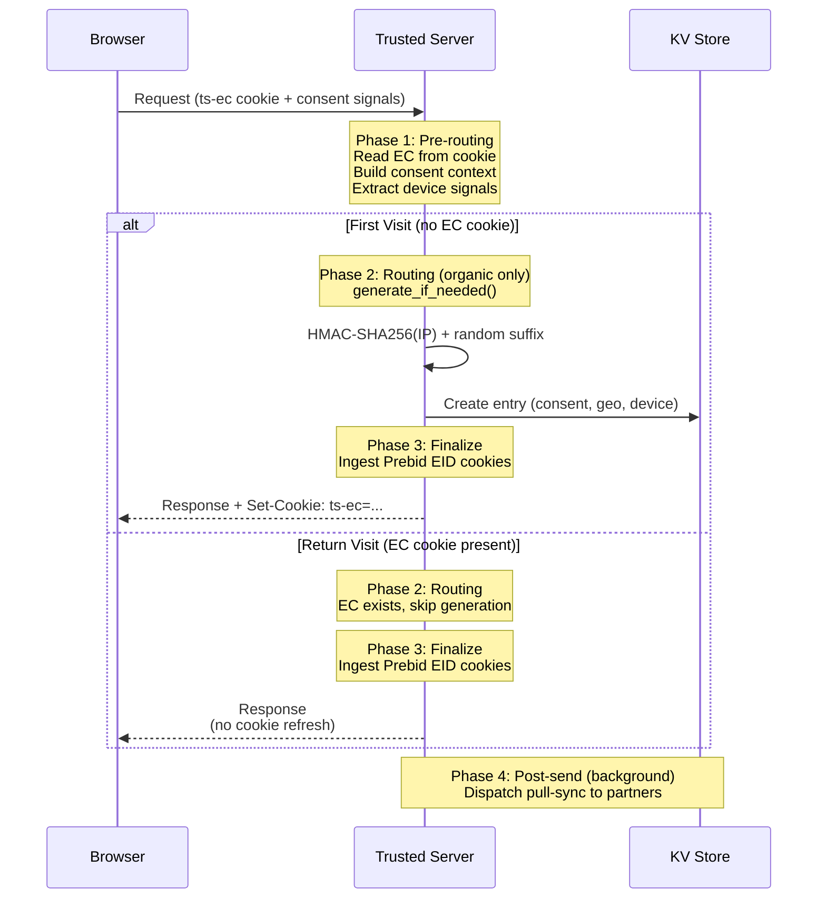
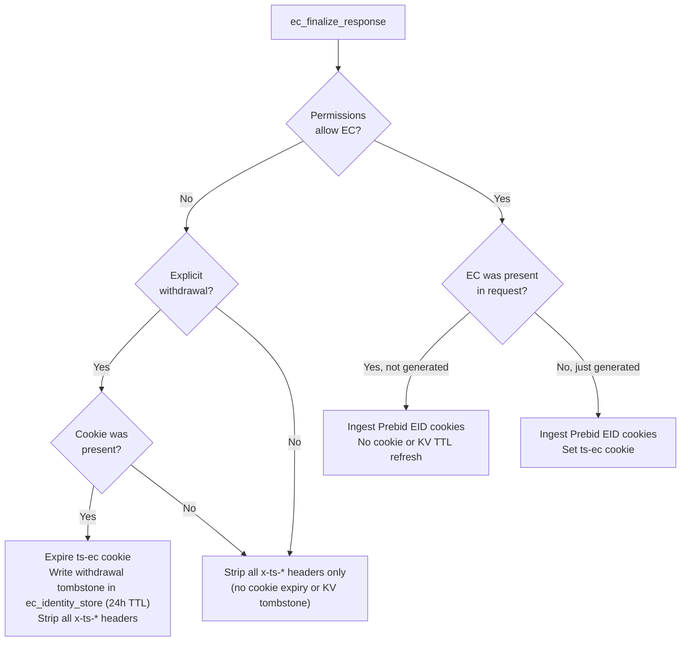
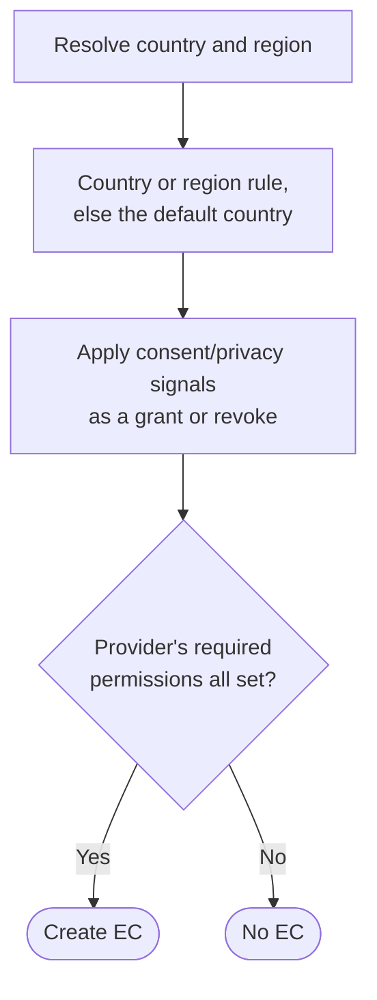
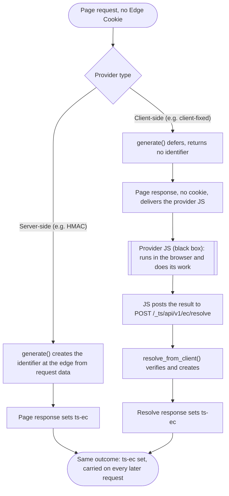
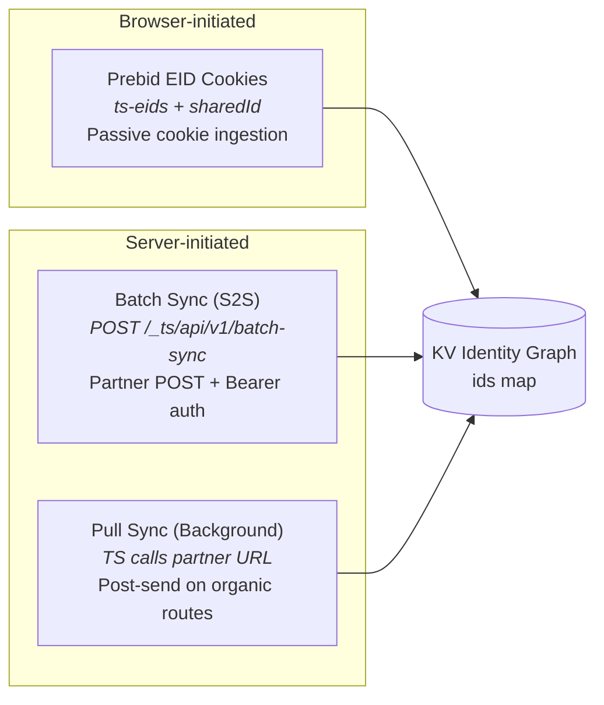
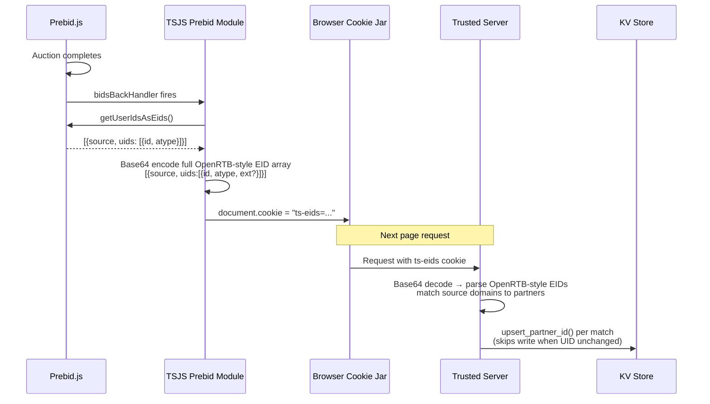
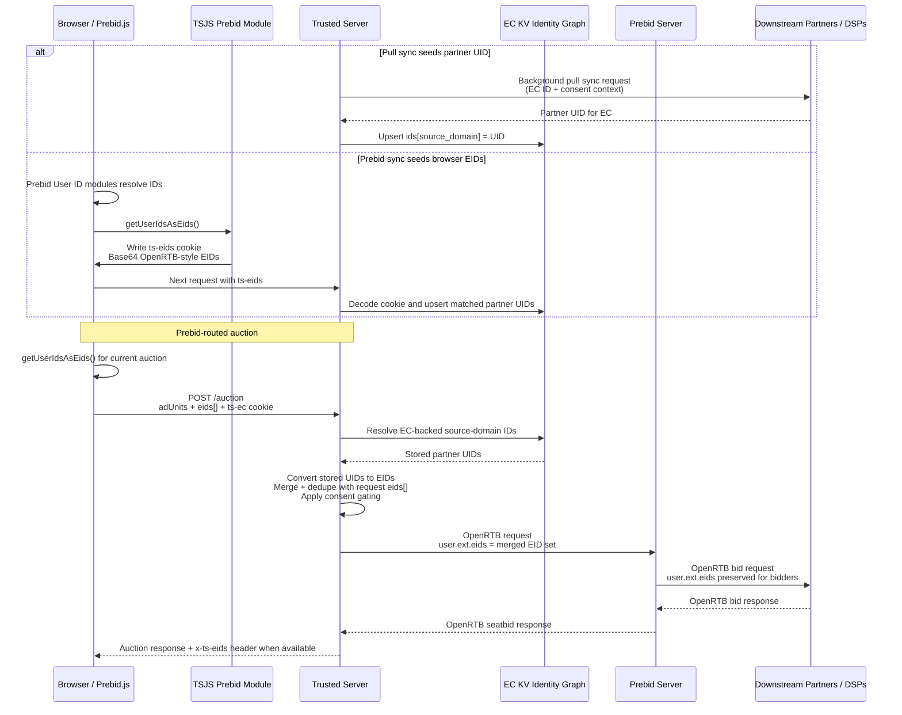

# Edge Cookies (EC)

Trusted Server persists a stable per-device identifier in a first-party
cookie on the publisher's domain. The cookie name is `ts-ec`. Trusted
Server also surfaces the current EC ID on the `x-ts-ec` response
header, and strips that header when the consent evaluation does not
permit EC use.

## Policy Posture

Trusted Server is technology. It is neutral on policy. The Edge Cookie gives the deployer a cookie slot and configuration over the surrounding attributes. The deployer determines the policy posture based on the laws and contractual arrangements that apply to their deployment. Privacy outcomes follow from that configuration, not from the cookie mechanism itself.

An Edge Cookie (EC) is a first-party identifier that the built-in provider derives on a first site visit with an HMAC of the client IP address plus a short random suffix, created only when the permission model allows it. It is passed in requests on subsequent visits and activity. Trusted Server surfaces the current EC ID via response headers and a first-party cookie. For the exact header and cookie names, see the [API Reference](/guide/api-reference).

For full operational onboarding (partner configuration, batch sync, identify, and auction verification), use the [EC Setup Guide](/guide/ec-setup-guide).

## How They Work

EC IDs are generated on first request using HMAC-SHA256 over the
normalized client IP and a configured secret, with a short random
suffix appended. On subsequent requests the value is read from the
`ts-ec` cookie and reused.

**Format:** `64-hex-hmac`.`6-alphanumeric-suffix`

**IP normalization:** IPv4 addresses pass through unchanged. IPv6
addresses are masked to the /64 prefix before hashing, so a device
that rotates its interface identifier under Privacy Extensions still
maps to a stable base.

### Determinism and Stability

| Scenario                                                    | Result                                               |
| ----------------------------------------------------------- | ---------------------------------------------------- |
| Same client IP, same secret, no cookie                      | Same 64-hex base; fresh suffix each mint.            |
| Same client IP, same secret, existing cookie                | Existing cookie value reused; no fresh mint.         |
| Same client IP, different secret                            | Different 64-hex base. Useful for rotating identity. |
| Multiple clients behind shared NAT, same secret, no cookies | Same 64-hex base; the suffix distinguishes them.     |

### Request Lifecycle

Every request passes through four phases. EC generation only happens on organic routes (publisher proxy, integration proxy, auction). Read-only endpoints like `/identify` and `/batch-sync` skip generation entirely. During pre-routing, Trusted Server builds the consent context from request-local cookies, headers, geolocation, and policy defaults. It does not load consent from a separate KV store.



### Response Finalization

After routing completes, the server evaluates the permission state and cookie presence to decide what to do with the EC cookie on the response.



When the required permissions cannot be established for the current request (for example an unknown country with no configured default, or missing or undecodable consent signals), Trusted Server fails closed for EC use by stripping EC headers, but it does **not** treat that as authoritative revocation of an already-issued EC.

## Permission Gating

EC creation is gated through the [permission model](/guide/permission-model), not by a jurisdiction rule baked into the core. The Edge Cookie provider advertises the permissions its data use requires, and Trusted Server creates an Edge Cookie only when every required permission is set. The built-in HMAC provider requires `necessary.operations.storage` (TCF Purpose 1), because the `Set-Cookie` operation stores information on the device.

The Edge Cookie code never reads consent. It checks only whether the required **permission** is set. Consent is one of the sources that _set_ a permission, not something the gate reads directly, so the Edge Cookie logic does not change when a consent framework changes. Two sources combine for each request:

- **A country and region baseline.** The country, and an optional region such as a US state, that the geo provider returns. A region rule takes precedence over its country, and when no country is identified, or the country/region has no rule, the configured default country applies.
- **Consent and privacy signals.** TCF, GPP, and GPC (`euconsent-v2`, `__gpp` / `__gpp_sid`, `us_privacy`, `Sec-GPC`) decoded from the request and mapped onto permissions as a **grant or a revoke** on top of that baseline. There is no separate consent KV fallback.

Today only `necessary.operations.storage` is resolved this way: its country and region baseline is adjusted by the incoming TCF signal, and the Edge Cookie is created only when the result is set. With no configured default country, an unknown country sets nothing without a signal, so the cookie is not created unless a signal grants the permission. The core encodes no jurisdiction's law. The deployer brings the policy, and the per-country and per-region rules are configuration rather than core logic. See the [permission model](/guide/permission-model) for the full list of permission sources and the resolution order.



The `ec_identity_store` KV store is the only EC lifecycle store. It holds identity graph state, source-domain keyed partner UIDs, a minimal consent snapshot used for EC entry metadata, and withdrawal tombstones. Permission resolution for each request is based on the live request signals listed above.

## Provider Types: Server-Side and Client-Side

The Edge Cookie identifier comes from a configurable provider, selected by `[ec] provider`. A provider is one of two types, and the permission gate above applies to both. The two reach the **same outcome** (a `ts-ec` cookie set and carried on every later request) by **different routes**.

- **Server-side** (for example the built-in HMAC provider, or the built-in `host-signals` provider that creates the identifier from the host's TLS JA4 and HTTP/2 signals on a host that supplies them). The provider derives the identifier at the edge from request data in `generate()`, and the **page response** sets the cookie. Nothing client-side is involved.
- **Client-side** (for example the `client-fixed` demo). The provider cannot derive the identifier at the edge, so `generate()` defers and returns no identifier. The page then runs the provider's own JavaScript in the browser, which does its work and posts the result to the resolve endpoint. The provider creates the identifier from that value in `resolve_from_client()`, and the **resolve response** sets the cookie.



The two types differ only in route and in the methods they use:

| Feature              | Server-side               | Client-side                                    |
| -------------------- | ------------------------- | ---------------------------------------------- |
| Example              | HMAC (`hmac`)             | `client-fixed` (demo)                          |
| Created in           | `generate()`, at the edge | `resolve_from_client()`, from the posted value |
| `generate()` returns | the identifier            | no identifier (defers)                         |
| Client JavaScript    | none                      | the provider JS (black box), which posts back  |
| Endpoint             | none                      | `POST /_ts/api/v1/ec/resolve`                  |
| Cookie set on        | the page response         | the resolve response                           |

The resolve endpoint requires an `Origin` on the publisher's domain and a `text/plain` or `application/json` body, and it answers `409` rather than silently replacing an identity the request already carries. A created identifier is persisted to the identity graph before the cookie is set, so withdrawal reaches a client-set identity the same way it reaches an edge-created one. On success the cookie is set on the endpoint's own first-party `200` response, so the value is live for every subsequent request without a second navigation. The cookie is `HttpOnly`, so the page script never reads it back; a non-`HttpOnly` marker cookie (`ts-ecr=1`, carrying no identity) tells the script a resolve succeeded so it does not post again on every page view. Every resolve response carries `Cache-Control: no-store`. The `client-fixed` demonstration provider is compiled only behind the `client-fixed-demo` cargo feature, so a production build rejects selecting it at startup.

Because the posted value comes from the browser, **verification is the provider's responsibility**. A client-side provider must verify the payload (for example a signature) before creating the identifier, or a client could forge an Edge Cookie. The endpoint itself is provider-agnostic. It bounds the body, applies the same permission gate as organic generation, calls the provider, and writes the cookie.

A built-in `client-fixed` provider demonstrates the client-side type end to end with no vendor coupling. Client and server share one fixed, known word. When no Edge Cookie is present, the page script (shipped in the tsjs bundle when that provider is selected) posts that word, the server verifies it matches, and on a match sets it as the Edge Cookie. The value is verifiable because it is a known constant, which is the point of the demo. It is useless in production, because a fixed value is not an identity, so it is for demonstration and testing only.

## Partner Sync Channels

Partner identities flow into the KV identity graph through three channels. Each writes to the same `ids` map in the KV entry via idempotent upsert logic: unchanged UIDs are accepted without a KV write, while different UIDs replace the stored value.



### Prebid EID Cookie Flow

The `ts-eids` cookie bridges client-side Prebid user ID modules with the server-side identity graph.



Current TSJS writers preserve the full OpenRTB-style `{source, uids:[...]}` shape in `ts-eids`. The server remains backward-compatible with earlier flattened `{source, id, atype}` cookies during rollout, but new cookies use the structured `uids[]` form.

The `sharedId` cookie follows a similar path but is written directly by Prebid's SharedID module rather than by TSJS. The server reads it separately and maps it via the `sharedid.org` source domain.

### EID Seeding and Prebid Bidstream Forwarding

EIDs can reach the EC identity graph from either server-side pull sync or browser-side Prebid sync. During a Prebid-routed auction, Trusted Server combines those stored IDs with any same-request EIDs from Prebid.js, applies consent gating, and forwards the merged set to Prebid Server as OpenRTB `user.ext.eids`. Prebid Server then passes those EIDs downstream to demand partners in its OpenRTB requests.



The relevant OpenRTB structure forwarded to Prebid Server and downstream partners is:

```json
{
  "user": {
    "id": "<ec-id-when-forwarding-is-allowed>",
    "ext": {
      "eids": [
        {
          "source": "id5-sync.com",
          "uids": [
            {
              "id": "ID5-abc123",
              "atype": 1
            }
          ]
        },
        {
          "source": "liveramp.com",
          "uids": [
            {
              "id": "LR-xyz789",
              "atype": 3,
              "ext": {
                "rtiPartner": "idl"
              }
            }
          ]
        }
      ]
    }
  }
}
```

Server-resolved EIDs and current-request Prebid EIDs are deduplicated by `source + uid.id`. When a partner UID already exists in KV, pull sync does not periodically refresh it; browser-side Prebid sync can still replace the stored UID if a later `ts-eids` cookie carries a different value for the same configured partner source.

## Configuration

Configure EC settings in the `[ec]` section of `trusted-server.toml`. See the [Configuration Reference](/guide/configuration) for the full surface and environment variable overrides.

The shipped configuration carries a local-development passphrase, and
known placeholder values are rejected at startup with a settings load
error, because an HMAC computed with a known secret can be forged by
anyone who knows it. Replace the development passphrase before
running outside local development.

## What Goes in the Cookie

The EC value is the deterministic HMAC base plus a random suffix. It
contains no name, email, account identifier, or other field supplied
by the user. The value is written back as `Set-Cookie` only when the
consent evaluation permits EC creation for the detected jurisdiction.
See [GDPR Compliance](/guide/gdpr-compliance) for how signals are
interpreted.

The value passes a base64url-compatible allowlist. The cookie envelope
sets `Path=/`, `Secure`, `HttpOnly`, `SameSite=Lax`, and a `Max-Age`.
`Domain` is computed as `.{publisher.domain}`. The separate
`cookie_domain` setting applies only to non-EC cookies.

## Operational Notes

- Rotate the secret periodically. Rotation produces a new 64-hex base
  for subsequent mints.
- Watch the logs for cookie value rejections, which happen when a
  `ts-ec` cookie value carries characters outside the allowlist.

## Runtime Behavior Notes

- Returning requests with consent and an existing `ts-ec` do not refresh the EC cookie or KV TTL.
- Newly generated ECs receive `Set-Cookie: ts-ec=...`.
- When the permission is not set but nothing was explicitly withdrawn, Trusted Server strips EC response headers for that request but leaves any existing `ts-ec` cookie intact; cookie expiry and tombstones happen only on explicit withdrawal. Withdrawal is deliberately narrow: a TCF record refusing storage in a jurisdiction whose baseline did not grant it. US-style opt-outs (GPC, a GPP sale opt-out, or a US Privacy opt-out) suppress use for the request but never expire the cookie or write a tombstone, so lifting the opt-out restores the identity.
- `/_ts/api/v1/identify` is read-oriented and returns identity enrichment for the authenticated partner. It computes `cluster_size` only when the EC entry does not already store one.
- `/_ts/api/v1/batch-sync` writes mappings into the EC identity graph. Mapping timestamps are retained for API compatibility but no longer order writes; valid mappings use idempotent last-write-wins semantics.
- Pull sync fills missing partner UIDs only. Existing partner UIDs are not periodically refreshed because EC entries no longer store per-partner sync timestamps.

## Next Steps

- Follow the [EC Setup Guide](/guide/ec-setup-guide)
- [Configuration Reference](/guide/configuration)
- [GDPR Compliance](/guide/gdpr-compliance) for consent signal handling
- Configure [Ad Serving](/guide/ad-serving)
- [Collective Sync](/guide/collective-sync) for cross-publisher data sharing details and diagrams
