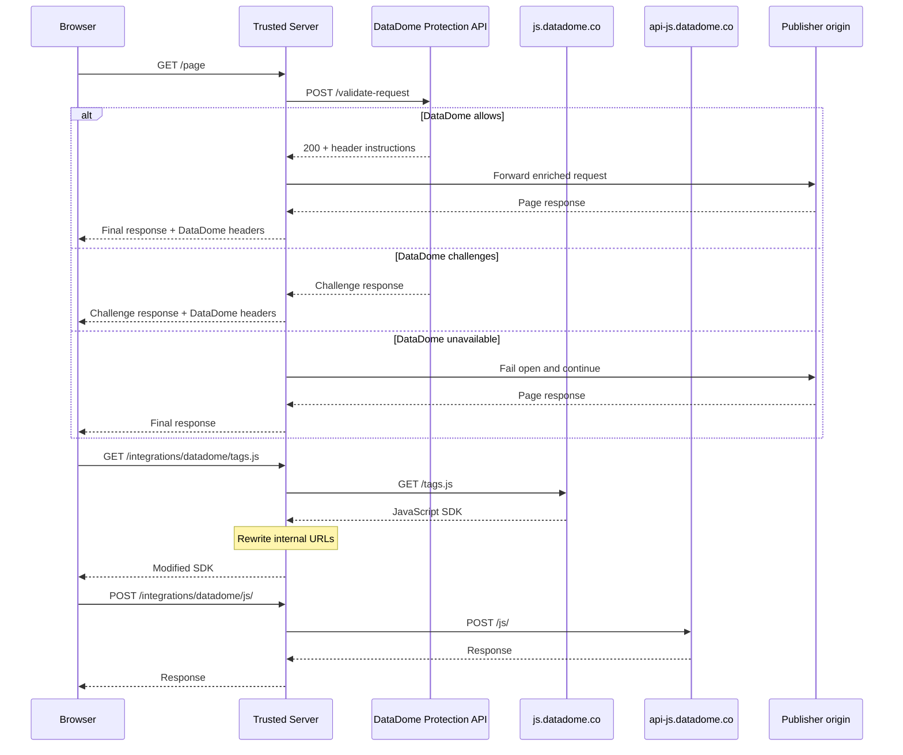

# DataDome Integration

DataDome provides bot protection and fraud prevention for websites. Trusted Server supports two complementary DataDome layers:

1. **First-party client delivery**: proxy the DataDome JavaScript tag and signal collection API through the publisher domain.
2. **Server-side request protection**: call the DataDome Protection API before route matching so DataDome can allow, challenge, or enrich requests at the edge.

## Overview

The DataDome integration can:

- Proxy `tags.js` through your first-party domain
- Rewrite internal DataDome URLs to route through Trusted Server
- Proxy signal collection API (`/js/*`) through first-party context
- Automatically rewrite `<script>` tags in HTML responses
- Auto-inject the client-side tag when `client_side_key` is configured
- Validate in-scope requests through the DataDome Protection API before publisher-origin routing
- Apply DataDome request-enrichment headers and downstream response headers/cookies

## Benefits

| Traditional setup          | Trusted Server approach             |
| -------------------------- | ----------------------------------- |
| Requires DNS CNAME changes | No DNS changes needed               |
| Separate subdomain setup   | Uses existing publisher domain      |
| Direct browser-to-DataDome | Traffic can flow through edge       |
| Ad blockers may interfere  | First-party context avoids blocking |
| Origin sees every request  | Edge can challenge before origin    |

## Configuration

Add the following to your `trusted-server.toml`:

```toml
[bot-protection]
module = "datadome"

[bot-protection.datadome]

# First-party JavaScript/proxy layer
sdk_origin = "https://js.datadome.co"
api_origin = "https://api-js.datadome.co"
cache_ttl_seconds = 3600
rewrite_sdk = true

# Server-side Protection API layer
enable_protection = false
# Required only when enable_protection = true.
server_side_key_secret_name = "datadome_server_side_key"
protection_api_origin = "https://api-fastly.datadome.co"
timeout_ms = 1500
protection_excluded_methods = ["OPTIONS"]
protection_excluded_asns = []
protection_excluded_ip_cidrs = []
protection_excluded_ip_cidr_sources = []
protection_ip_list_cache_ttl_seconds = 300
enable_graphql_support = false

# Client-side tag auto-injection
client_side_key = ""
inject_client_side_tag = true
client_side_tag_url = "/integrations/datadome/tags.js"
client_side_configuration = { ajaxListenerPath = true }

[[bot-protection.datadome.protection_exclusion_rules]]
id = "default-static-assets"
type = "path_regex"
patterns = ["(?i)\\.(avi|flv|mka|mkv|mov|mp4|mpeg|mpg|mp3|flac|ogg|ogm|opus|wav|webm|webp|bmp|gif|ico|jpeg|jpg|png|svg|svgz|swf|eot|otf|ttf|woff|woff2|css|less|js|map)$"]
```

### Configuration options

| Option                                 | Type    | Default                          | Description                                                             |
| -------------------------------------- | ------- | -------------------------------- | ----------------------------------------------------------------------- |
| `sdk_origin`                           | string  | `https://js.datadome.co`         | DataDome SDK origin URL for `tags.js`                                   |
| `api_origin`                           | string  | `https://api-js.datadome.co`     | DataDome signal collection API origin URL for `/js/*`                   |
| `cache_ttl_seconds`                    | integer | `3600`                           | Cache TTL for `tags.js`                                                 |
| `rewrite_sdk`                          | boolean | `true`                           | Rewrite DataDome script URLs in HTML to first-party paths               |
| `enable_protection`                    | boolean | `false`                          | Call the Protection API before route matching                           |
| `server_side_key_secret_name`          | string  | none                             | Default-store secret reference required when protection is enabled      |
| `protection_api_origin`                | string  | `https://api-fastly.datadome.co` | Protection API origin                                                   |
| `timeout_ms`                           | integer | `1500`                           | Dynamic backend first-byte timeout for Protection API calls             |
| `protection_excluded_methods`          | array   | `["OPTIONS"]`                    | HTTP methods skipped before the Protection API call                     |
| `protection_excluded_asns`             | array   | `[]`                             | Client autonomous system numbers skipped before the Protection API call |
| `protection_excluded_ip_cidrs`         | array   | `[]`                             | Inline client IP CIDR ranges skipped before the Protection API call     |
| `protection_excluded_ip_cidr_sources`  | array   | `[]`                             | Config Store sources containing dynamic client IP CIDR bypass lists     |
| `protection_ip_list_cache_ttl_seconds` | integer | `300`                            | Process-local cache TTL for Config Store-backed IP CIDR bypass lists    |
| `protection_exclusion_rules`           | array   | Static asset path regex          | Structured method/path/query/IP/ASN exclusion rules                     |
| `protection_test_bypass`               | object  | omitted                          | Staging-only fixed-header bypass; secret must contain at least 32 bytes |
| `enable_graphql_support`               | boolean | `false`                          | Reserved for future GraphQL body inspection; ignored in v1              |
| `client_side_key`                      | string  | `""`                             | DataDome client-side JavaScript key used for tag injection              |
| `inject_client_side_tag`               | boolean | `true`                           | Auto-inject the browser tag when `client_side_key` is non-empty         |
| `client_side_tag_url`                  | string  | `/integrations/datadome/tags.js` | Root-relative or HTTPS script URL used by auto-injection                |
| `client_side_configuration`            | object  | `{ ajaxListenerPath = true }`    | Options assigned to `window.ddoptions`                                  |

## Client-side setup

### Auto-injection

Set `client_side_key` to have Trusted Server inject the DataDome browser tag into processed HTML responses:

```toml
[bot-protection]
module = "datadome"

[bot-protection.datadome]
client_side_key = "YOUR_DATADOME_JS_KEY"
inject_client_side_tag = true
```

The tag is the serve middleware `bot-protection.datadome.tag`, which runs on each reader's copy of the pages a `[[serve]]` entry names it for. See [Placing page changes](/guide/configuration#placing-page-changes). It writes the DataDome configuration straight before the Trusted Server JavaScript bundle:

```html
<script>
  window.ddjskey = 'YOUR_DATADOME_JS_KEY'
  window.ddoptions = { ajaxListenerPath: true }
</script>
<script src="/integrations/datadome/tags.js" async></script>
```

If your site already manages the DataDome tag, disable auto-injection:

```toml
[bot-protection]
module = "datadome"

[bot-protection.datadome]
inject_client_side_tag = false
```

### Manual setup

You can also load DataDome manually through the first-party path:

```html
<script>
  window.ddjskey = 'YOUR_DATADOME_JS_KEY'
  window.ddoptions = {}
</script>
<script src="/integrations/datadome/tags.js" async></script>
```

If `rewrite_sdk` is enabled, Trusted Server rewrites existing DataDome script tags in HTML, on the pages a `[[fetch]]` entry names the middleware `bot-protection.datadome` for:

```html
<!-- Original -->
<script src="https://js.datadome.co/tags.js" async></script>

<!-- Becomes -->
<script
  src="https://www.example.com/integrations/datadome/tags.js"
  async
></script>
```

## Server-side Protection API

When `enable_protection = true`, Trusted Server calls DataDome before normal route matching. DataDome can return:

- **Allow**: continue routing and optionally enrich the upstream request.
- **Challenge**: return the DataDome response directly without contacting the publisher origin.
- **Fail-open condition**: continue routing without DataDome effects when the Protection API times out, returns malformed instructions, or returns an unexpected status.

`server_side_key_secret_name` is a key reference in the logical `trusted_server_secrets` store. It must resolve to a non-empty value when server-side protection is enabled. Missing or invalid credentials fail startup before requests are served. Protection API transport and response failures continue to fail open per request.

### Protected traffic

A request is protected when all of the following are true:

1. `[bot-protection] module` selects DataDome.
2. `enable_protection = true`.
3. The method is not listed in `protection_excluded_methods`.
4. The path is not one of Trusted Server's internal routes.
5. The client IP does not match `protection_excluded_ip_cidrs` or any Config Store-backed CIDR source.
6. The client ASN is not listed in `protection_excluded_asns`.
7. No `protection_exclusion_rules` match.
8. The request does not contain a matching enabled `protection_test_bypass` credential while `FASTLY_IS_STAGING=1`.

Static assets are excluded by default using a case-insensitive file-extension regex. Trusted Server internal routes such as `/static/tsjs=`, `/integrations/`, `/first-party/`, discovery routes, and signature-verification routes are also excluded by default.

Auction traffic at `/auction` is protected by default.

### Staging test bypass

For short-lived browser automation on an access-controlled staging site, you
can configure a static header credential that skips only the server-side
Protection API:

```toml
# Runtime activation also requires FASTLY_IS_STAGING=1.
[bot-protection]
module = "datadome"

[bot-protection.datadome.protection_test_bypass]
enabled = true
credential_secret_name = "datadome_test_bypass"
```

`protection_test_bypass` requires `enable_protection = true`; it is disabled
when omitted and is runtime-active only when `FASTLY_IS_STAGING=1`.
`FASTLY_IS_STAGING` is supplied at runtime by Fastly (`1` in staging and `0` in
production); it is not compiled into or promoted with the Wasm artifact. Verify
staging through the `X-TS-ENV: staging` response signal and the integration
activation log, and verify production omits that response signal. A retained
section cannot bypass protection in a production or other non-staging runtime.
Store a randomly generated credential containing at least 32 bytes of
high-entropy material under the referenced key in `trusted_server_secrets`, configure this section
only while needed, protect the site with an outer access control such as Basic
Auth, and remove the section when testing finishes.

Whenever the enabled DataDome request filter runs on the Fastly adapter, the
fixed `x-ts-datadome-bypass` header is removed before configuration or
credential checks. It therefore cannot reach DataDome or the publisher origin
through that path when the bypass is absent, disabled, inactive, or invalid.
Active credentials are compared in constant time and never logged. Duplicate
header values fail closed. Scope the header to the staging origin; do not attach
it to every request in a browser context because that can disclose the
credential to third-party origins. With Playwright:

```ts
await context.route('https://staging.example.com/**', async (route) => {
  const headers = {
    ...route.request().headers(),
    'x-ts-datadome-bypass': process.env.DATADOME_TEST_BYPASS!,
  }
  await route.continue({ headers })
})
```

### Client-side tag suppression behavior

On the Fastly adapter, a request that matches an IP-based DataDome exclusion
or the configured test-bypass credential also omits Trusted Server's
automatically injected client-side DataDome tag from processed HTML. This keeps
the client-side layer consistent with the server-side Protection API skip.

This behavior applies to:

- `protection_excluded_ip_cidrs`;
- `protection_excluded_ip_cidr_sources`;
- structured `ip_cidr` rules;
- structured `ip_cidr_source` rules; and
- a matching enabled `protection_test_bypass` credential in a staging runtime.

Method, ASN, path, query-parameter, static-asset, and internal-route exclusions
alone do not suppress the client-side tag. However, a simultaneous matching IP
exclusion suppresses it regardless of which first-match rule and reason are
logged. DataDome tags already present in publisher HTML are not removed or
changed by this behavior, and `/integrations/datadome/tags.js` remains available
when requested directly.

Because the processed HTML differs by client IP or test credential,
tag-suppressed HTML is marked `private, no-store`, has origin validators
removed, and has shared-surrogate cache directives removed. This response-time
policy cannot invalidate tag-bearing HTML already held by a shared cache in
front of Trusted Server. Guaranteed suppression requires bypassing or purging
that cache, or avoiding shared caching ahead of Trusted Server.

IP-exclusion suppression skips are logged at `info` for navigations and `debug`
for subresources; matching test-bypass events remain at `info` as security audit
events. Protection API result logs classify `allowed`, `blocked`, and
`failed_open` outcomes and use distinct `api_status` and `datadome_status`
fields. For example:

```text
[datadome] protection decision=skipped rule=protection-test-bypass reason=test_bypass client_tag=omitted method=GET
```

### Structured exclusion rules

Use structured rules for all DataDome protection exclusions. Each rule has an `id`, optional `methods`, and a typed matcher. The default configuration includes a `path_regex` rule for common static assets.

```toml
[bot-protection]
module = "datadome"

[[bot-protection.datadome.protection_exclusion_rules]]
id = "legacy-static-get-head"
methods = ["GET", "HEAD"]
type = "path_regex"
patterns = [
  "(?i)\\.(css|css\\.map|js|js\\.map|json|png|jpg|webp|woff2)$",
  "^/\\.image/",
  "^/robots\\.txt$",
]

[[bot-protection.datadome.protection_exclusion_rules]]
id = "next-rsc"
methods = ["GET", "HEAD"]
type = "query_param_non_empty"
names = ["_rsc"]
```

Supported rule types are:

- `path_exact`
- `path_prefix`
- `path_regex`
- `query_param_non_empty`
- `asn`
- `ip_cidr`
- `ip_cidr_source`

Config Store-backed CIDR sources accept newline-, comma-, whitespace-, or JSON-array encoded CIDR lists. They are useful for large or frequently updated vendor crawler lists.

```toml
[bot-protection]
module = "datadome"

[[bot-protection.datadome.protection_excluded_ip_cidr_sources]]
config_store = "datadome-ip-bypass"
key = "googlebot_ips"
```

### Header handling

DataDome can return pointer headers that identify which headers Trusted Server should copy:

| Pointer header               | Applied to                                 |
| ---------------------------- | ------------------------------------------ |
| `X-DataDome-request-headers` | Request forwarded to Trusted Server/origin |
| `X-DataDome-headers`         | Final browser response                     |

Trusted Server copies only the named headers. Pointer headers themselves are not forwarded. `Set-Cookie` is appended, while other copied headers are set/replaced. Unsafe hop-by-hop, framing, host, and internal `x-ts-*` headers are rejected.

DataDome downstream response headers are applied after EC response finalization and generic Trusted Server response headers so DataDome challenge/cache/cookie headers win.

### GraphQL limitation

`enable_graphql_support` is reserved for future request-body inspection. Trusted Server v1 does not parse GraphQL bodies for DataDome payload enrichment.

## Endpoints

The first-party layer exposes these routes:

| Method     | Path                             | Description           |
| ---------- | -------------------------------- | --------------------- |
| `GET`      | `/integrations/datadome/tags.js` | DataDome SDK script   |
| `GET/POST` | `/integrations/datadome/js/*`    | Signal collection API |

## How it works



## Environment variables

Override configuration via environment variables:

```bash
TRUSTED_SERVER__BOT-PROTECTION__DATADOME__SDK_ORIGIN=https://js.datadome.co
TRUSTED_SERVER__BOT-PROTECTION__DATADOME__API_ORIGIN=https://api-js.datadome.co
TRUSTED_SERVER__BOT-PROTECTION__DATADOME__CACHE_TTL_SECONDS=3600
TRUSTED_SERVER__BOT-PROTECTION__DATADOME__REWRITE_SDK=true
TRUSTED_SERVER__BOT-PROTECTION__DATADOME__ENABLE_PROTECTION=true
TRUSTED_SERVER__BOT-PROTECTION__DATADOME__SERVER_SIDE_KEY_SECRET_NAME=datadome_server_side_key
TRUSTED_SERVER__BOT-PROTECTION__DATADOME__CLIENT_SIDE_KEY=your-client-side-key
```

## Client-side script guard

For single-page applications and frameworks like Next.js that dynamically insert script tags, the integration includes a client-side guard. When the `datadome` module is included in your TSJS bundle, it intercepts dynamically inserted DataDome scripts and rewrites them to use first-party paths.

The guard handles:

- `<script src="js.datadome.co/...">` elements
- `<link rel="preload" as="script" href="js.datadome.co/...">` elements
- `<link rel="prefetch" as="script" href="js.datadome.co/...">` elements

This keeps DataDome scripts routed through first-party context, even when inserted dynamically by client-side JavaScript.

## Troubleshooting

### Script not loading

Check that `[bot-protection]` selects the module:

```toml
[bot-protection]
module = "datadome"
```

If you rely on auto-injection, verify `client_side_key` is non-empty and `inject_client_side_tag = true`.

### Signals not sending

Verify that signal collection routes are working:

```bash
curl -X POST https://www.example.com/integrations/datadome/js/check
```

### Server-side protection not running

Check that both fields are configured:

```toml
[bot-protection]
module = "datadome"

[bot-protection.datadome]
enable_protection = true
server_side_key_secret_name = "datadome_server_side_key"
```

Also verify the request is not excluded by the default internal/static route exclusions or your custom inclusion/exclusion regexes.

### HTML rewriting not working

Ensure `rewrite_sdk = true`, that a `[[fetch]]` entry names `bot-protection.datadome` for the page, and that your pages are being proxied through Trusted Server's HTML processing pipeline.

## See also

- [DataDome First-Party Integration Docs](https://docs.datadome.co/docs/integrations#first-party-javascript-tag)
- [Integrations Overview](/guide/integrations-overview)
- [First-Party Proxy](/guide/first-party-proxy)
