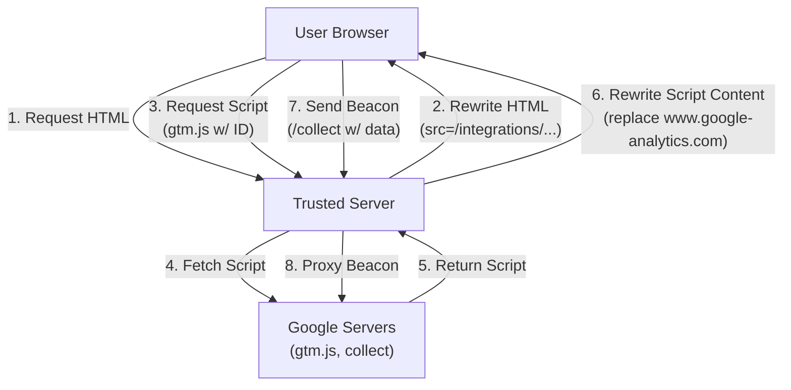

# Google Tag Manager Integration

**Category**: Tag Management
**Status**: Production
**Type**: First-Party Tag Gateway

## Overview

The Google Tag Manager (GTM) integration enables Trusted Server to act as a first-party proxy for GTM scripts and analytics beacons. This improves performance and measurement accuracy by serving these assets from your own domain, and limits the client data forwarded to Google.

## What is the Tag Gateway?

The Tag Gateway intercepts requests for GTM scripts (`gtm.js`) and Google Analytics beacons (`collect`). Instead of the user's browser connecting directly to Google content servers, it connects to your Trusted Server. Trusted Server then fetches the content from Google and serves it back to the user.

**Benefits**:

- **Bypass Ad Blockers**: Serving scripts from a first-party domain can prevent them from being blocked by some ad blockers and privacy extensions.
- **Extended Cookie Life**: First-party cookies set by these scripts are more durable in environments like Safari (ITP).
- **Performance**: Utilize edge caching for scripts.
- **IP Address Handling**: Does not forward client IP to Google (Google sees edge server IP, not user IP).

**IP Forwarding vs. Analytics Tradeoff**:

Client IP addresses are intentionally **not forwarded** to Google Analytics. This means:

- ✅ **IP withheld**: User IP addresses are not sent to Google
- ⚠️ **Analytics**: Geographic targeting and user location data will be based on the edge server's IP, not the actual user's location
- ⚠️ **Accuracy**: Analytics reports may show less accurate geographic distribution

This is a deliberate design choice to limit data forwarded to Google. If your use case requires accurate geographic data, you may need to consider alternative approaches.

## Configuration

Add the GTM configuration to `trusted-server.toml`:

```toml
[tag]
modules = ["google-tag-manager"]

[tag.google-tag-manager]
container_id = "GTM-XXXXXX"
# upstream_url = "https://www.googletagmanager.com" # Optional override (must be https)
# allowed_tag_ids = ["G-XXXXXXXX"] # Tag ids besides container_id that gtag/js may serve first-party
# cache_max_age = 900 # Optional: Cache duration in seconds (default: 900)
# max_beacon_body_size = 65536 # Optional: Max POST body size in bytes (default: 65536 / 64KB)
```

### Configuration Options

| Field                  | Type   | Required | Description                                                                                                                                                                      |
| ---------------------- | ------ | -------- | -------------------------------------------------------------------------------------------------------------------------------------------------------------------------------- |
| `container_id`         | string | Yes      | Your GTM Container ID (e.g., `GTM-A1B2C3`)                                                                                                                                       |
| `upstream_url`         | string | No       | Custom upstream, as a credential-free `https` bare origin with a literal host, with no path, query, fragment, userinfo or wildcard (default: `https://www.googletagmanager.com`) |
| `allowed_tag_ids`      | array  | No       | Extra tag ids servable on `gtag/js` besides `container_id` (default: none)                                                                                                       |
| `cache_max_age`        | number | No       | Cache duration in seconds (default: `900`, range: `60`-`86400`)                                                                                                                  |
| `max_beacon_body_size` | number | No       | Max POST body size in bytes (default: `65536`, range: `1024`-`1048576`)                                                                                                          |

### Upgrading: check `allowed_tag_ids`

Only `container_id` and the ids listed in `allowed_tag_ids` are served from your
own origin. If your pages load `gtag/js` with a measurement id different from
your container — a GA4 `G-` id, an Ads `AW-` id or a Merchant Center `MC-` id,
for example — add those ids here.

Missing one does not break the page, but it does degrade the tag, and on some
sites it stops the tag loading altogether:

- It is served third-party, losing the ad-blocker resilience this integration
  exists to provide.
- A `<link rel="preload">` for it pays an extra round trip.
- **A strict `script-src` blocks it.** A redirect does not make the upstream
  origin satisfy `'self'`, so unless your policy lists that origin explicitly,
  the redirected script is refused and the tag does not run at all. The origin
  to allow is whatever `upstream_url` points at — `https://www.googletagmanager.com`
  by default, or your own tagging domain if you have overridden it.

Standard `gtag.js` installations use a product tag ID that is usually not the
`GTM-` container ID, so most deployments that load `gtag/js` will have at least
one ID to add here.

To find the ids your pages use, look for `gtag/js?id=` in your rendered HTML:

```bash
curl -s https://www.example.com/ | grep -oE 'gtag/js\?id=[A-Za-z0-9-]+'
```

### Upgrading: `upstream_url` must now be a bare origin

`upstream_url` was previously checked only for being a well-formed URL. It is
now required to be a credential-free `https` bare origin with a literal host,
and these values are rejected:

| Rejected value                       | Reason                                            |
| ------------------------------------ | ------------------------------------------------- |
| `https://tags.example.com/gateway`   | Path — targets are built by appending `/gtm.js`   |
| `https://tags.example.com?env=stage` | Query — same, the appended path lands after it    |
| `https://tags.example.com#anchor`    | Fragment — the appended path is swallowed by it   |
| `https://user:pw@tags.example.com`   | Userinfo — echoed to the client in a tag redirect |
| `https://*.example.com`              | Wildcard host — widens the proxy allowlist        |

A trailing slash is still accepted; it is trimmed before targets are built.

**This is a breaking change.** A path-based value such as
`https://tags.example.com/gateway` passed validation before this release and
produced targets below that path, so a deployment using one now fails
config validation. `ts config push` rejects it, which is where you should expect
to see this. Validation is fail-closed rather than skip-the-integration: a
config that reaches the runtime without having been pushed through that check
fails building the integration registry, so every integration is affected, not
just this one. If your upstream serves tags below a path, front it with a
hostname that serves them at the root instead.

## How It Works



### 1. Script Rewriting

On the pages a `[[fetch]]` entry names the middleware `tag.google-tag-manager` for, Trusted Server rewrites GTM script tags to point to the local proxy. See [Placing page changes](/guide/configuration#placing-page-changes).

**Before:**

```html
<script src="https://www.googletagmanager.com/gtm.js?id=GTM-XXXXXX"></script>
```

**After:**

```html
<script src="/integrations/google_tag_manager/gtm.js?id=GTM-XXXXXX"></script>
```

### 2. Script Proxying

The proxy intercepts requests for the GTM library and modifies it on-the-fly. This is critical for First-Party context.

1.  **Fetch**: Retrieves the original `gtm.js` from Google.
2.  **Rewrite**: Replaces hardcoded references to `www.google-analytics.com` and `www.googletagmanager.com` with the local proxy path.
3.  **Serve**: Returns the modified script with correct caching headers.

### 3. Beacon Proxying

Analytics data (events, pageviews) normally sent to `google-analytics.com/collect` are now routed to:

`https://your-server.com/integrations/google_tag_manager/collect`

Trusted Server acts as the forwarding gateway. Client IP addresses are not forwarded to Google. Google sees only the edge server IP, not the actual user IP.

## Core Endpoints

### `GET .../gtm.js` - Script Proxy

Proxies the Google Tag Manager library.

**Request**:

```
GET /integrations/google_tag_manager/gtm.js
```

**Behavior**:

- Proxies to `https://www.googletagmanager.com/gtm.js`
- Uses the configured `container_id`. A client-supplied `id` parameter is
  ignored, so this endpoint only ever serves your own container. Other
  parameters (`l`, `gtm_auth`, `gtm_preview`, `gtm_cookies_win`) are forwarded,
  so container environments and preview mode keep working.
- Rewrites internal URLs to use the first-party proxy
- Sets `Accept-Encoding: identity` during fetch to ensure rewriteable text response

### `GET .../gtag/js` - GA4 Tag Proxy

Proxies the Google Analytics 4 tag library (gtag.js).

**Request**:

```
GET /integrations/google_tag_manager/gtag/js?id=G-XXXXXXXX
```

**Behavior**:

- Proxies to `https://www.googletagmanager.com/gtag/js`
- Rewrites internal URLs to use the first-party proxy
- Sets `Accept-Encoding: identity` during fetch to ensure rewriteable text response

Only `container_id` and any `allowed_tag_ids` are served from your origin, and
they are matched exactly — a tag id spelled with different capitalization is
treated as unconfigured. A
request naming a different tag id is answered with a redirect to the upstream,
so your origin serves only containers you configured. The visitor then loads
that tag from the upstream directly, which a `script-src` that does not list
the upstream origin will block. Upstream answers `200` for tag ids that do not exist, so it
cannot be relied on to reject an unknown tag.

### `GET/POST .../collect` - Analytics Beacon

Proxies analytics events (GA4/UA).

**Request**:

```
POST /integrations/google_tag_manager/g/collect?v=2&...
```

**Behavior**:

- Proxies to `https://www.google-analytics.com/g/collect`
- Forwarding: User-Agent, Referer, Payload
- IP forwarding: Does NOT forward client IP (Google sees Trusted Server IP)

**POST Request Handling**:

The endpoint validates POST request sizes to prevent memory pressure:

- If `Content-Length` header is present and valid:
  - Requests exceeding `max_beacon_body_size` are rejected early with `413 Payload Too Large`
  - Valid requests proceed normally
- If `Content-Length` header is malformed: `400 Bad Request`
- If `Content-Length` header is missing: Request is accepted (HTTP/2 compatible)
  - Body is read in 8KB chunks with size validation
  - Reading stops immediately if `max_beacon_body_size` is exceeded
  - Oversized bodies return `413 Payload Too Large` without buffering the full payload

**Memory Protection**:

The implementation uses chunked reading to prevent unbounded memory allocation. Bodies are read in small chunks (8KB), and size is validated incrementally. This ensures that even if a client sends a malicious multi-gigabyte POST (with no Content-Length or an incorrect one), the server will reject it after reading at most `max_beacon_body_size + 8KB` into memory.

This approach maintains compatibility with HTTP/2 and HTTP/3 clients while providing robust protection against memory exhaustion attacks.

## Performance & Caching

### Compression

The integration requires the upstream `gtm.js` to be uncompressed to perform string replacement. Trusted Server fetches it with `Accept-Encoding: identity`.

_Note: Trusted Server will re-compress the response (gzip/brotli) before sending it to the user if the `compression` feature is enabled._

### Cache Behavior

- **Script Caching**: `gtm.js` and `gtag/js` are cached with `Cache-Control: public, max-age=900` (15 minutes) by default
- **Cache Duration**: Configurable via `cache_max_age` setting (60-86400 seconds)
- **Edge Caching**: Fastly edge nodes will cache scripts according to the Cache-Control headers

**Stale Cache Handling**:

If the Google upstream is unreachable when a cached script expires:

- The edge will attempt to fetch a fresh copy from Google
- If the fetch fails, the request will fail (no stale content is served)
- Consider implementing `stale-while-revalidate` at the CDN level if you need fallback behavior

For production deployments, monitor upstream availability and consider:

- Setting up health checks for Google's endpoints
- Configuring appropriate cache TTLs based on your update frequency needs
- Implementing retry logic at the edge platform level

### Direct Proxying

Beacon requests (`/collect`) are proxied directly using streaming, minimizing latency overhead.

## Manual Verification

You can verify the integration using `curl`:

**Test Script Result**:

```bash
curl -v "http://localhost:8080/integrations/google_tag_manager/gtm.js?id=GTM-XXXXXX"
```

_Expected_: `200 OK`. Body should contain `/integrations/google_tag_manager` instead of `google-analytics.com`.

**Test Beacon Result**:

```bash
curl -v -X POST "http://localhost:8080/integrations/google_tag_manager/g/collect?v=2&tid=G-TEST"
```

_Expected_: `200 OK` (or 204).

## Implementation Details

See [crates/tag/google-tag-manager/src/lib.rs](https://github.com/IABTechLab/trusted-server/blob/main/crates/tag/google-tag-manager/src/lib.rs).

## Next Steps

- Review [Prebid Integration](/guide/integrations/prebid) for header bidding.
- Check [Configuration Guide](/guide/configuration) for other integration settings.
- Learn more about [Edge Cookies](/guide/edge-cookies) which are generated alongside this integration.
