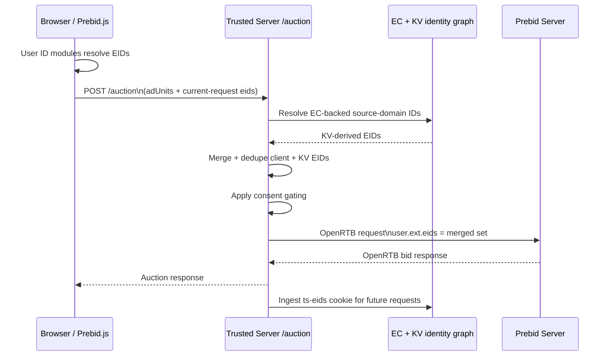

# Prebid Integration

**Category**: Demand Wrapper
**Status**: Production
**Type**: Header Bidding

## Overview

The Prebid integration enables server-side header bidding through Prebid Server while maintaining first-party context and applying publisher-configured consent enforcement.

## What is Prebid?

Prebid is the leading open-source header bidding solution that allows publishers to offer ad inventory to multiple demand sources simultaneously, maximizing revenue through competition.

## Configuration

Prebid configuration has two independent owners:

- `[integration.prebid]` owns browser Prebid.js behavior, being bundle
  selection and injection, browser timeout and debug, account injection,
  script interception, client-side bidders, and refresh exclusions. It runs
  when `prebid` is named in `[integration] provider`.
- A `[demand.<name>]` table that sets `implementation = "prebid_server"`, its
  `notifications`, and `[auction.bidders]` own every Prebid Server request.
  Prebid Server is a demand implementation, not a page integration, so it is
  never named in `[integration] provider`. See
  [Configuration Rules](/guide/configuration-rules).

```toml
[integration]
provider = ["prebid"]

[integration.prebid]
timeout_ms = 1000
debug = false
client_side_bidders = ["example-browser"]
excluded_gam_ad_unit_path_suffixes = ["/example-tracking-only"]
script_patterns = ["/prebid.js", "/prebid.min.js"]
external_bundle_url = "https://assets.example.com/prebid/trusted-prebid.js"
# external_bundle_sha256 = "<fictional sha256>"
# external_bundle_sri = "sha384-<fictional digest>"

# Optional operator-owned Prebid User ID modules, forwarded to Prebid verbatim.
[[integration.prebid.managed_user_ids]]
name = "identityLink"
params = { pid = "999", notUse3P = false }

[integration.prebid.managed_user_ids.storage]
type = "cookie"
name = "idl_env"
expires = 15
refresh_in_seconds = 1800

# External bundle generation inputs used by `ts prebid bundle`.
# Values are exact Prebid module stems without `.js`.
[integration.prebid.bundle.modules]
bidder = ["rubiconBidAdapter"]
user_id = ["sharedIdSystem", "identityLinkIdSystem"]
analytics = ["atsAnalyticsAdapter"]

[proxy]
allowed_domains = ["assets.example.com"]

[auction]
enabled = true
timeout_ms = 2000

[demand]
provider = ["pbs_main"]

[demand.pbs_main]
implementation = "prebid_server"
endpoint = "https://prebid.example.com/openrtb2/auction"
timeout_ms = 900
routing = "explicit"
debug = false
test_mode = false
debug_query_params = "example-debug=1"
consent_forwarding = "both"
bid_param_overrides = { example-server = { placement = "example-placement" } }
bid_param_zone_overrides = { example-server = { header = { placement = "example-header" } } }

[[demand.pbs_main.bid_param_override_rules]]
when.bidder = "example-server"
when.zone = "header"
set = { placement = "example-rule-placement" }

[demand.pbs_main.notifications]
suppress_all = false
suppress_seats = ["example-seat"]

[auction.bidders.example-server]
provider = "pbs_main"
```

### Browser configuration options

| Field                                           | Default                                                                | Ownership and behavior                                                            |
| ----------------------------------------------- | ---------------------------------------------------------------------- | --------------------------------------------------------------------------------- |
| `account_id`                                    | `None`                                                                 | Optional browser-injected account value                                           |
| `timeout_ms`                                    | `1000`                                                                 | Browser Prebid.js timeout only                                                    |
| `debug`                                         | `false`                                                                | Browser Prebid.js debug only                                                      |
| `client_side_bidders`                           | `[]`                                                                   | Native browser adapters that are not folded into `trustedServer`                  |
| `excluded_gam_ad_unit_path_suffixes`            | `[]`                                                                   | GAM suffixes omitted from Trusted Server refresh auctions                         |
| `script_patterns`                               | `["/prebid.js", "/prebid.min.js", "/prebidjs.js", "/prebidjs.min.js"]` | Publisher Prebid scripts intercepted to prevent duplicate instances               |
| `external_bundle_url`                           | Required when enabled                                                  | HTTPS generated bundle URL; host and redirects must be in `proxy.allowed_domains` |
| `external_bundle_sha256`                        | `None`                                                                 | Optional content hash used for versioning, cache policy, and ETag                 |
| `external_bundle_sri`                           | `None`                                                                 | Optional SRI metadata                                                             |
| `bundle.modules.bidder`                         | Required and non-empty                                                 | Exact Prebid bidder module stems compiled into the external bundle                |
| `bundle.modules.user_id`                        | Curated preset when omitted                                            | Curated User ID module stems compiled into the external bundle                    |
| `bundle.modules.analytics`                      | `[]`                                                                   | Analytics adapter module stems compiled into the external bundle                  |
| `managed_user_ids[].name`                       | Required                                                               | Prebid `userSync.userIds` entry Trusted Server installs and keeps installed       |
| `managed_user_ids[].params`                     | `{}`                                                                   | Module-specific parameters, forwarded to Prebid.js unchanged                      |
| `managed_user_ids[].storage.type`               | `cookie`                                                               | Browser storage for the module's value: `cookie` or `html5`                       |
| `managed_user_ids[].storage.name`               | Required when `storage` exists                                         | Cookie or local-storage key the module reads and writes                           |
| `managed_user_ids[].storage.expires`            | Prebid's own default                                                   | Storage lifetime in days; at least 1. Any per-module ceiling is the module's own  |
| `managed_user_ids[].storage.refresh_in_seconds` | Prebid's own default                                                   | Seconds before the module may refresh the stored value; at least 1                |

### Demand source options

The settings every `[demand.<name>]` table shares are the required `endpoint`,
optional `timeout_ms`, `routing`, and `notifications`. The `prebid_server`
timeout defaults to 1000 ms, an explicit value in the table overrides it, and
the remaining auction budget caps runtime `tmax`. `routing` must stay
`explicit`, because PBS rejects impressions with no routed bidder or
stored-request demand.

When migrating an origin-only legacy `server_url`, use that origin as the
`endpoint`. The compiler adds `/openrtb2/auction` and preserves query
parameters. A configured non-root path, such as `/bid` or `/custom/pbs`, stays
exact. `/openrtb2/auction/` is normalized to `/openrtb2/auction`.

The settings `prebid_server` adds to its own table are:

| Field                      | Default | Behavior                                            |
| -------------------------- | ------- | --------------------------------------------------- |
| `debug`                    | `false` | PBS request/response diagnostics                    |
| `test_mode`                | `false` | Top-level OpenRTB `test: 1`; independent of debug   |
| `debug_query_params`       | `None`  | Optional page-URL debug query fragment              |
| `bid_param_overrides`      | `{}`    | Static per-bidder shallow merges                    |
| `bid_param_zone_overrides` | `{}`    | Per-bidder/per-zone shallow merges                  |
| `bid_param_override_rules` | `[]`    | Ordered exact-match rules; later matching rules win |
| `consent_forwarding`       | `both`  | `openrtb_only`, `cookies_only`, or `both`           |

`notifications.suppress_all` replaces the old global notification switch.
`notifications.suppress_seats` removes `nurl` and `burl` only for exact returned
`seatbid.seat` values. It does not match bidder route IDs. See
[Configuration](/guide/configuration#auction-configuration) for bounds.

### Browser/server bidder ownership

Every server-side bidder code comes from `[auction.bidders.<code>]`; the browser
integration has no server bidder list. The validated route keys are injected as
`serverSideBidders`. On initial and refresh auctions, only matching publisher
bids are folded into the `trustedServer.bidderParams` envelope. Configured
`client_side_bidders` and other unowned demand remain native browser bids. Both
paths compete in the same Prebid.js auction.

The reserved `trustedServer` envelope cannot select a provider or endpoint. Its
nested bidder keys resolve through `[auction.bidders]`, and one envelope accepts
at most 128 bidder entries. The optional `zone` fact is limited to 256 UTF-8
bytes. Missing, `null`, or empty `bidderParams` invokes Prebid stored-request
routing; malformed envelopes do not.

Browser `timeout_ms` and `debug` never inherit a demand source's timeout or
debug value. Selecting the browser integration does not create a demand source,
and a `prebid_server` demand source can exist without browser injection.

## External Bundle Generation

Use `ts prebid bundle` to build the publisher-specific browser bundle from
`[integration.prebid.bundle.modules]` selections:

```bash
ts prebid bundle
```

The command writes generated artifacts to `dist/prebid/` by default and updates
`external_bundle_sha256` and `external_bundle_sri` in `trusted-server.toml` from
the generated manifest. Upload the generated JavaScript file manually, set
`external_bundle_url` to the hosted HTTPS asset URL, and include that host (plus
any redirect targets) in `proxy.allowed_domains` before running
`ts config validate` or `ts config push`.

Each configured value is the exact filename stem from the pinned Prebid.js
package. Do not add `.js`. Trusted Server checks the package lock, installed
version, exact-case metadata type, and resolved package export before Vite runs.
Local paths, URLs, package specifiers, and modules that are absent from the
pinned package are rejected.

Module stems are build-time names. Runtime APIs use the codes registered by
those modules:

| Module stem           | Runtime setting                                           |
| --------------------- | --------------------------------------------------------- |
| `rubiconBidAdapter`   | `client_side_bidders = ["rubicon"]`                       |
| `atsAnalyticsAdapter` | `pbjs.enableAnalytics({ provider: "atsAnalytics", ... })` |

Omitting `user_id` selects the curated default preset. Set `user_id = []` to
exclude all User ID modules. Omitted and empty `analytics` lists both select no
analytics adapters. The generated schema-versioned manifest records the
effective module lists and the bidder and analytics runtime codes. Regenerating
a bundle changes its content-addressed filename, SHA-256, and SRI when its
contents change.

The external artifact contains Prebid core, consent modules, and the selected
modules. The separate deferred `tsjs-prebid` shim installs the `trustedServer`
adapter on the same `window.pbjs` object and processes the publisher queue. A
bundle generated before the shim split still carries a baked-in shim, so upgrade
that bundle with the server and push its new hash and SRI. The sentinel
`window.__tsjsPrebidShimInstalled` prevents duplicate shim installation.

### Upgrading from `bundle.adapters` and `bundle.user_id_modules`

Before deploying this server version, move the old bundle fields under
`[integration.prebid.bundle.modules]` and expand short bidder names to exact
upstream stems. For example, `adapters = ["rubicon"]` becomes
`bidder = ["rubiconBidAdapter"]`; `client_side_bidders` continues to use the
runtime code `rubicon`.

`ts prebid bundle` rejects the removed `adapters`, `user_id_modules`, and
`analytics_adapters` fields with the replacement path. Runtime config
validation, `ts config push`, and server startup also reject the old bundle
fields.

Bundles with the old flat manifest shape are treated as unstamped. When relevant
User ID or `client_side_bidders` configuration is present, the shim reports that
it cannot verify those configured modules or adapters. Regenerate and deploy the
external bundle to stamp the supported schema. Auction routing does not depend
on these diagnostics.

The consent modules include Prebid's `tcfControl`, so a regenerated bundle can
enforce the TCF signal it collects rather than only reporting it. Its default
rules are activity-specific and depend on which module a managed entry selects.
For an `identityLink` entry, for example, Purpose 1 and LiveRamp's GVL vendor
consent gate browser resolution and storage; Purpose 3 has no standalone default
rule, and Purpose 4 controls user-provided-data activity rather than
IdentityLink resolution. Validate a regenerated bundle against a live CMP before
rolling it out broadly.

When managed User IDs are configured and the page exposes a callable
`window.__tcfapi`, the Trusted Server shim activates Prebid's standard IAB GDPR
collector by adding only `consentManagement.gdpr.cmpApi = "iab"`. It does not
set a timeout or force `defaultGdprScope`. An existing publisher-owned
configuration always wins, sibling consent settings are preserved, and pages
without a TCF API are unchanged. If queued or late publisher configuration later
takes ownership, the shim first deactivates the collector it created so the old
IAB listener cannot overwrite the publisher's consent state. Ownership transfers
once; the automatic collector is not re-enabled afterward. A delayed first CMP
response is also ignored after transfer and removes its listener when the CMP
finally supplies the listener ID.

Publisher ownership follows Prebid's own rule for reading `consentManagement`:
a truthy `gdpr`, `usp`, or `gpp` selects the namespaced shape, and any other
non-empty object is read as a legacy top-level TCF configuration such as
`{ cmpApi: "static", consentData: ... }`. The shim recognizes both, so it never
appends a `gdpr` namespace that would demote a publisher's legacy settings, and
when a publisher merge uses the legacy shape the retired namespace is removed
rather than left behind as a disabled TCF module.

### CMP discovery timing

TCF activation reads `window.__tcfapi` once, so a CMP that installs itself after
the deferred shim runs would otherwise leave managed modules seeded with
Prebid's GDPR handler disabled — the module fires its vendor request with no TCF
parameters, and no later reconfiguration can recall it. Managed entries
therefore stay out of every configuration Prebid sees until consent discovery
concludes:

| Event                                              | Result                                                         |
| -------------------------------------------------- | -------------------------------------------------------------- |
| A CMP returns a settled TCF result                 | The collector activates and managed entries seed               |
| A CMP is callable but has not answered yet         | Managed entries stay deferred; the shim awaits a result        |
| A CMP installs `window.__tcfapi` later             | Its first settled result activates the collector, then seeding |
| The publisher supplies TCF configuration           | Managed entries seed under the publisher's policy              |
| No CMP or publisher TCF configuration is available | Auctions proceed with managed entries deferred                 |

An auction does not establish that TCF does not apply. Discovery remains open
across auctions, including when the CMP property cannot be watched. Publisher
`setConfig`, `mergeConfig`, and auction calls recheck whether a settled CMP
result or publisher-owned TCF configuration is now available. Until then,
publisher configuration passes through without adding managed entries. Once
ready, managed entries are merged onto the effective configuration. Pages
without a CMP must supply their own explicit Prebid TCF policy to enable managed
IDs.

### A settled CMP result, not a callable API

A callable `__tcfapi` is not a consent decision. Prebid's own GDPR handler gives
up after its default ten-second timeout and then proceeds with null consent and
`gdprApplies: false`, which `tcfControl` cannot distinguish from a user outside
GDPR scope. A managed module seeded on a callable-but-silent CMP would therefore
contact its vendor and write its identity storage with no jurisdiction result
and no consent behind it.

Automatic TCF activation is Trusted Server's own configuration, so it fails
closed. The shim subscribes to the CMP with `addEventListener` and seeds managed
entries only once the result is settled:

| CMP result                                   | Terminal | Managed entries |
| -------------------------------------------- | -------- | --------------- |
| `gdprApplies: false`                         | Yes      | Seeded          |
| `eventStatus: "tcloaded"`                    | Yes      | Seeded          |
| `eventStatus: "useractioncomplete"`          | Yes      | Seeded          |
| `eventStatus: "cmpuishown"`                  | No       | Deferred        |
| No response, or the CMP refuses the listener | No       | Deferred        |

A settled result that denies consent still seeds the managed entry; `tcfControl`
then blocks the vendor call and the storage write, which is the enforcement path
this integration relies on. A CMP that recovers later — the user completes its
UI, or a delayed first response arrives — activates the managed entries at that
point, with `userSync.autoRefresh` briefly enabled so Prebid initializes modules
added after its first pass.

This scope is deliberately narrow. It applies only to the automatic TCF
collector that Trusted Server configures for its own managed modules. A
publisher-owned `consentManagement` configuration carries the publisher's own
timeout posture, and Prebid's standard timeout semantics continue to govern
publisher bidders, analytics, and every other controlled activity on the page.
The tradeoff is that a CMP which never settles leaves managed identity
unresolved for the page lifetime. Auctions are unaffected.

## Debug Mode

When `debug = true`, the Prebid integration enables additional diagnostics on both the outgoing OpenRTB request and the incoming response.

### Outgoing request flags

| OpenRTB field                   | Value  | Purpose                                                                                             |
| ------------------------------- | ------ | --------------------------------------------------------------------------------------------------- |
| `ext.prebid.debug`              | `true` | Tells Prebid Server to include `ext.debug` in the response (httpcalls, resolvedrequest)             |
| `ext.prebid.returnallbidstatus` | `true` | Asks Prebid Server to return per-bid status for every bidder, including those that returned no bids |

### Response metadata enrichment

The Prebid provider extracts metadata from the Prebid Server response and attaches it to the `AuctionResponse.metadata` map:

**Always-on fields** (present regardless of `debug`):

| Key                  | Source                   | Description                    |
| -------------------- | ------------------------ | ------------------------------ |
| `responsetimemillis` | `ext.responsetimemillis` | Per-bidder response times (ms) |
| `errors`             | `ext.errors`             | Per-bidder error diagnostics   |
| `warnings`           | `ext.warnings`           | Per-bidder warning diagnostics |

**Debug-only fields** (only when `debug = true`):

| Key         | Source                 | Description                                              |
| ----------- | ---------------------- | -------------------------------------------------------- |
| `debug`     | `ext.debug`            | Prebid Server debug payload (httpcalls, resolvedrequest) |
| `bidstatus` | `ext.prebid.bidstatus` | Per-bid status from every invited bidder                 |

### Upstream HTTP errors

When Prebid Server returns a non-2xx status, the provider detail always includes a safe error classification, HTTP status, and generic message:

```json
{
  "error_type": "http_status",
  "http_status": 400,
  "message": "Prebid Server returned HTTP 400"
}
```

With `debug = true`, Trusted Server also extracts the first error message from allowlisted JSON fields (`message`, `error`, `errors`, `detail`, `title`, or `reason`) or a plain-text response. The message is normalized to one line and limited to 500 characters:

```json
{
  "error_type": "http_status",
  "http_status": 400,
  "message": "Prebid Server returned HTTP 400",
  "upstream_message": "Invalid request: imp[0] has no valid bidders",
  "upstream_message_truncated": false
}
```

HTML error pages and unrecognized JSON payloads are not exposed. Debug mode also writes a bounded error-body preview to `tslog`, correlated with the auction ID.

::: warning
Enabling `debug` increases response sizes and adds overhead. It can also expose bounded upstream diagnostics to `/auction` callers and logs. Use it temporarily when diagnosing auction issues, not as a permanent production setting.
:::

### Test mode vs. debug

`test_mode` and `debug` are independent flags:

- **`debug`** — Enables diagnostic data without affecting bidder behavior. Bidders still treat the auction as live.
- **`test_mode`** — Sets the top-level OpenRTB `test: 1` flag. Bidders treat the request as non-billable test traffic, which can significantly reduce fill rates.

You can combine both to get debug diagnostics on test traffic, or use `debug` alone to inspect live auctions without affecting revenue.

## Features

### Server-Side Header Bidding

Move header bidding to the server for:

- Faster page loads (reduce browser JavaScript)
- Better mobile performance
- Reduced client-side latency
- Improved user experience

### OpenRTB 2.6 Support

Full OpenRTB protocol conversion:

- Converts ad units to OpenRTB `imp` objects
- Injects publisher domain and page URL
- Injects EC ID into bid requests for user recognition
- Supports banner formats (video and native are currently not emitted by the Prebid provider)

### EC ID Injection

Automatically injects EC ID into bid requests for user recognition via first-party context.

### Request Signing

Optional Ed25519 request signing for bid request authentication and fraud prevention.

### Script Interception

The `script_patterns` configuration controls which publisher-provided Prebid scripts are intercepted and replaced with empty JavaScript. Trusted Server always injects its managed first-party `/integrations/prebid/bundle.js` script for the configured external bundle, so interception prevents duplicate Prebid instances.

**Pattern Matching**:

- **Suffix matching**: `/prebid.min.js` matches any URL ending with that path
- **Wildcard patterns**: `/static/prebid/*` matches paths under that prefix (filtered by known Prebid script suffixes)
- **Case-insensitive**: All patterns are matched case-insensitively

**Examples**:

```toml
# Default patterns (intercept common Prebid scripts)
script_patterns = ["/prebid.js", "/prebid.min.js"]

# Custom CDN path with wildcard
script_patterns = ["/static/prebid/*", "/assets/js/prebid.min.js"]

# Disable script interception (not recommended; may duplicate the managed bundle)
script_patterns = []
```

When a request matches a script pattern, Trusted Server returns an empty JavaScript file with aggressive caching (`max-age=31536000`).

### Bid Param Overrides

Use `bid_param_overrides` for static per-bidder param overrides when the same override should apply regardless of ad zone.

**Behavior**:

- Overrides are matched by bidder name only
- Override params are shallow-merged into incoming bidder params
- Override values win on key conflicts
- Unrelated incoming fields are preserved
- These compatibility entries are normalized into the same runtime engine as `bid_param_override_rules`

**Example**:

```toml
[demand.pbs_main.bid_param_overrides.example-server]
networkId = 99999
pubid = "example-server-pub"
```

`bid_param_overrides` is a table, so EdgeZero environment overlays cannot
replace it. Edit the TOML, then run `ts config validate` and `ts config push`.

### Bid Param Zone Overrides

Use `bid_param_zone_overrides` for per-zone, per-bidder param overrides when
an adapter uses different server-to-server placement IDs per ad zone.

The JS adapter reads the zone from `mediaTypes.banner.name` on each Prebid ad unit (e.g., `"header"`, `"in_content"`, `"fixed_bottom"`) and sends it alongside the bidder params. The server then uses this zone to look up the correct override. When `mediaTypes.banner.name` is not set, no zone is sent and zone overrides are skipped for that impression.

**Behavior**:

- Overrides are matched by bidder name + zone combination
- Override params are shallow-merged into incoming bidder params (override values win on key conflicts)
- Non-conflicting incoming fields are preserved
- When no zone override matches (unknown zone or missing zone), incoming params are left unchanged
- These compatibility entries are normalized into the same runtime engine as `bid_param_override_rules`

**Example**:

```toml
[demand.pbs_main.bid_param_zone_overrides.example-server]
header = { placementId = "example-header-placement" }
in_content = { placementId = "example-content-placement" }
fixed_bottom = { placementId = "example-bottom-placement" }
```

If the incoming request for zone `header` has:

```json
{ "example-server": { "placementId": "client-side-header-placement" } }
```

the outgoing bidder params become:

```json
{ "example-server": { "placementId": "example-header-placement" } }
```

For an unrecognized zone (e.g., `sidebar`), the incoming params are left unchanged.

`bid_param_zone_overrides` is a table, so EdgeZero environment overlays cannot
replace it. Edit the TOML, then run `ts config validate` and `ts config push`.

### Bid Param Override Rules

Use `bid_param_override_rules` for the canonical ordered override format. Each rule contains exact-match `when` conditions and a non-empty `set` object that is shallow-merged into bidder params when all populated matchers match.

**Behavior**:

- Rules can match on `when.bidder`, `when.zone`, or both
- Matching is exact and case-sensitive — `when.bidder = "Kargo"` will not match a runtime bidder named `kargo`
- Rules are evaluated in declaration order
- Later matching rules win on overlapping keys
- Compatibility fields from `bid_param_overrides` and `bid_param_zone_overrides` are normalized into earlier rules, so explicit canonical rules take precedence on conflicts
- Within compat fields, `bid_param_overrides` is normalized before `bid_param_zone_overrides`, so zone overrides win on overlapping keys when both fields target the same bidder
- `set` values use TOML values. TOML has no null literal, so operators cannot
  configure null override values.

**Example**:

```toml
[[demand.pbs_main.bid_param_override_rules]]
when.bidder = "example-server"
when.zone = "header"
set = { placementId = "example-header-placement", keep = "example" }
```

`bid_param_override_rules` is an array, so EdgeZero environment overlays cannot
replace it. Edit the TOML, then run `ts config validate` and `ts config push`.

## Refresh Auction GAM-Path Opt-Out

Use `excluded_gam_ad_unit_path_suffixes` when a GAM slot must refresh for an
impression or measurement purpose but must not participate in Trusted Server's
Prebid refresh auction:

```toml
[integration.prebid]
excluded_gam_ad_unit_path_suffixes = ["/trackingonly"]
```

Trusted Server reads each refreshed GPT slot's `getAdUnitPath()` and compares it to
the configured suffixes with an exact, case-sensitive `endsWith()` match. A matching
slot is omitted from the synthetic Prebid refresh ad units, but it remains in the
original GPT refresh call. In a mixed global refresh, normal display slots still
auction and receive refreshed Prebid targeting while excluded slots still refresh in
GAM. Because the original refresh is preserved as one GPT call, an excluded slot in
that mixed refresh waits for the auction to complete or the refresh watchdog to fire
(up to 1.5 seconds by default); an all-excluded refresh passes through immediately.

Each suffix must be a non-empty slash-prefixed path with no surrounding whitespace.
The root suffix (`"/"`) is rejected, as are suffixes without a leading slash; exact
duplicates are injected once. Matching is literal: paths are not case-normalized or
slash-normalized. Use a specific terminal GAM path segment, not a broad size rule or
div ID.

If GPT does not expose `getAdUnitPath()` for a slot or the getter fails, Trusted
Server fails open and runs the normal refresh auction. The option affects only this
Trusted Server GPT-refresh wrapper; it does not block direct publisher Prebid,
APS, or other auction flows.

The filter runs in the server-served `tsjs-prebid` shim, and the server injects its
suffix list into the same page. Deploy the updated Trusted Server application and
configuration together; this option does not require regenerating the external Prebid
bundle. Follow the [External Bundle Generation](#external-bundle-generation) migration
note only when upgrading a bundle generated before the shim split, or when changing
external Prebid bidder, User ID, or analytics modules.

## Client-Side Bidders

The `client_side_bidders` config field keeps selected demand on native
Prebid.js adapters while validated `[auction.bidders]` routes identify demand
owned by Trusted Server.

### How it works

1. The server injects the `clientSideBidders` list into the page via `window.__tsjs_prebid`.
2. When `pbjs.requestBids()` is called, the TSJS shim checks each bid against the list.
3. **Client-side bidders** are left as standalone bids — their native Prebid.js adapters handle them in the browser.
4. **Bidders present in `[auction.bidders]`** are absorbed into the
   `trustedServer` adapter and routed through `/auction` to their configured
   demand source. Unowned bidders remain native browser demand.
5. Both sets of bids compete in the same Prebid.js auction.

### Configuration

```toml
[integration.prebid]
client_side_bidders = ["example-browser"]

[auction.bidders.example-server]
provider = "pbs_main"
```

Do not route the same bidder through `[auction.bidders]` while also listing it in
`client_side_bidders`; choose one owner. Include every client-side adapter in
the generated external bundle.

### External bundle adapter selection

Client-side bidders need their exact Prebid.js module stems in the generated
bundle:

```toml
[integration.prebid]
client_side_bidders = ["rubicon", "appnexus", "openx"]

[integration.prebid.bundle.modules]
bidder = ["rubiconBidAdapter", "appnexusBidAdapter", "openxBidAdapter"]
user_id = ["sharedIdSystem", "uid2IdSystem"]
```

Run `ts prebid bundle` after changing the module list. The generator resolves
`prebid.js/modules/<stem>.js` through the pinned package and records both stems
and registered bidder codes in `manifest.json`. At runtime, TSJS checks each
`client_side_bidders` runtime code against that manifest.

::: warning
A new client-side bidder requires its runtime code in `client_side_bidders` and
its exact module stem in `bundle.modules.bidder`. Rebuild and upload the bundle
after either change. Without the module, the bidder is dropped from both auction
paths.
:::

## User ID Modules

Prebid.js can expose publisher-configured User ID Module output via
`pbjs.getUserIdsAsEids()`. The TSJS Prebid shim reads those current-request
EIDs after auctions and forwards them to Trusted Server when they are available.

User ID submodule inclusion comes from `bundle.modules.user_id`. The available
modules and default preset are checked in at
`crates/trusted-server-js/lib/src/integrations/prebid/user_id_modules.json`.
Omit `user_id` to use that preset, provide an explicit list for a publisher
subset, or use `user_id = []` to include none.

This is deliberate: the external bundle is pure Prebid.js (core, consent and
User ID modules, and client-side bid adapters) while the server-served TSJS
prebid shim installs the `trustedServer` adapter onto `window.pbjs` and routes
auctions through `/auction` — but publishers often need different User ID
submodules. Moving that selection to the external bundle keeps
publisher-specific Prebid choices out of the Trusted Server WASM artifact while
preserving a manifest and bundle hash for auditing.

The current preset includes common ID modules such as Yahoo ConnectID, Criteo,
LiveIntent, SharedID, UID2, ID5, LiveRamp IdentityLink, PubProvidedID, and
Unified ID / TDID. LiveIntent is imported through a local ESM shim because the
public Prebid wrapper contains a CommonJS `require(...)` mode switch that is not
safe for the TSJS IIFE bundle.

Example EID source mapping:

| EID source                                                        | Included module        |
| ----------------------------------------------------------------- | ---------------------- |
| `yahoo.com`                                                       | `connectIdSystem`      |
| `criteo.com`                                                      | `criteoIdSystem`       |
| `liveintent.com`, `bidswitch.net`, `openx.net`, `pubmatic.com`, … | `liveIntentIdSystem`   |
| `pubcid.org`                                                      | `sharedIdSystem`       |
| `adserver.org` with `rtiPartner = TDID`                           | `unifiedIdSystem`      |
| `uidapi.com`                                                      | `uid2IdSystem`         |
| `id5-sync.com`                                                    | `id5IdSystem`          |
| `liveramp.com`                                                    | `identityLinkIdSystem` |

User ID and bidder selections are separate typed lists in the same `modules`
table.

## Analytics adapters

Add analytics modules by exact stem. When the pinned Prebid.js package includes
ATS, use this build selection:

```toml
[integration.prebid.bundle.modules]
bidder = ["rubiconBidAdapter"]
analytics = ["atsAnalyticsAdapter"]
```

Publisher JavaScript still owns provider options and enablement:

```js
pbjs.que.push(() => {
  pbjs.enableAnalytics({
    provider: 'atsAnalytics',
    options: { pid: 'example-publisher-id' },
  })
})
```

`atsAnalyticsAdapter` is the module stem, while `atsAnalytics` is the registered
runtime provider. Trusted Server imports the module but does not call
`pbjs.enableAnalytics`.

Only analytics modules shipped by the pinned Prebid package can be selected. If
a configured stem is unavailable, the generator reports the installed pinned
version and missing module path. Custom files, local paths, URLs, and automatic
downloads are not supported.

## Managed User ID modules

Trusted Server can own one or more Prebid `userSync.userIds` entries so
operators configure identity centrally instead of asking publishers to edit
their Prebid JavaScript.

Each `[[integration.prebid.managed_user_ids]]` entry is forwarded to Prebid.js
verbatim. Trusted Server validates only what Prebid needs to address the module
— a usable entry name and storage key, positive expiry and refresh values — and
never interprets `params`. Supported names come from the checked-in
`user_id_modules.json` registry, so Trusted Server core needs no
vendor-specific code and names no identity vendor itself.

### Prerequisites

The module must be present in the built bundle. Name it under
`bundle.user_id_modules`, or omit that list to take the generator's default
preset, which covers the commonly used modules.

`ts prebid bundle` resolves every managed `name` through the checked-in
`user_id_modules.json` registry. An unknown name, a name that maps to more than
one module, or two managed names that resolve to the same module — `sharedId`
and `pubCommonId` both select `sharedIdSystem`, for example — fail before bundle
generation. Prebid registers one submodule for a module's name and each of its
aliases and then selects the first matching entry, so a shared module would
silently drop one managed configuration. After generation, the command
reads the new manifest and confirms that every resolved module is present. A
missing module reports both the managed name and required module and leaves the
existing bundle hash and SRI unchanged.

The browser-side diagnostic remains useful when a bundle is hosted externally,
is stale, or was modified after generation. Core remains vendor-neutral: it
forwards each managed entry's `params` to Prebid.js without interpreting them.

```toml
[integration.prebid.bundle]
adapters = ["rubicon"]
user_id_modules = ["identityLinkIdSystem"]

[[integration.prebid.managed_user_ids]]
name = "identityLink"
params = { pid = "999", notUse3P = false }

[integration.prebid.managed_user_ids.storage]
type = "cookie"
name = "idl_env"
expires = 15
refresh_in_seconds = 1800
```

Run `ts prebid bundle`, upload the generated content-addressed bundle, copy its
hash metadata into `[integration.prebid]`, and validate the configuration
before rollout.

### Worked example: LiveRamp RampID

The configuration above selects Prebid's `identityLink` submodule, which
resolves a LiveRamp RampID identity envelope and forwards it through the
existing EID path. It is presented here as the reference example; the mechanism
is the same for any User ID module.

Trusted Server does not collect email addresses, hash identifiers, call a
server-to-server ATS API, or add a new application-facing envelope API.

Before configuring it, obtain a test or production Placement ID from LiveRamp,
have the exact publisher origin approved by LiveRamp, and confirm the
publisher's CMP and LiveRamp contract permit the intended recognition mode.
`idl_env` is IdentityLink's documented storage key and `pid` its documented
Placement ID parameter; both are operator configuration here, not values Trusted
Server supplies.

The generated bundle carries Prebid's `tcfControl` module alongside the
`consentManagement*` modules. That pairing is what makes the TCF signal
enforceable: `consentManagement*` retrieves the consent data, while `tcfControl`
registers activity controls that act on it. For managed User IDs, the shim
activates the collector once CMP discovery concludes and the publisher has not
already supplied a TCF configuration in either the namespaced or the legacy
shape. Under pinned Prebid's defaults, later publisher consent configuration
takes ownership after the shim removes its automatically registered IAB
listener. Purpose 1 and LiveRamp's GVL vendor
consent (vendor 97) gate IdentityLink resolution and storage. Purpose 3 has no
standalone default rule. Purpose 4 controls user-provided-data activity, but
denying it alone does not block IdentityLink resolution or storage.

Default EID transmission accepts a qualifying purpose and vendor basis from any
of Purposes 2–10. Publishers can require Purpose 4 specifically by enabling
Prebid's `eidsRequireP4Consent` setting. These are the generated bundle's TCF
defaults; equivalent GPP/US-state browser activity-control modules are not
bundled, so US-state opt-outs remain enforced at Trusted Server's forwarding
gate.

When entries are configured, Trusted Server owns one deterministic entry per
configured `name` for publisher configuration applied through the public
`pbjs.setConfig` and `pbjs.mergeConfig` APIs. Other publisher-configured User ID
entries are preserved, but calls through those APIs that add, remove, or replace
a managed name are normalized back to the operator-managed values. Ownership
follows Prebid's own matching rule rather than exact string equality: Prebid
resolves a `userSync.userIds` entry to a submodule on either its name or its
alias, case-insensitively, then takes the first matching entry. A managed name
therefore claims every spelling that resolves to the same submodule — `sharedId`
also claims `pubCommonId` and any casing of either — because a retained
publisher entry would otherwise sit ahead of the managed one and win. This is a
configuration-ownership convention, not a security boundary against same-origin
code that retained a pre-wrapper function reference or directly mutates Prebid's
internal configuration. Including a module in a bundle is inert until a managed
entry selects it.

### Resolution timing and data flow

IdentityLink resolves asynchronously. A new browser's first auction can run
before RampID is available; later auctions can include it without blocking the
page or auction. When available, the opaque value follows the standard path:

1. `pbjs.getUserIdsAsEids()` exposes an entry whose source is `liveramp.com`.
2. The current `/auction` request includes that entry.
3. Trusted Server merges and consent-gates it, then forwards it to Prebid
   Server as `user.ext.eids`.
4. The browser persists the same opaque value in the bounded `ts-eids` cookie.
5. A later request can ingest it into an EC/KV partner configured with
   `source_domain = "liveramp.com"`.

Trusted Server treats the RampID envelope as an opaque string. Do not log,
decode, publish, or dimension metrics by the value. Source names, counts,
booleans, and status codes are sufficient for diagnostics.

### Browser network and storage footprint

With `notUse3P` unset or false, the IdentityLink submodule performs
third-party recognition from the browser. Operators should plan for this before
configuring the entry:

| Effect                  | Detail                                                                                                                                            |
| ----------------------- | ------------------------------------------------------------------------------------------------------------------------------------------------- |
| Outbound request        | A credentialed `GET` from the page to LiveRamp's envelope endpoint (`api.rlcdn.com`). Trusted Server does not proxy it.                           |
| Content Security Policy | Publishers running a strict CSP must allow that host in `connect-src`, or recognition fails silently.                                             |
| Browser storage         | `idl_env` plus IdentityLink's bookkeeping entries (`idl_env_cst`, `idl_env_last`, `_lr_retry_request`, `_lr_env_src_ats`).                        |
| Recognition opt-out     | `notUse3P = true` suppresses the third-party request. RampID then resolves only where an authenticated envelope is already available on the page. |

Because the request leaves the browser directly rather than through the edge,
this integration is not a first-party replacement for LiveRamp recognition; it
configures Prebid's client-side submodule on the operator's behalf. Server-side
resolution is tracked separately (see the design document's out-of-scope
section).

If the publisher's page already loads LiveRamp's ATS library, the submodule
prefers `window.ats.retrieveEnvelope` over the third-party endpoint. That is
the submodule's own behavior — Trusted Server neither loads ATS nor calls a
server-to-server ATS API.

### Degraded behavior

| Condition                                                | Result                                                                                             |
| -------------------------------------------------------- | -------------------------------------------------------------------------------------------------- |
| TCF Purpose 1 or LiveRamp vendor consent is denied       | Default `tcfControl` blocks IdentityLink resolution and storage                                    |
| TCF Purpose 3 or 4 alone is denied                       | Resolution/storage continues under defaults; publisher rules may differ                            |
| The user opts out under a US state signal                | No LiveRamp EID is forwarded; the auction continues                                                |
| LiveRamp cannot recognize the browser                    | IdentityLink yields no EID; the auction continues                                                  |
| LiveRamp network resolution fails                        | The current auction continues without RampID                                                       |
| The managed module is missing from the bundle            | Existing diagnostics report the missing module; auctions continue                                  |
| The origin is not approved by LiveRamp                   | Resolution yields no usable EID; the auction continues                                             |
| EC/KV is unavailable                                     | A current-request EID can still reach `/auction`; persistence degrades                             |
| The resolved envelope exceeds the 512-byte EID value cap | The envelope is dropped from both the `/auction` payload and EC persistence; the auction continues |
| The CMP is callable but never returns a settled result   | The managed entry is never seeded; no vendor call, no identity storage, and the auction continues  |
| Two managed entries address one Prebid submodule         | The later entry is dropped with a logged error; the first entry's configuration takes effect       |
| A silent CMP stub is replaced by a working CMP           | The shim re-subscribes to the replacement; a CMP that already answered once keeps its own wait     |

The TCF rows assume either the managed-ID automatic setup described above or a
publisher-owned Prebid GDPR configuration. A CMP API and its policy remain
publisher responsibilities; Trusted Server does not synthesize consent or GDPR
applicability.

### Credential-based validation

Live validation must run outside CI on a LiveRamp-approved non-production
origin. Never commit a live Placement ID or envelope. Record only the approved
domain, booleans, source names, counts, and status codes:

1. Build a bundle containing `identityLinkIdSystem` and configure a managed
   `identityLink` entry with the test Placement ID.
2. With positive consent, confirm `idl_env` is created or refreshed.
3. Record the byte length of the resolved envelope — the length only, never the
   value — and confirm it is at or below the 512-byte EID value cap. Anything
   above it is dropped as described in the degraded-behavior table.
4. Confirm `pbjs.getUserIdsAsEids()` reports source `liveramp.com` without
   recording its value.
5. Confirm a controlled Prebid Server request contains that source in
   `user.ext.eids`.
6. Confirm a later request ingests the source into the configured
   `liveramp.com` EC partner.
7. Repeat with denied consent and confirm the envelope endpoint is not called,
   `idl_env` is not written, and no LiveRamp EID is forwarded.
8. Repeat on an unapproved origin and confirm identity resolution degrades
   without blocking the auction.

This integration forwards RampID identity envelopes through the Prebid auction
path. LiveRamp ATS Direct audience segments, including `_lr_atsDirect` storage
and GAM or Prebid segment activation, require a separate integration and are
not passed by this implementation.

## Identity Forwarding

Trusted Server uses a **hybrid EID forwarding model** for Prebid-routed auctions:

1. **Current-request EIDs from Prebid.js** are read from `pbjs.getUserIdsAsEids()` in the browser and sent in the `/auction` request body.
2. **Server-side EIDs from the EC/KV identity graph** are resolved on the edge from the current EC ID.
3. Trusted Server **merges and deduplicates** both sets before calling Prebid Server.
4. The merged result is forwarded downstream as `user.ext.eids` in the OpenRTB request.
5. The `ts-eids` cookie is still ingested after the response so later requests can reuse the IDs even when the current auction does not provide them again.

This means Prebid auctions get same-request transparency for browser-resolved IDs without giving up the durability of the server-managed EC identity graph.

### Identity flow



### Merge and deduplication rules

- Client-request EIDs and KV-resolved EIDs are merged by `source`
- UIDs are deduplicated by `source + id`
- If the same UID appears in both places, it is sent only once downstream
- Distinct UIDs under the same source are preserved
- Consent gating is applied to the **merged** set before forwarding

### What reaches Prebid Server

The downstream Prebid Server request includes:

- `user.id` when EC forwarding is allowed
- `user.ext.eids` containing the merged, deduplicated EID set
- forwarded browser cookies (subject to consent-forwarding mode)

In practice, this gives operators both:

- **same-request identity transparency** for Prebid User ID Module output, and
- **future-request continuity** through cookie ingestion and KV-backed partner resolution.

## Endpoints

### POST /auction

Browser and programmatic auction endpoint used by the Trusted Server Prebid adapter.

**Request Body**: Ad units configuration
**Response**: OpenRTB bid response with creatives

### GET /integrations/prebid/bundle.js

First-party proxy route for the configured `external_bundle_url`. An optional
`?v=<external_bundle_sha256>` query enables content-addressed caching.

### GET `<script_patterns>` (Dynamic)

Routes are registered dynamically based on the `script_patterns` configuration. Each pattern creates an endpoint that returns an empty JavaScript file to prevent client-side Prebid.js loading.

Default registered routes:

- `GET /prebid.js`
- `GET /prebid.min.js`
- `GET /prebidjs.js`
- `GET /prebidjs.min.js`

Set `script_patterns = []` to disable these routes entirely.

## Use Cases

### Pure Server-Side Header Bidding

Replace client-side Prebid.js entirely with server-side auctions for maximum performance.

### Hybrid Client + Server

Use server-side for primary demand and `client_side_bidders` for adapters that don't work well with Prebid Server (e.g. Magnite/Rubicon). See [Client-Side Bidders](#client-side-bidders) for configuration details.

### Mobile-First Monetization

Optimize mobile ad serving with reduced JavaScript overhead.

## Implementation

Production Prebid Server demand sources compile from `[demand.<name>]` into a
shared OpenRTB request and response driver.
The browser integration lives in
[crates/trusted-server-core/src/integrations/prebid.rs](https://github.com/IABTechLab/trusted-server/blob/main/crates/trusted-server-core/src/integrations/prebid.rs),
while provider execution uses
[crates/trusted-server-core/src/auction/provider.rs](https://github.com/IABTechLab/trusted-server/blob/main/crates/trusted-server-core/src/auction/provider.rs)
and shared request construction uses
[crates/trusted-server-core/src/auction/openrtb.rs](https://github.com/IABTechLab/trusted-server/blob/main/crates/trusted-server-core/src/auction/openrtb.rs).
`PrebidAuctionProvider` remains test-only legacy parity code.

### OpenRTB request construction

The shared OpenRTB driver builds Prebid Server requests:

- Converts ad slots to OpenRTB `imp` objects with bidder params
- Sets bid floor and currency (`bidfloor`/`bidfloorcur`) from slot configuration
- Marks impressions as `secure: 1` (HTTPS-only creatives)
- Sets `tagid` from the slot ID
- Adds site metadata with publisher domain, a validated publisher-owned page URL with query and fragment removed, `site.publisher` from the domain, and the browser `Referer` as `site.ref`. Removing query and fragment data from `site.page` can reduce contextual targeting or per-page reporting for sites whose page identity depends on query parameters
- Injects EC ID in the user object
- Merges current-request browser EIDs with KV-resolved EIDs and forwards the deduplicated result as `user.ext.eids`
- Forwards user consent string and sets the GDPR flag based on geo and consent presence
- Translates the `Sec-GPC` header to a US Privacy string (`us_privacy`)
- Extracts `DNT` and `Accept-Language` headers into device fields
- Includes device info (user-agent, client IP) and geo (lat/lon/metro) when available
- Sets `tmax` from the configured timeout and `cur` to `["USD"]`
- Sets `ext.prebid.debug` and `ext.prebid.returnallbidstatus` when `debug` is enabled
- Sets the top-level `test: 1` flag when `test_mode` is enabled
- Appends `debug_query_params` to page URL when configured
- Applies `bid_param_overrides`, `bid_param_zone_overrides`, and `bid_param_override_rules` via the unified override engine before request dispatch
- Signs requests when request signing is enabled

## Best Practices

1. **Configure Timeouts**: Set `timeout_ms` based on your latency requirements
2. **Select Bidders**: Enable only bidders you have direct relationships with
3. **Monitor Performance**: Track bid response times and fill rates
4. **Test Thoroughly**: Validate bid requests in debug mode before production

## Next Steps

- Review [Ad Serving Guide](/guide/ad-serving) for general concepts
- Check [OpenRTB Support](/roadmap) on the roadmap for enhancements
- Explore [Request Signing](/guide/request-signing) for authentication
- Learn about [Edge Cookies](/guide/edge-cookies) for state management
