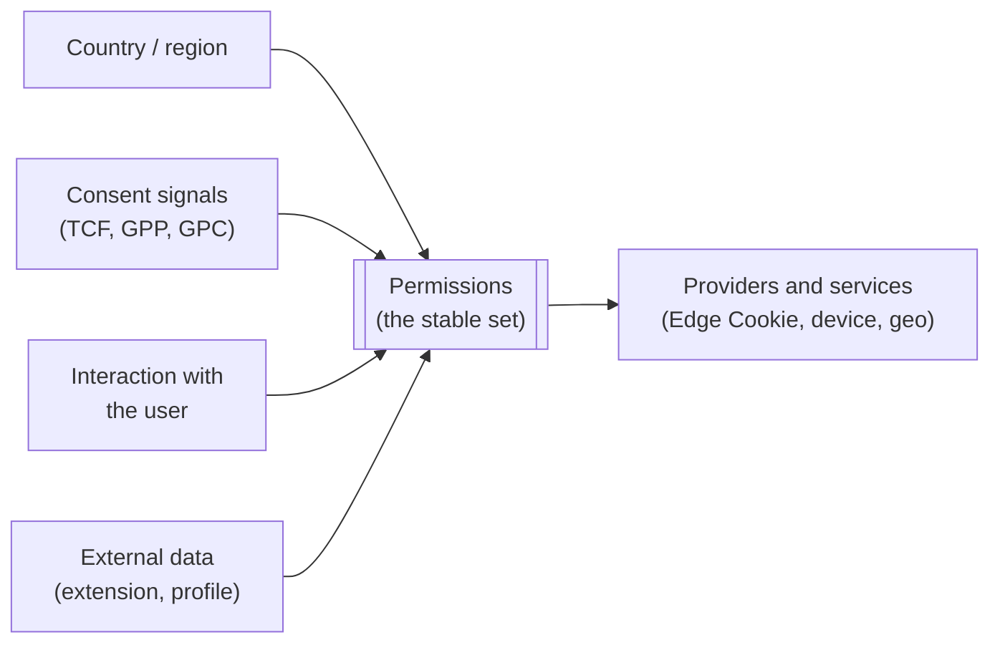
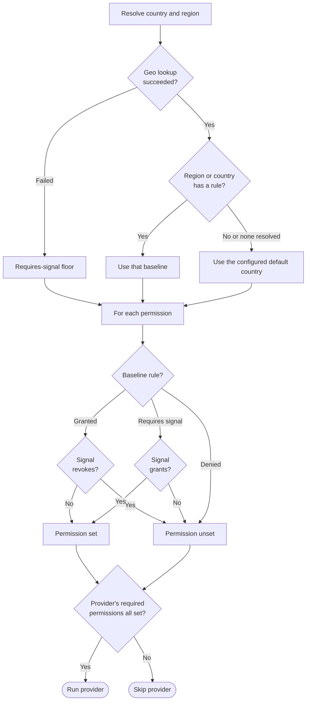

# Permission Model

Trusted Server runs an Edge Cookie, device, or geo provider only when the
technical permissions that provider requires are set. The permission model is
how a deployer's policy decides whether those permissions are set, without that
policy being baked into the core.

## Privacy is a spectrum

Privacy is a spectrum, not a binary, and Trusted Server is technology that is
neutral on policy. Different deployers operate under different laws and run
different policies, so it is the deployer who decides how to configure the
stack. Trusted Server provides the mechanism to establish and check permissions,
and the deployer brings the policy that decides how permissions are established
and what they allow.

The default deployment makes no host-specific call, creates no identifiers, and
resolves no location until an operator enables a provider. It requires exactly
one policy decision, the default jurisdiction baseline (`[geo] default_country`).
Trusted Server does not assume a jurisdiction for you, so you declare one, and
the examples use the most protective baseline (GDPR-EU). With no Edge Cookie
provider selected there is nothing to gate, so no identifier is created and the
request proceeds.

## Separating legal policy from the core

The core does not encode any jurisdiction's law or any single policy. A provider
advertises the technical permissions its data use requires, and the core runs
the provider only when every required permission is set. A provider that
requires nothing always runs, so a vendor-neutral default shows no consent
dialogue and needs no per-request policy interaction.

## Permission sources

Permissions are the single currency every service and provider reads. A provider
never reads consent, a consent framework, or any other source directly. It sees
only the resulting permissions, so it cannot depend on how they were derived.



A request's permissions are set by one or more **permission sources**. Consent
is one source among several, not the basis for every permission:

- **Country and region.** The baseline position for a jurisdiction, from the geo
  provider, keyed by ISO 3166-1 with an optional region such as a US state. When
  no country is identified, or the country/region has no rule, the deployer's
  configured default country applies. A default is required, so there is always
  one.
- **Consent signals.** TCF, GPP, or GPC decoded from the request, mapped onto
  permissions as a grant or a revoke on top of the baseline.
- **Interaction with the user.** A publisher may establish a preference because
  it chooses to, not only because a law requires it.
- **Data from another source.** For example a browser extension, or a person's
  profile from an external service.

The model gates on whether a permission is _set_, not on how it was
established, so any of these sources plugs into the same mechanism.

### Why this matters

Implementors of services, features, and providers are protected from the method
used to derive the current request's permissions. They work against a clean,
stable set of permissions that does not change when laws, consent frameworks, or
signal sources change. A new GPP section, a new opt-out signal, or a revised
jurisdiction rule changes a _source_, never the permission a provider checks.

If a source carries a distinction a consumer needs but no existing permission can
express, the fix is to add a permission to the model, never to leak the source
into the consumer.

## The permission vocabulary

The permission names are IAB Privacy Taxonomy Data Uses, mapped from the IAB TCF
Europe purposes and used **only** as technical identifiers. No CMP or TCF policy
is implemented in the core. Two purposes have no Data Use yet: purpose 1 (device
storage) uses a proposed `necessary.operations.storage` key, and purpose 11
keeps its TCF identifier `select-basic-content`. Both are flagged for an upstream
taxonomy addition. All eleven purposes are now resolved against the incoming
consent and privacy signals. A present TCF record grants or revokes each purpose
directly, and where no TCF record is present a US-style opt-out (GPC, a GPP sale
opt-out, or a US Privacy opt-out) is honored. The remaining taxonomy Data Uses
have no TCF purpose, so no signal maps to them and their configured baseline
stands. The mapping itself, which TCF purpose grants which Data Use and what a
US-style opt-out revokes, is declared in the `signals` section of
`permissions.yaml`, not in the code, so a deployer changes policy by editing that
file.

`permissions.yaml` carries a policy flag for **every** Data Use in the taxonomy,
not only the eleven below. The eleven have a dedicated identifier because a
provider may gate on them. Every other Data Use is listed for completeness and,
where no informed policy decision has been made, is `denied` by default. Trusted
Server is not the policy authority, so a deployer sets the flags to match its own
jurisdiction rules.

The eleven named Data Uses, with the TCF purpose each maps from:

| #   | Data Use identifier                             | IAB TCF Europe purpose                          |
| --- | ----------------------------------------------- | ----------------------------------------------- |
| 1   | `necessary.operations.storage`                  | Store and/or access information on a device     |
| 2   | `advertising_marketing.first_party.contextual`  | Use limited data to select advertising          |
| 3   | `advertising_marketing.profiling`               | Create profiles for personalised advertising    |
| 4   | `advertising_marketing.first_party.targeted`    | Use profiles to select personalised advertising |
| 5   | `advertising_marketing.personalize.profiling`   | Create profiles to personalise content          |
| 6   | `advertising_marketing.personalize.content`     | Use profiles to select personalised content     |
| 7   | `analytics.ad_reporting.measure_ad_performance` | Measure advertising performance                 |
| 8   | `analytics.ad_reporting.content_performance`    | Measure content performance                     |
| 9   | `analytics.ad_reporting.market_research`        | Understand audiences through statistics         |
| 10  | `necessary.operations.improve`                  | Develop and improve services                    |
| 11  | `select-basic-content`                          | Use limited data to select content              |

## How providers use permissions

A provider advertises a required permission set. The core resolves the
permissions it has set for the request, then runs the provider only when every
required permission is set.

| Provider                  | Requires                       | Effect when not set       |
| ------------------------- | ------------------------------ | ------------------------- |
| Built-in HMAC Edge Cookie | `necessary.operations.storage` | No Edge Cookie is created |
| A vendor-neutral provider | nothing                        | Always runs               |

The Edge Cookie `Set-Cookie` operation always requires `necessary.operations.storage`
(Purpose 1), because writing the cookie stores information on the device.

## Groups and rules

The policy lives in a human-editable `permissions.yaml` at the repository root,
compiled into the build, so policy owners read and change it in version control.
It has two parts. **Groups** are named baselines, each a set of permission flags.
**Rules** map a country, or a country and state, to a group. The keys are the
codes a geo provider returns, matched case-insensitively. The country is an
ISO 3166-1 alpha-2 code (`FR`), and a state adds the ISO 3166-2 subdivision code
with no country prefix (`US/CA` is California). The Fastly and other geo
providers both emit these codes directly. A region rule takes precedence over its
country. A request that matches no rule, or whose country the geo provider could
not resolve, uses the deployer's configured default country
(`[geo] default_country`). A default is required, so there is always one.

The country and region rules set only the **baseline** position. They say what
is permitted before any session signal, not what a deployer must ask the user
for. Session signals are then layered on top, and the deployer's own policy
decides how those signals are gathered.

Each permission flag in a group is one of three acquisition rules, which a
session signal can then change:

| Flag              | Baseline, and how a session signal changes it                       |
| ----------------- | ------------------------------------------------------------------- |
| `granted`         | Set by default, unless a signal revokes it (for example an opt-out) |
| `requires_signal` | Not set by default, set only when a signal grants it                |
| `denied`          | Never set, even when a signal grants it                             |

A group lists every permission and its flag, so its meaning is explicit in the
file. (A group may instead give a single `default` flag for any permission it
omits, but the shipped groups spell every one out.) A rule may then make small
per-permission tweaks on top of its group with a `permissions` map from Data
Use to flag (`granted`, `requires_signal`, or `denied`), each entry overriding
the group baseline for that Data Use.

### Why three states, not two

`requires_signal` and `denied` both start unset, so they can look like the same
"off" state, but they answer different questions and a session signal treats
them differently.

- `requires_signal` means the Data Use is permitted **with** a signal. A grant,
  for example TCF consent to the mapped purpose, sets it.
- `denied` means the Data Use is not permitted here at all. A grant **cannot**
  set it. This models a jurisdiction where there is no lawful basis for the use,
  so a consent signal is irrelevant.

For a worked example, take a deployer who sets
`advertising_marketing.profiling: denied` for a country that does not permit
profiling. A request arrives with a TCF string that consents to Purpose 3
(create profiles for personalised advertising), which maps to that Data Use. The
resolver pairs the `denied` baseline with the grant signal and still leaves the
permission **unset**, so a provider that requires profiling does not run. The
same consent against a `requires_signal` baseline would set it. Consent lifts
`requires_signal`; it never lifts `denied`.

The shipped `permissions.yaml` defines `gdpr-eu`, `gdpr-uk`, and `us-opt-out`
groups, and maps the EU 27 and the EEA members (IS, LI, NO) to `gdpr-eu`, the
UK to `gdpr-uk`, and the US (with all 50 states and DC) and Australia to
`us-opt-out`. For device storage (Purpose 1), that yields:

| Country        | Device storage (Purpose 1)                                      |
| -------------- | --------------------------------------------------------------- |
| EU 27 and EEA  | Requires signal (opt-in)                                        |
| United Kingdom | Granted (no signal required under the reformed ePrivacy regime) |
| United States  | Granted (opt-out)                                               |
| Australia      | Granted                                                         |

These are defaults to modify or replace, not legal advice. The deployer must set
the default country for unmatched requests in `trusted-server.toml`
(`[geo] default_country`). It is required and validated at startup against these
rules, so startup fails when it is unset or names no rule. A rule that names a
group not defined in the file, or a flag that is not `granted`,
`requires_signal`, or `denied`, is rejected at build time, so a typo is caught
rather than silently ignored.

## How a request resolves

A permission is _set_ when Trusted Server may rely on it for this request, and
unset otherwise. A provider runs only when every permission it requires is
set.

Signal precedence is fixed in code, most restrictive first. A US-style opt-out
(GPC, a GPP sale opt-out, or a US Privacy opt-out) suppresses the Data Uses
the policy revokes even when a TCF record consents, because an explicit
opt-out is never overridden by another signal. A consent record that is
present but cannot be decoded blocks baseline grants (fail-closed) rather
than degrading to the no-signal baseline. Only then does a TCF record decide
the Data Uses its purposes map to. Opt-outs suppress use for the request;
they never destroy an already-issued identifier. Destructive withdrawal (the
cookie expired and the identity-graph row tombstoned) happens only when a TCF
record refuses storage in a jurisdiction whose baseline did not grant it.



## Configuration

The geo provider, which resolves the country, and the default country for
unmatched requests are selected in `trusted-server.toml`. The country and region
rules live in the human-editable `permissions.yaml` at the repository root,
compiled into the build (not loaded at runtime).

```toml
# trusted-server.toml selects the geo provider and the default country used when
# a request matches no rule (or the geo provider resolves no country).
[geo]
provider = "platform"
default_country = "US"
# With no geo provider, every request is treated as default_country. A
# deployment that runs an Edge Cookie provider without a geo provider must
# acknowledge that explicitly:
# assume_single_jurisdiction = true
```

The default country covers requests the geo provider leaves unmatched. A
failed geo lookup is different: it resolves every permission to the
requires-signal floor instead of the default, so an outage is handled
protectively rather than as the deployer's default jurisdiction, and it is
logged at error level.

```yaml
# permissions.yaml (excerpt). Each group lists every permission and its flag.
# Rules map countries and states to a group.
groups:
  gdpr-eu: # opt-in, every purpose requires a signal
    necessary.operations.storage: requires_signal
    advertising_marketing.first_party.contextual: requires_signal
    # ... the remaining purposes, also requires_signal
  us-opt-out: # opt-out, every purpose granted
    necessary.operations.storage: granted
    advertising_marketing.first_party.contextual: granted
    # ... the remaining purposes, also granted

rules:
  FR: gdpr-eu
  US: us-opt-out
  US/CA: # a state can override single flags on top of its group
    group: us-opt-out
    permissions:
      advertising_marketing.first_party.targeted: denied
```

## Relationship to Edge Cookies

Edge Cookie creation is gated through this model: the built-in HMAC provider
requires `necessary.operations.storage`, so an Edge Cookie is created only when that
permission is set. See [Edge Cookies](/guide/edge-cookies) for the full
request lifecycle.
