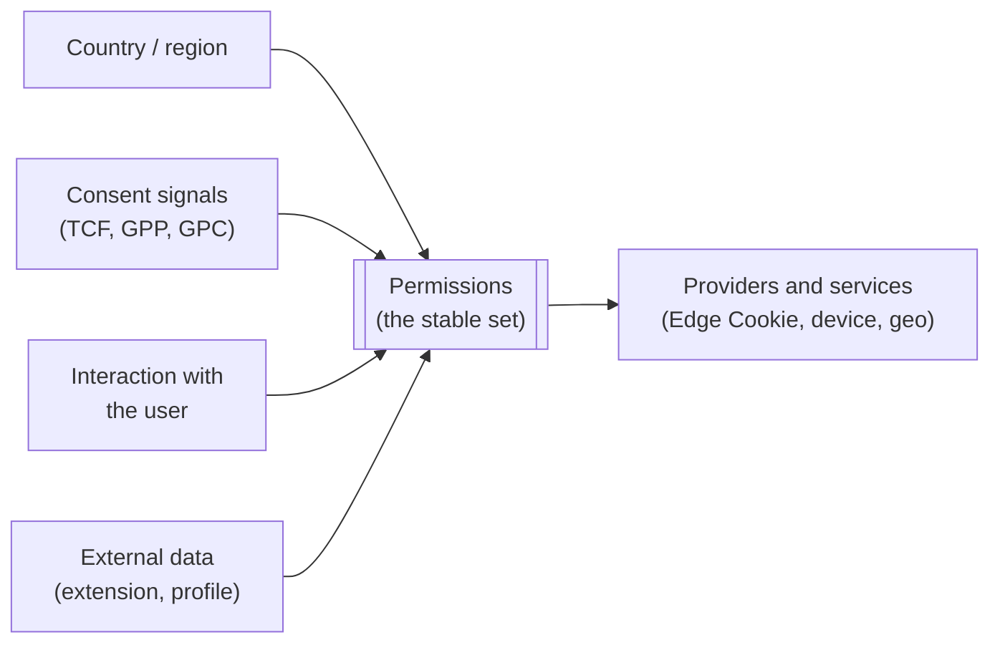
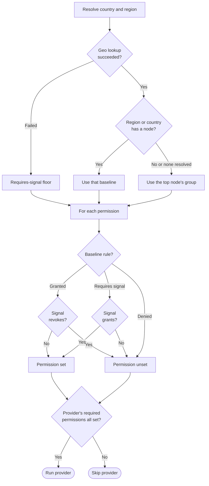

# Permission Model

Trusted Server runs the Edge Cookie provider only when the technical
permissions it requires are set, and the device and geo providers declare
their requirements the same way. The permission model is
how a deployer's policy decides whether those permissions are set, without that
policy being baked into the core.

## Privacy is a spectrum

Privacy is a spectrum, not a binary, and Trusted Server is technology that is
neutral on policy. Different deployers operate under different laws and run
different policies, so it is the deployer who decides how to configure the
stack. Trusted Server provides the mechanism to establish and check permissions,
and the deployer brings the policy that decides how permissions are established
and what they allow.

The default deployment makes no host-specific call, creates no identifiers, and
resolves no location until an operator enables a provider. It requires exactly
one policy decision, the baseline that applies when no country can be resolved,
which is stated at the top of the `rules:` tree in `permissions.yaml`. Trusted
Server does not assume a jurisdiction for you, so you declare one, and
the examples use the most protective baseline (GDPR-EU). With no Edge Cookie
provider selected there is nothing to gate, so no identifier is created and the
request proceeds.

## Where the vocabulary comes from

The permissions are not a vocabulary this project invented. They are the IAB
Tech Lab Privacy Taxonomy Data Uses, with the IAB TCF Europe purposes mapped
onto them where no Data Use exists yet.

That matters for reading the rest of this guide. When a provider declares the
permissions its data use requires, it is naming a Data Use from that taxonomy,
so an operator or an auditor can check the declaration against the taxonomy
rather than against our interpretation of it. The mapping from TCF purposes is
recorded in `permissions.yaml` alongside the rules, so no signal-to-permission
policy is hidden in code.

## Separating legal policy from the core

The core does not encode any jurisdiction's law or any single policy. A provider
advertises the technical permissions its data use requires, and the core runs
the Edge Cookie provider only when every permission that provider requires is
set. An Edge Cookie provider that requires nothing always runs, so a
vendor-neutral default needs no consent prompt and no per-request
policy interaction.

Device and geo providers declare their required permissions through the same
method, and the core does not yet gate either of them on what they declare, so
for those two the declaration is recorded rather than enforced. The only place
a declaration currently decides whether a provider runs is the Edge Cookie
path, in `ec/mod.rs`. Treat a device or geo declaration as a statement of
intent until that gap is closed, and do not rely on it to keep a provider from
running.

## Evidence is not rationed, use is

Every provider sees all the evidence available for a request. Trusted Server
does not decide which vendor is allowed to see which signal, because
withholding a signal from one vendor and not another would discriminate between
them, and the core stays neutral between vendors.

What a vendor may do with what it sees is the part that is governed. A provider
declares the permissions its data use requires, and the permission model decides
whether each one is set. So access is universal and use is gated, rather than
the other way round.

If you are looking for a way to stop a vendor using a signal, the answer is a
permission, not a hidden signal.

## Permission sources

Permissions are the single currency every service and provider reads. A provider
never reads consent, a consent framework, or any other source directly. It sees
only the resulting permissions, so it cannot depend on how they were derived.



A request's permissions are set by one or more **permission sources**. Consent
is one source among many, not the basis for every permission:

- **Country and region.** The baseline position for a jurisdiction, from the geo
  provider, keyed by ISO 3166-1 with an optional region such as a US state. When
  a region has no rule of its own the country's rule applies, and when no
  country is identified, or the country has no rule either, the baseline at the
  top of the rules tree applies. That top baseline is required, so there is
  always one.
- **Consent signals.** TCF, GPP, or GPC decoded from the request, mapped onto
  permissions as a grant or a revoke on top of the baseline.
- **Interaction with the user.** A publisher may establish a preference because
  it chooses to, not only because a law requires it.
- **Data from another source.** For example a browser extension, or a person's
  profile from an external service.

The model gates on whether a permission is _set_, not on how it was
established, so any of these sources plugs into the same mechanism.

### Why this matters

Implementors of services, features, and providers are protected from the method
used to derive the current request's permissions. They work against a clean,
stable set of permissions that does not change when laws, consent frameworks, or
signal sources change. A new GPP section, a new opt-out signal, or a revised
jurisdiction rule changes a _source_, never the permission a provider checks.

If a source carries a distinction a consumer needs but no existing permission can
express, the fix is to add a permission to the model, never to leak the source
into the consumer.

## The permission vocabulary

The permission names are IAB Privacy Taxonomy Data Uses, mapped from the IAB TCF
Europe purposes and used **only** as technical identifiers. No CMP or TCF policy
is implemented in the core. Two purposes have no Data Use yet. Purpose 1 (device
storage) uses a proposed `necessary.operations.storage` key, and purpose 11
keeps its TCF identifier `select-basic-content`. Both are flagged for an upstream
taxonomy addition. All eleven purposes are now resolved against the incoming
consent and privacy signals. A present TCF record grants or revokes each purpose
directly, and a US-style opt-out (GPC, a GPP sale opt-out, or a US Privacy
opt-out) revokes whether or not a TCF record is present. The remaining taxonomy Data Uses
have no TCF purpose, so no signal maps to them and their configured baseline
stands. The mapping itself, which TCF purpose grants which Data Use and what a
US-style opt-out revokes, is declared in the `signals` section of
`permissions.yaml`, not in the code, so a deployer changes policy by editing that
file.

`permissions.yaml` carries a policy flag for **every** Data Use in the taxonomy,
not only the eleven below. The eleven have a dedicated identifier because a
provider may gate on them. Every other Data Use is listed for completeness and,
where no informed policy decision has been made, is `denied` by default. Trusted
Server is not the policy authority, so a deployer sets the flags to match its own
jurisdiction rules.

The eleven named Data Uses, with the TCF purpose each maps from:

| #   | Data Use identifier                             | IAB TCF Europe purpose                          |
| --- | ----------------------------------------------- | ----------------------------------------------- |
| 1   | `necessary.operations.storage`                  | Store and/or access information on a device     |
| 2   | `advertising_marketing.first_party.contextual`  | Use limited data to select advertising          |
| 3   | `advertising_marketing.profiling`               | Create profiles for personalised advertising    |
| 4   | `advertising_marketing.first_party.targeted`    | Use profiles to select personalised advertising |
| 5   | `advertising_marketing.personalize.profiling`   | Create profiles to personalise content          |
| 6   | `advertising_marketing.personalize.content`     | Use profiles to select personalised content     |
| 7   | `analytics.ad_reporting.measure_ad_performance` | Measure advertising performance                 |
| 8   | `analytics.ad_reporting.content_performance`    | Measure content performance                     |
| 9   | `analytics.ad_reporting.market_research`        | Understand audiences through statistics         |
| 10  | `necessary.operations.improve`                  | Develop and improve services                    |
| 11  | `select-basic-content`                          | Use limited data to select content              |

## How providers use permissions

A provider advertises a required permission set. The core resolves the
permissions it has set for the request, then runs the Edge Cookie provider only
when every permission that provider requires is set. Device and geo providers
advertise a set in the same way, and nothing gates them on it yet, so the table
below lists only the provider whose declaration currently decides whether it
runs.

| Provider                  | Requires                       | Effect when not set       |
| ------------------------- | ------------------------------ | ------------------------- |
| Built-in HMAC Edge Cookie | `necessary.operations.storage` | No Edge Cookie is created |
| A vendor-neutral provider | nothing                        | Always runs               |

The Edge Cookie `Set-Cookie` operation always requires `necessary.operations.storage`
(Purpose 1), because writing the cookie stores information on the device.

## Groups and rules

The policy lives in a human-editable `permissions.yaml` at the repository root,
compiled into the build, so policy owners read and change it in version control.
It has two parts. **Groups** are named baselines, each a set of permission flags.
**Rules** are a single tree that says which group applies where.

### Reading and editing the rules tree

Every node of the tree has a `group`, and children are optional. A child key is
a place code, so the keys directly under `rules:` are ISO 3166-1 alpha-2 country
codes (`FR`, `US`, `GB`), and the keys beneath a country are ISO 3166-2 region
codes with no country prefix (`CA` is California). Codes are matched
case-insensitively, so `us` and `US` name the same place. Where a code sits
also tells two identical codes apart, since `DE` at the first level is Germany
and `DE` under `US` is Delaware. These are the codes a
geo provider returns. The Fastly geo provider emits them directly, and any other
provider must do the same.

A node can be written two ways. The shorthand is a single string, which becomes
that node's `group` and gives it no children, so `GB: gdpr-uk` is a complete
rule. The longer form is a mapping, which must contain `group:` and may carry
child place codes beside it. A reserved key can never be mistaken for a place,
because an ISO code is at most three characters long.

Any node may also carry `jurisdiction:` beside its `group:`, naming the consent
handling for the places that node covers. A node that carries none inherits the
nearest ancestor that does. The top node, meaning the `rules:` mapping itself,
is the one node that must carry both, so the inheritance always ends somewhere
and every place in the tree has an answer. The top node is also the answer for a
visitor whose country cannot be resolved, whose baseline is the top `group` and
whose consent handling is the top `jurisdiction`.

The accepted values are the states of the `Jurisdiction` type in
`crates/trusted-server-core/src/consent/jurisdiction.rs`, which the rest of the
stack already uses:

| Value           | Meaning                                                                                                                     | Where it may be written       |
| --------------- | --------------------------------------------------------------------------------------------------------------------------- | ----------------------------- |
| `gdpr`          | GDPR handling, being `Jurisdiction::Gdpr`, which appears in logs as `GDPR`                                                  | Any node                      |
| `us-state`      | A US state with a comprehensive privacy law, being `Jurisdiction::UsState`. The node names the state, so the value does not | A region node under `US` only |
| `non-regulated` | The place is known and matches no regulation, being `Jurisdiction::NonRegulated`                                            | Any node                      |
| `unknown`       | The jurisdiction cannot be determined, being `Jurisdiction::Unknown`                                                        | Any node                      |

Anything else is a configuration error rather than a silent default. Write the
value in lower case. `us-state` carries no state code, because the node it sits
on already names the state, which is why it is rejected at the top of the tree
and on a country node, neither of which names one.

Matching is most specific wins, and `group` and `jurisdiction` fall back the
same way. Trusted Server tries the region node, then the country node, then the
top node, taking the first `group` it finds and the first `jurisdiction` it
finds, which need not come from the same node. A geo lookup **failure** is a
different state from having no location. It keeps the requires-signal floor
described below and its jurisdiction is `unknown`, rather than reaching the tree
at all.

```yaml
rules:
  group: gdpr-eu
  # Inherited by every country not overriding it, and the answer when no
  # country resolves.
  jurisdiction: gdpr
  GB: gdpr-uk # inherits gdpr
  US:
    group: us-notice
    jurisdiction: non-regulated
    CA:
      group: us-opt-out
      jurisdiction: us-state
    NY: us-notice # inherits non-regulated
```

Read that tree as follows. A Manchester visitor gets `gdpr-uk` under GDPR
handling, inherited from the top. A Californian visitor gets `us-opt-out` under
that state's own opt-out handling. A Texas visitor gets `us-notice` under
`non-regulated` handling, both through the `US` node, because no `TX` child
exists. A visitor whose country cannot be resolved gets `gdpr-eu` under GDPR
handling, both stated at the top.

Startup rejects a file whose top node has no `group` or no `jurisdiction`, in
the same way a missing default country was rejected before, so the unknown case
is always answered in the file rather than assumed by the code.

Because the tree now says which regime applies where, the older consent
settings `[consent.gdpr] applies_in` and `[consent.us_states] privacy_states`
retire into it. The shipped `permissions.yaml` carries the same 31 GDPR
countries, being the EU 27 plus Iceland, Liechtenstein, Norway and the United
Kingdom, each inheriting `gdpr` from the top node, and the same 20 US states
with a comprehensive privacy law, written as region children of `US` carrying
`jurisdiction: us-state`. One file therefore holds the baselines and the regime
applicability together, so a policy owner reads and changes both in one place
instead of keeping two lists in step.

The country and region rules set only the **baseline** position. They say what
is permitted before any session signal, not what a deployer must ask the user
for. Session signals are then layered on top, and the deployer's own policy
decides how those signals are gathered.

Each permission flag in a group is one of three acquisition rules, which a
session signal can then change:

| Flag              | Baseline, and how a session signal changes it                       |
| ----------------- | ------------------------------------------------------------------- |
| `granted`         | Set by default, unless a signal revokes it (for example an opt-out) |
| `requires_signal` | Not set by default, set only when a signal grants it                |
| `denied`          | Never set, even when a signal grants it                             |

A group lists every permission and its flag, so its meaning is explicit in the
file. (A group may instead give a single `default` flag for any permission it
omits, but the shipped groups spell every one out.) A node written as a mapping
may then make small per-permission tweaks on top of its group with a
`permissions` map from Data Use to flag (`granted`, `requires_signal`, or
`denied`), each entry overriding the group baseline for that Data Use.

### Why three states, not two

`requires_signal` and `denied` both start unset, so they can look like the same
"off" state, but they answer different questions and a session signal treats
them differently.

- `requires_signal` means the Data Use is permitted **with** a signal. A grant,
  for example TCF consent to the mapped purpose, sets it.
- `denied` means the Data Use is not permitted here at all. A grant **cannot**
  set it. This models a jurisdiction where there is no lawful basis for the use,
  so a consent signal is irrelevant.

For a worked example, take a deployer who sets
`advertising_marketing.profiling: denied` for a country that does not permit
profiling. A request arrives with a TCF string that consents to Purpose 3
(create profiles for personalised advertising), which maps to that Data Use. The
resolver pairs the `denied` baseline with the grant signal and still leaves the
permission **unset**, so a provider that requires profiling does not run. The
same consent against a `requires_signal` baseline would set it. Consent lifts
`requires_signal`; it never lifts `denied`.

The shipped `permissions.yaml` defines `gdpr-eu`, `gdpr-uk`, and `us-opt-out`
groups, and maps the EU 27 and the EEA members (IS, LI, NO) to `gdpr-eu`, the
UK to `gdpr-uk`, and the US (a country node whose region children are the 20
states with a comprehensive privacy law, each carrying `jurisdiction: us-state`)
and Australia to `us-opt-out`. For device storage (Purpose 1), that yields:

| Country        | Device storage (Purpose 1)                                      |
| -------------- | --------------------------------------------------------------- |
| EU 27 and EEA  | Requires signal (opt-in)                                        |
| United Kingdom | Granted (no signal required under the reformed ePrivacy regime) |
| United States  | Granted (opt-out)                                               |
| Australia      | Granted                                                         |

These are defaults to modify or replace, not legal advice. The deployer states
the baseline for an unresolved request at the top of the rules tree, through its
`group` and its `jurisdiction`. Both are required and are validated at startup,
so startup fails when either is missing or when the `group` names nothing
defined in the file. A node that names a
group not defined in the file, or a flag that is not `granted`,
`requires_signal`, or `denied`, is rejected at build time, so a typo is caught
rather than silently ignored.

## How a request resolves

A permission is _set_ when Trusted Server may rely on it for this request, and
unset otherwise. The Edge Cookie provider runs only when every permission it
requires is set, which is the one place a declaration currently decides whether
a provider runs.

Signal precedence is fixed in code, most restrictive first. A US-style opt-out
(GPC, a GPP sale opt-out, or a US Privacy opt-out) suppresses the Data Uses
the policy revokes even when a TCF record consents, because an explicit
opt-out is never overridden by another signal. A consent record that is
present but cannot be decoded blocks baseline grants (fail-closed) rather
than degrading to the no-signal baseline. Only then does a TCF record decide
the Data Uses its purposes map to. Opt-outs suppress use for the request;
they never destroy an already-issued identifier. Destructive withdrawal (the
cookie expired and the identity-graph row tombstoned) happens only when a TCF
record refuses storage in a jurisdiction whose baseline did not grant it.



The "Failed" branch is the rule for a geo provider that can report a failed
lookup. None of the providers shipped today can, so a geo outage takes the
"No or none resolved" branch instead. See the note on the top node below.

## How the resolved permissions reach downstream code

The permission state is resolved once, at the start of the request cycle in
`EcContext::read_from_request`, before any integration request filter or route
handler runs. Everything downstream reads that one result rather than deriving
its own, so there is a single decision per request.

**Server side.** An integration request filter receives
`permissions: Option<&PermissionState>` on its `RequestFilterInput`, alongside
the geo result it already receives, so a filter can skip or narrow what it does
when a permission it depends on is unset. None of the shipped filters changes
its behavior on that input yet, so for now the state is carried and available
rather than acted on.

**Page side.** The same resolved state reaches the page as
`window.tsjs.permissions`, an object listing the Data Use names that are set for
this request. The names are the ones used everywhere else in this guide, being
the `permissions.yaml` keys and `Permission::as_str()`.

```json
{
  "set": [
    "necessary.operations.storage",
    "analytics.ad_reporting.market_research"
  ]
}
```

Delivery follows the pattern already used for `adSlots` and `bids`, and the
timing depends on how the page is assembled. Under inline assembly the value is
injected as a `<script>` at the open of `<head>`, before the tsjs bundle, on
every HTML document, so it is there before any page module runs. Under
shared-template (ESI) assembly the `<head>` is part of a template shared across
visitors and must carry nothing request-scoped, so the value is spliced into the
per-request script at the `</body>` seam instead. A permissions-only seam script
is emitted even when the ad stack did not run, so a visitor whose consent was
denied or who was classified as a bot still receives the state, empty in that
case rather than missing.

Because the arrival point moves, a page module must not read `tsjs.permissions`
directly at load. TSJS core defaults the value to `{ set: [] }` and exposes
`tsjs.whenPermissions()`, a promise that resolves when the real value arrives,
immediately in the head-first case or at the body seam, with a
`DOMContentLoaded` fallback. That promise is the waiting point for a vendor page
module, which does nothing with identity and contacts no vendor until the
promise resolves. Wiring the existing integrations' JavaScript to wait on it is
follow-up work.

The page cannot work this out for itself. Consent is only one of the ways a
permission is set, and the country and region baselines and the deployer's
configuration live on the server, so a CMP read in the page cannot reproduce the
server's decision. The server decision is the authority, and an in-page CMP read
is at most a withdrawal re-check under it, able to narrow what the server
resolved and never to widen it.

## Configuration

The geo provider, which resolves the country, is selected in
`trusted-server.toml`. The rules tree, including the baseline for a request with
no resolvable country, lives in the human-editable `permissions.yaml` at the
repository root, compiled into the build (not loaded at runtime).

```toml
# trusted-server.toml selects the geo provider. The baseline used when a request
# matches no node, or the geo provider resolves no country, is stated at the top
# of the rules tree in permissions.yaml.
[geo]
provider = "platform"
# With no geo provider, every request resolves at the top of the rules tree. A
# deployment that runs an Edge Cookie provider without a geo provider must
# acknowledge that explicitly:
# assume_single_jurisdiction = true
```

The top of the tree covers requests the geo provider leaves unmatched. A
failed geo lookup is different, because it resolves every permission to the
requires-signal floor instead of the top baseline, and is logged at error level.

Read that alongside which lookups can actually fail, because it decides how
much the top baseline is doing for you. None of the geo providers shipped
today can fail. Fastly's lookup returns "no data" rather than an error, the
Cloudflare provider reads request headers, and the Axum and Spin providers
resolve nothing at all. **A geo outage therefore reaches the top baseline,
not the floor**, because "no data" and "the deployer left this unmatched" are
the same state. Choose the top `group` and `jurisdiction` on that basis, meaning
whatever they grant is what an outage grants. The floor applies to a geo
provider that does its own lookup and can report a failure.

```yaml
# permissions.yaml (excerpt). Each group lists every permission and its flag.
# The rules tree maps places to a group and a jurisdiction, countries first,
# then regions beneath, with each node inheriting what it does not state.
groups:
  gdpr-eu: # opt-in, every purpose requires a signal
    necessary.operations.storage: requires_signal
    advertising_marketing.first_party.contextual: requires_signal
    # ... the remaining purposes, also requires_signal
  us-opt-out: # opt-out, every purpose granted
    necessary.operations.storage: granted
    advertising_marketing.first_party.contextual: granted
    # ... the remaining purposes, also granted

rules:
  group: gdpr-eu # when no country can be resolved
  jurisdiction: gdpr # inherited by every node that states none
  FR: gdpr-eu
  US:
    group: us-opt-out
    jurisdiction: non-regulated
    CA: # a region can override single flags on top of its group
      group: us-opt-out
      jurisdiction: us-state
      permissions:
        advertising_marketing.first_party.targeted: denied
```

## Relationship to Edge Cookies

Edge Cookie creation is gated through this model, because the built-in HMAC provider
requires `necessary.operations.storage`, so an Edge Cookie is created only when that
permission is set. See [Edge Cookies](/guide/edge-cookies) for the full
request lifecycle.
