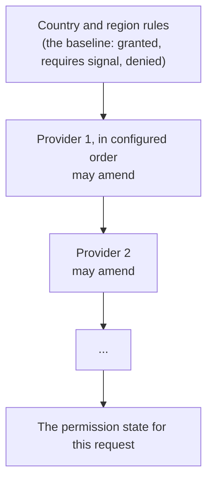

# Permission Signals

The [permission model](./permission-model) decides whether a permission is
set. This page is about where the signals that amend it come from, and why
none of them is built into the core.

## Providers, not a built-in list

A permission signal provider answers for one scheme. Global Privacy Control is
one, the sale opt-out carried in a GPP string is another, a US Privacy string
a third, and a TCF v2 record a fourth. Each is a crate that depends on the
core, implements one trait, and is linked by the adapter that runs it. The
core holds the trait, the order the providers are asked in, the country and
region baseline, and the policy vocabulary for what a deployment decides about
the shipped schemes, being whether a TCF record answers, which signals count as
a US-style opt-out and what an opt-out takes away. It holds no scheme's wire
format and no scheme's meaning.

That is deliberate. Privacy is a non-price factor of competition. Publishers,
browsers and standards bodies compete on it, and schemes come and go.
Compiling a closed list of schemes into the core would settle that competition
in code, because the schemes built in would be the only ones a deployment
could act on, and the core maintainers would be deciding which privacy schemes
exist. So the four that ship are crates like any other, none of them
privileged by being the one that happens to be built in, and a scheme the core
has never heard of plugs in the same way.

The core also does not know what a TCF purpose is. The mapping from TCF
purpose to Data Use lives in the TCF provider crate, so a deployment that runs
no TCF carries no table of another scheme's numbers. The purposes are the IAB
TCF Europe purposes and what they grant are IAB Tech Lab Privacy Taxonomy Data
Uses, so a reader checks the mapping against the industry's own documents
rather than against us, and the [permission model](./permission-model) guide
lists it in full. Two purposes have no Data Use yet, so the crate carries a
proposed key for one and the TCF identifier for the other until the taxonomy
adds them.

A scheme that is not one of the four is added the same way, as a crate that
reads its own signal from the request, without a change to the core. The next one
is Model Terms for Marketing (MTM), where a publisher and the parties it passes
data to agree to be bound by a published set of terms, and what a provider
reads is whether that agreement covers this request. MTM arrives in a following
pull request, and it is one of many terms schemes rather than the only one,
because a publisher, a trade body or a regulator can each publish terms and
each set becomes a provider. The four here are a starting set and not the list.

## How a request resolves

Permissions are resolved in layers, each amending the one before.



The baseline comes from `permissions.yaml`, keyed by country and region, with
the top node of the rules tree standing in for a request whose place is
unknown. The geo provider supplies the place. No geo provider means no country,
so every request resolves at that top node, and only a lookup that failed
resolves at the requires-signal floor, because a place that could not be
determined must not be treated as the declared default.

The providers are then asked in order. Each sees what the providers before it
settled on and may amend it. A provider with no opinion answers neutral and
leaves the prior value standing, which is different from refusing.

## The order is the policy

The last provider with an opinion decides, so the order is the policy. It is a
deployment's to set, not the code's to assume.

```toml
[permission_signal]
sources = ["gpc", "gpp-sale-opt-out", "us-privacy", "tcf"]
```

A provider not on the list does not run, and there is no separate switch. A
publisher who does not want to act on Global Privacy Control removes `"gpc"`
from the list, and the provider that reads the header then does not run. One
caveat: the core's consent pipeline can also synthesize a US Privacy opt-out
from that header for a visitor in a US state, when the consent settings say to,
which they do by default, and the `us-privacy` provider then acts on the record
it produced. A publisher who wants the header to have no effect at all turns
that setting off as well. Leaving the section out entirely runs every provider
the adapter offers, in the order it offers them, so a signal is never quietly
ignored because someone forgot to list it. An empty list runs none of them,
which is a publisher acting on no signal at all, and leaves every permission
at its country and region baseline.

A name matching no provider the adapter links, or a name given twice, is
refused at startup rather than ignored, so a typo cannot silently stop a
scheme being honored. What ran, and what was left out, is written to the log
once at startup.

The default order asks the signal with no interface of its own first and the
ones carrying a choice made through an interface after. Global Privacy
Control is a browser setting, so it revokes personalization on arrival,
whereas a GPP sale opt-out, a US Privacy string and a TCF record each carry
an answer a person gave, so they are asked later and amend it. A deployment
wanting the browser setting to stand over a later answer puts `gpc` last.
Trusted Server takes no view on which scheme should win, because that is a
question about a jurisdiction and a publisher.

## The providers that ship

| Identifier         | Crate                                 | Reads                                             |
| ------------------ | ------------------------------------- | ------------------------------------------------- |
| `gpc`              | `crates/permission-signal/gpc`        | The `Sec-GPC` header, Global Privacy Control      |
| `gpp-sale-opt-out` | `crates/permission-signal/gpp`        | The US sale opt-out carried in a GPP string       |
| `us-privacy`       | `crates/permission-signal/us-privacy` | The sale opt-out in a US Privacy string           |
| `tcf`              | `crates/permission-signal/tcf`        | A TCF v2 record, with the purpose mapping in code |

The three opt-outs are separate so that a publisher who does not act on Global
Privacy Control can remove it and keep the other two. What an opt-out takes
away, and whether a TCF record answers for the deployment at all, remain the
policy's decisions in the `signals` section of `permissions.yaml`, so a
deployment changes those without changing a provider.

## The terms the data is available under

A provider may also declare the terms documents the request's data is available
under, and the permission state carries what every configured provider declared,
in the order they were asked. The page reads them as `tdls` alongside `set`:

```json
{
  "set": ["necessary.operations.storage"],
  "tdls": ["https://terms.example.com/marketing/2.txt"]
}
```

Whoever receives the data reads them to decide whether those are terms they
accept, and whether they may pass the data on. An empty list says no terms were
declared, which is not the same as terms permitting anything, so a recipient
needing a basis and finding none has none.

Each entry is the address of a published document a person can read, and the
document must never be edited once published, which is why a version belongs in
its address. A document that can be rewritten tomorrow means a recipient can
never prove what it agreed to, and one edit silently rewrites the basis of every
transaction already sent under it.

None of the four schemes that ship carries terms, so the list is empty until a
terms scheme runs. Model Terms for Marketing (MTM) is the first of many rather
than the only one, since a publisher, a trade body or a regulator can each
publish terms and each set becomes a provider.

## Withdrawal is a separate question

A provider may also say that the request explicitly withdraws a permission,
which is different from not granting it. A withdrawal of storage expires the
browser cookie and writes the authoritative tombstone against the identifier.
A permission that is merely not set strips the response headers and leaves an
already issued identifier alone, so a returning visitor is not permanently
withdrawn before they get to answer.

Most schemes have no such notion, a browser setting and a sale opt-out
included, and of the four that ship only TCF answers it. The core then scopes
the answer to the jurisdiction, so a refusal only withdraws where the storage
baseline did not grant storage outright, because where it did the identifier
never depended on the record.

## What is not a provider

A consent record that arrives and cannot be read revokes, ahead of the
providers and whichever of them are configured. That is error handling rather
than a signaling scheme, so it is not in the list and cannot be removed. A
publisher chooses which signals to act on, but not what happens when one of
those signals arrives unreadable. An unreadable record is a preference
someone expressed that could not be read, which is not the same as no
record at all, so it must not degrade to the no-signal baseline.

## Adding a scheme

1. Create a crate that depends on `trusted-server-core` and implements
   `PermissionSignalProvider` from `trusted_server_core::permission_signal`.
   Give it a stable identifier, which is the name configuration uses.
2. Answer neutral for a permission the scheme has no opinion on, including
   when its signal is absent from the request. Reading an absent signal as a
   refusal would revoke the permission on every request that did not carry
   the scheme, which is most of them.
3. Read the request through the evidence the seam offers, which is the
   headers, cookies, path and query, so the core keeps no list of what a
   scheme may read. The decoded consent record is offered too, for the
   schemes the consent pipeline already decodes, caches against the
   identifier and expires, and a provider for one of those should read the
   record rather than the wire, so it answers the same as every other reader
   of the same request.
4. Link the crate at the adapter's composition root, in the list of providers
   it offers, and give it a place in the default order.

The trait, the input a provider receives, and the rules for consulting a peer
are documented in the module itself, at
`crates/trusted-server-core/src/permission_signal/README.md`.
