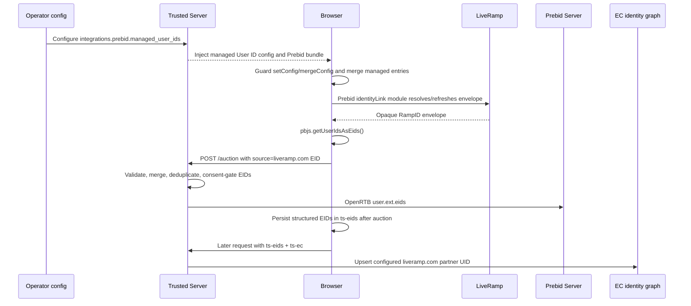

# LiveRamp Integration Design

**Issue:** [#355 — Investigate and document LiveRamp integration](https://github.com/IABTechLab/trusted-server/issues/355)

**Parent epic:** [#354 — LiveRamp integration](https://github.com/IABTechLab/trusted-server/issues/354)

**Initiative:** [#55 — Monetization integrations](https://github.com/IABTechLab/trusted-server/issues/55)

**Status:** Draft PR implemented; external live validation partially complete

**Date:** 2026-08-21

**Revised:** 2026-08-31

## 1. Executive summary

LiveRamp integration is feasible in two distinct forms, but they must not be
treated as one protocol:

1. **RampID identity-envelope forwarding through Prebid.js is feasible now.**
   Trusted Server already bundles Prebid's `identityLinkIdSystem`, reads
   `liveramp.com` EIDs through `pbjs.getUserIdsAsEids()`, sends them to
   `/auction`, merges them with EC/KV identities, applies consent gating, and
   forwards them to Prebid Server as OpenRTB `user.ext.eids`.
2. **LiveRamp ATS Direct audience segments are not part of that EID flow.** ATS
   Direct returns a separate segment envelope and has separate subscription,
   storage, TTL, deal-approval, and activation requirements. The cited
   LiveRamp documentation describes activating these values as GAM `atsd`
   targeting, not as a `liveramp.com` EID.

The first implementation makes the existing RampID path operationally complete
through vendor-neutral `managed_user_ids` configuration under the Prebid
integration. The generated bundle command must resolve every managed config
name through the checked-in User ID registry and reject a manifest that omits
the corresponding module. Native server-to-server ATS resolution and ATS
Direct segment activation remain separate follow-up decisions.

## 2. Issue hierarchy and collected requirements

The GitHub issue hierarchy is:

```text
#55 Initiative: Monetization integrations
└── #354 Epic: LiveRamp integration
    └── #355 Task: Investigate and document LiveRamp integration
```

The work also references `IABTechLab/uid2-optout#385`, which tracked access to
LiveRamp test credentials. It is a related cross-repository dependency, not part
of the trusted-server issue hierarchy.

The three trusted-server issues have empty or placeholder bodies, so their
comments and linked documentation define the operative requirements.

### 2.1 Issue #354

The only comment asks the team to confirm whether LiveRamp segments are passed
to auction requests through the Prebid.js integration. This specification must
therefore distinguish identity envelopes from segment data and answer both
questions explicitly.

### 2.2 Issue #355

The comments establish the following sequence and requirements:

1. Review LiveRamp's Real-Time Identity Service (RTIS) tag documentation.
2. Wait for LiveRamp to clarify the integration.
3. Test the documentation LiveRamp supplied.
4. Review the ATS Envelope API page LiveRamp recommended.
5. Write a specification and determine feasibility.

The issue's direct deliverable is an evidence-backed specification. If the
recommended path is feasible, implementation follows the approved design.

### 2.3 Credential dependency

The work references the cross-repository tracking issue
[IABTechLab/uid2-optout#385](https://github.com/IABTechLab/uid2-optout/issues/385),
named “Get test credentials from LR team.” The implementation owner has since
confirmed access to a test Placement ID and a MITM-assisted browser validation
environment. Those values remain outside the repository.

Automated tests must not depend on LiveRamp configuration. A live Placement ID
and a LiveRamp-approved test origin remain necessary for the outstanding live
validation matrix, but their availability is no longer an implementation
blocker.

## 3. Terminology and product boundaries

### 3.1 RampID identity envelope

Prebid's LiveRamp module is named `identityLinkIdSystem`, its configuration name
is `identityLink`, and its EID source is `liveramp.com`. It resolves an encrypted
RampID envelope into Prebid's identity APIs. The envelope identifies a user to
authorized demand partners; Trusted Server treats the value as opaque.

### 3.2 RTIS

LiveRamp's Real-Time Identity Service tag is a pixel or JavaScript tag that uses
LiveRamp cookie recognition and redirects a RampID to an endpoint registered
with LiveRamp. It requires LiveRamp to configure a tag ID and callback endpoint.
Trusted Server has no RTIS callback route today.

RTIS is not selected for the first implementation because the managed Prebid
module already provides the browser-to-bidstream path, while a new callback
would require correlation, endpoint authentication, storage, abuse protection,
and a LiveRamp-specific server contract.

### 3.3 ATS Envelope API

The ATS Envelope API resolves hashed email, hashed phone, or configured custom
IDs into one or more encrypted envelopes. A server-to-server call requires a
Placement ID, a privacy-approved Origin, consent parameters where applicable,
and the browser's client IP in `X-Forwarded-For`.

The ordinary ATS response contains an identity envelope with `type: 19` and
`source: "envelopeLiveramp"`. A no-consent response is HTTP 204. Configuration,
authorization, service, and geographic/consent failures use distinct 4xx
statuses.

### 3.4 ATS Direct segments

ATS Direct is a separate product layered onto an approved ATS placement and
subscription. Its V2 response can include `type: 26`, `source: "atsDirect"`,
whose value represents matching deal/segment IDs. LiveRamp documents storing
this in `_lr_atsDirect`, maintaining a region-dependent TTL, refreshing it, and
applying selected deal IDs to GAM under the `atsd` targeting key.

An ATS Direct segment envelope is not a RampID and must not be placed in
`user.ext.eids` under `liveramp.com`.

## 4. Current Trusted Server capabilities

The following capabilities already exist on `main`:

- `crates/trusted-server-js/lib/src/integrations/prebid/user_id_modules.json`
  includes `identityLinkIdSystem` in the default preset, maps the Prebid config
  name `identityLink`, and maps EID source `liveramp.com`.
- `crates/trusted-server-js/lib/src/integrations/prebid/index.ts` reads
  `pbjs.getUserIdsAsEids()`, validates EID structure, and includes valid EIDs in
  the current `/auction` request.
- The same TSJS module persists structured OpenRTB-style EIDs in the first-party
  `ts-eids` cookie after auction completion.
- `crates/trusted-server-core/src/auction/endpoints.rs` parses current-request
  EIDs, loads server-resolved EIDs from the EC/KV graph, merges and deduplicates
  them, and applies centralized consent gating.
- `crates/trusted-server-core/src/integrations/prebid.rs` serializes the merged
  set to Prebid Server as OpenRTB `user.ext.eids`.
- `crates/trusted-server-core/src/ec/prebid_eids.rs` ingests `ts-eids` on a
  later request and maps configured sources such as `liveramp.com` into the
  EC/KV identity graph.
- The external bundle manifest and runtime diagnostics already identify which
  Prebid User ID modules were compiled into the bundle.

### 4.1 Bundle consistency

The implementation validates managed entries against the checked-in User ID
module registry during `ts prebid bundle`. The CLI resolves each managed config
name through the registry, rejects unknown or ambiguous names, invalidates any
stale manifest before generation, and confirms that the fresh manifest contains
every required module before updating deployable hash metadata. Runtime
diagnostics retain the same defense for externally supplied or stale artifacts.

### 4.2 Browser consent activation

Bundling Prebid's consent collector and activity-control modules makes browser
enforcement available, but does not activate it. Prebid activates the TCF path
only after `consentManagement.gdpr` is configured. The managed User ID path
therefore initializes the standard IAB collector when all of the following are
true:

- at least one managed User ID entry is configured;
- the publisher has not already configured `consentManagement.gdpr`; and
- the page exposes the IAB `__tcfapi`.

The shim performs this check before seeding managed User IDs and before
`processQueue()`. It preserves every publisher-owned consent setting and does
not force GDPR scope or add a CMP configuration on pages without the TCF API.
This keeps the browser behavior vendor-neutral and avoids imposing GDPR latency
or defaults on non-TCF publishers.

The effective value returned by `pbjs.getConfig("consentManagement")` is the
source of truth at installation time. If it is an object with its own `gdpr`
property, that property is publisher-owned and the shim leaves it untouched
regardless of its value, including `null`, `false`, or a partial object. If the
effective value is absent, or is an object without its own `gdpr` property, the
shim adds only:

```js
{
  consentManagement: {
    ...existingConsentManagement,
    gdpr: { cmpApi: "iab" },
  },
}
```

Prebid's timeout and `defaultGdprScope` defaults remain authoritative. Existing
sibling settings such as `gpp` are copied into the update. A non-object or
throwing effective value is not safe to merge: the shim logs a diagnostic and
does not replace it.

The automatic update uses the original Prebid `setConfig` function and records
that the shim owns the resulting IAB collector. Publisher configuration already
applied before the shim therefore wins immediately. If a queued or late
`setConfig` or `mergeConfig` call later supplies an own `gdpr` value, including
`null` or `false`, ownership transfers to the publisher. Before forwarding that
call, the shim sends `gdpr.enabled = false` through the original `setConfig` API.
This invokes Prebid's supported consent reset path and removes the CMP event
listener when its ID is already known. Together with the callback guard below,
it prevents a later IAB event from overwriting publisher-owned static or custom
consent.

Prebid cannot remove an IAB listener before the CMP returns its listener ID. To
cover that interval, the shim guards only the callback registered by its own
automatic activation. After ownership transfers, a delayed first response is
not forwarded into Prebid's consent handler; when it carries a listener ID, the
guard asks the TCF API to remove that stale subscription. The page's current
callable `__tcfapi` is used for removal, with the function captured at activation
as a fallback for pages whose API disappears. The page's global `__tcfapi`
function is restored immediately after activation, so publisher and CMP calls
outside that subscription are unchanged.

The cleanup update preserves effective sibling consent settings. A following
publisher `setConfig` call retains its normal replacement semantics. Because
Prebid's `mergeConfig` deep-merges with the temporary disabled value, the shim
adds `enabled = true` only when the publisher supplied an object-valued `gdpr`
whose `enabled` value is missing or `undefined`; this restores Prebid's normal
enabled default without changing an explicit boolean publisher choice. The
publisher merge is prepared before the cleanup update. If it cannot be safely
inspected, cleanup is skipped so the temporary disabled value cannot leak into
the publisher's effective configuration. The transfer occurs at most once,
sibling-only consent updates do not claim GDPR ownership, and the shim never
re-applies its automatic minimum afterward. Throwing configuration accessors
are caught and logged rather than breaking shim installation. If effective
consent state cannot be read or copied during transfer, the shim does not issue
a replacement cleanup update that could erase unknown sibling state; the
guarded callback still rejects stale automatic responses, and the publisher call
is forwarded unchanged.

## 5. Approaches considered

### 5.1 Selected: vendor-neutral managed User IDs with bundle validation

Add `managed_user_ids` to `PrebidIntegrationConfig`, inject the opaque entries
through `window.__tsjs_prebid`, and let the TSJS Prebid shim install and protect
each operator-owned Prebid User ID configuration before queued work is
processed. At bundle time, the CLI reads the same registry as the JavaScript
generator, resolves each managed config name, and confirms that the freshly
generated manifest contains every required module before updating hash/SRI
metadata.

Benefits:

- Uses the existing module, bundle generator, EID transport, consent gate, and
  EC/KV ingestion path.
- Keeps browser identity configuration beside the Prebid bundle that consumes
  it.
- Adds no new upstream route or PII-bearing server API.
- Fails an unusable managed-name/module pairing during the bundle command.
- Can be fully tested without external credentials, with a separate live
  verification gate.

Trade-offs: this only resolves identities visible to browser modules, and the
CLI must deserialize the registry's vendor-neutral module/config-name schema.
It does not add server-side HEM resolution or ATS Direct segments.

### 5.2 Alternative boundary: standalone LiveRamp integration

A new `integrations/liveramp` module could own browser and server APIs. This is
not needed for the browser path implemented by the current PR, while the ATS
API input contract and ATS Direct product scope remain unresolved. It would
also duplicate Prebid lifecycle and bundle validation responsibilities if added
before a server-side consumer is confirmed.

Revisit this boundary if a future approved design adds server-to-server ATS
resolution or a non-Prebid LiveRamp consumer.

### 5.3 Deferred: RTIS callback endpoint

An RTIS endpoint would introduce a new unauthenticated redirect/callback
surface and a correlation problem without improving the already-supported
Prebid identity path. LiveRamp also requires per-endpoint configuration. It is
not implemented by the current PR and requires explicit team confirmation
before being treated as a follow-up requirement.

### 5.4 Deferred: native server-to-server ATS resolution

Native resolution is technically possible with Trusted Server's platform HTTP
abstractions, consent context, geo context, and client IP access. It is not
implementation-ready because:

- Trusted Server has no approved source for hashed email, hashed phone, or a
  LiveRamp custom ID.
- Sending a hashed identifier to LiveRamp is a privacy and publisher-contract
  decision, not merely a transport detail.
- ATS API enablement and placement configuration for server-to-server use are
  not confirmed by the browser Placement ID alone.
- Rate limits, timeout policy, caching, envelope refresh, and identifier
  deletion semantics are not confirmed.
- [#630 — HEM Resolution (LiveRamp)](https://github.com/IABTechLab/trusted-server/issues/630)
  was closed as not planned and must not be silently revived.

## 6. Proposed configuration

> **Revision, 2026-08-25.** An earlier draft of this section specified a typed
> `[integrations.prebid.liveramp]` subsection, which named a single identity
> vendor inside `trusted-server-core`. It is superseded by the vendor-neutral
> `managed_user_ids` surface below. RampID is now a configuration choice, not a
> type in core.

Managed Prebid User ID modules are optional and nested under the existing Prebid
integration. Each entry is an opaque passthrough: core validates only what
Prebid needs to address the module, and never interprets `params`.

```toml
[integrations.prebid]
enabled = true
server_url = "https://prebid.example.com/openrtb2/auction"
external_bundle_url = "https://assets.example.com/prebid/trusted-prebid-<sha256>.js"
external_bundle_sha256 = "<sha256>"
external_bundle_sri = "sha384-<base64>"

# RampID, expressed purely as operator configuration.
[[integrations.prebid.managed_user_ids]]
name = "identityLink"
params = { pid = "999", notUse3P = false }

[integrations.prebid.managed_user_ids.storage]
type = "cookie"
name = "idl_env"
expires = 15
refresh_in_seconds = 1800
```

The Rust representation names no vendor:

```rust
pub struct PrebidIntegrationConfig {
    // Existing fields omitted.
    pub managed_user_ids: Vec<PrebidManagedUserIdConfig>,
}

pub struct PrebidManagedUserIdConfig {
    pub name: String,
    pub params: serde_json::Map<String, serde_json::Value>,
    pub storage: Option<PrebidManagedUserIdStorage>,
}

pub struct PrebidManagedUserIdStorage {
    pub storage_type: PrebidUserIdStorageType,
    pub name: String,
    pub expires: Option<u16>,
    pub refresh_in_seconds: Option<u32>,
}

pub enum PrebidUserIdStorageType {
    Cookie,
    Html5,
}
```

Validation:

| Field                        | Rule                                                                                                                                                                                                                |
| ---------------------------- | ------------------------------------------------------------------------------------------------------------------------------------------------------------------------------------------------------------------- |
| `name`                       | Required. Non-empty, untrimmed-free ASCII token of letters, digits, `_`, `-`, or `.`. Unique across entries: Prebid keys `userSync.userIds` by name, so a repeat gives one submodule two conflicting configurations |
| `params`                     | Optional. Any TOML table; forwarded to Prebid without inspection                                                                                                                                                    |
| `storage.type`               | Optional. `cookie` (default) or `html5`                                                                                                                                                                             |
| `storage.name`               | Required when `storage` exists. Same token rule as `name`                                                                                                                                                           |
| `storage.expires`            | Optional. At least 1 when present; omitted leaves Prebid's default. No upper bound — a ceiling is the module's                                                                                                      |
| `storage.refresh_in_seconds` | Optional. At least 1 when present; omitted leaves Prebid's default                                                                                                                                                  |

Values that used to be typed defaults in core — `notUse3P = false`,
`idl_env`, 15 days, 1800 seconds — are now operator-supplied, because each is a
property of the module the operator selected rather than of Trusted Server.

The operator selects both managed entries and bundle modules, but `ts prebid
bundle` validates that selection. It reads
`crates/trusted-server-js/lib/src/integrations/prebid/user_id_modules.json`, the
same registry used by the JavaScript generator, and joins each managed `name`
against the registry's `configNames`. No vendor-specific mapping is compiled
into the CLI, and registry additions extend both the generator and validation.

### 6.1 Bundle consistency validation

The CLI performs focused validation in this order:

1. Parse the managed User ID names alongside the existing bundle inputs. An
   absent key becomes an empty list; a non-array value, non-table entry, or
   missing, empty, or non-string `name` fails instead of being skipped.
2. Locate the JavaScript library and load its checked-in User ID registry.
3. Resolve every managed name to exactly one `moduleName`. Unknown or
   ambiguously mapped names fail before generator invocation.
4. Remove only the exact `<out>/manifest.json` file when it already exists. A
   generator that returns success without writing a new manifest must not reuse
   stale metadata from an earlier build.
5. Generate the external Prebid bundle normally.
6. Deserialize `userIdModules` from the newly written manifest.
7. Confirm that every resolved module appears in the manifest.
8. Update `external_bundle_sha256` and `external_bundle_sri` only after the
   consistency check succeeds.

Unknown-name errors identify the managed name and registry path. Ambiguous-name
errors additionally list the candidate modules. Missing-manifest-module errors
identify the managed name, its required module, and the corrective
`integrations.prebid.bundle.user_id_modules` field. A failed consistency check
leaves the existing config metadata unchanged. The browser-side warning remains
as defense in depth for externally built, stale, or modified artifacts.

An empty `managed_user_ids` preserves current behavior and emits no managed User
ID configuration.

## 7. Browser configuration and ordering

The Rust Prebid head injector extends `window.__tsjs_prebid` with a camel-cased
`managedUserIds` array containing the validated entries. A Placement ID is an
operator identifier rather than a secret, but diagnostics must not copy
envelope values.

The TSJS Prebid shim translates the injected object into:

```javascript
{
  userSync: {
    userIds: [
      {
        name: 'identityLink',
        params: {
          pid: '999',
          notUse3P: false,
        },
        storage: {
          type: 'cookie',
          name: 'idl_env',
          expires: 15,
          refreshInSeconds: 1800,
        },
      },
    ]
  }
}
```

Publisher commands may already be waiting in `window.pbjs.que`, including a
`requestBids` command. Appending the managed configuration would be too late:
Prebid processes existing commands in insertion order, so a publisher auction
could run before the new entry.

When one or more managed entries are configured, the shim instead installs
narrowly scoped, idempotent wrappers around the public `pbjs.setConfig` and
`pbjs.mergeConfig` APIs before calling `pbjs.processQueue()`:

1. Capture and bind the real `pbjs.setConfig` and, when present,
   `pbjs.mergeConfig` implementations.
2. Replace both public APIs with wrappers that normalize every call containing
   a `userSync` object. Calls without `userSync` pass through unchanged.
3. Build a set containing every configured managed name. For a call with an
   explicit `userSync.userIds`, preserve entries whose names are outside that
   set, remove every publisher-supplied entry whose name is managed, and append
   one fresh copy of each operator-managed entry in configuration order.
   Preserve sibling `userSync` and top-level fields.
4. Calls whose `userSync` object omits `userIds` pass through unchanged. The
   pinned generated Prebid artifact retains its effective `userIds` defaults
   across partial `setConfig` and `mergeConfig` updates, so injecting a copied
   list in the shim would duplicate Prebid behavior and make the wrapper depend
   on a mocked configuration model that does not match the shipped artifact.
   A real-artifact characterization test protects this pinned behavior.
5. During initial installation, read the already-effective
   `pbjs.getConfig('userSync.userIds')` value,
   normalize its supported array/config shape, preserve entries whose names are
   not managed, append fresh copies of every managed entry, and apply that
   merged list synchronously through the captured function. This covers
   publisher configuration that ran after the external Prebid bundle loaded
   but before the deferred TSJS shim. An absent or malformed effective list
   degrades to an empty publisher list. Complete this step before processing
   any existing queue entries.
6. Call `pbjs.processQueue()`. Queued publisher `setConfig` and `mergeConfig`
   calls flow through the wrappers, so a later queued `requestBids` observes
   the managed entry.
7. Keep the wrappers installed after queue processing so later publisher calls
   through either public configuration API cannot silently replace or delete
   operator-owned managed entries. Repeated TSJS installation must not stack
   wrappers.

This is configuration ownership for supported Prebid API usage, not a security
boundary against adversarial same-origin JavaScript that retained an earlier
function reference or mutates internal configuration objects directly.

This policy gives the operator ownership of every configured managed entry.
Publishers retain ownership of all other Prebid and User ID configuration.
Omitting `managed_user_ids` installs no wrapper and preserves current publisher
behavior exactly.

After queue processing, existing runtime diagnostics repeat the registry-backed
module check against the browser bundle stamp. This is a fallback for bundles
that were built externally, became stale, or were modified after `ts prebid
bundle`; a bundle created by the CLI has already passed the build-time check.

## 8. Data flow



Identity resolution is asynchronous. The design does not promise a LiveRamp
EID in the first auction on a new browser. Current-request forwarding applies
as soon as `getUserIdsAsEids()` exposes the envelope; `ts-eids` and EC/KV
ingestion provide reuse on later requests.

## 9. Consent, privacy, and security

- Trusted Server continues to apply its centralized consent gate before EIDs
  reach providers. No LiveRamp-specific bypass is introduced.
- Prebid's User ID and consent-management modules remain responsible for
  deciding whether the browser may call LiveRamp. LiveRamp must be configured
  correctly in the publisher's CMP/GVL posture.
- When managed User IDs are active and the publisher exposes `__tcfapi`, the
  Trusted Server shim activates Prebid's standard IAB GDPR collector if the
  publisher has not already configured one. Existing publisher
  `consentManagement.gdpr` settings always win. Pages without `__tcfapi` are
  unchanged, and Trusted Server does not synthesize GDPR applicability.
- Correction applied during implementation: `consentManagementTcf` only
  _retrieves_ the TC string. Enforcement lives in Prebid's `tcfControl`
  activity-control module, which the generated external bundle did not carry.
  Without it a denied Purpose 1 still permitted the vendor call and the
  `idl_env` write; only EID _forwarding_ was gated, server-side. The bundle now
  imports `tcfControl`, covered by
  `crates/trusted-server-js/lib/test/prebid-consent-enforcement.test.mjs`.
  Equivalent GPP/US-state activity controls (`gppControl_usnat`,
  `gppControl_usstates`) remain unbundled; US opt-outs are still enforced only
  at the server's forwarding gate.
- Pinned Prebid's default `tcfControl` rules do not treat every denied purpose
  identically. Purpose 1 plus the module's GVL vendor consent controls
  IdentityLink device access, resolution, and storage. Purpose 2 controls bid
  fetching. Purpose 3 has no standalone default `tcfControl` rule. Purpose 4
  controls user-provided-data activity. With the default
  `eidsRequireP4Consent: false`, EID transmission is permitted when any Purpose
  2–10 has the required purpose/legal-interest and vendor basis; publishers may
  opt into requiring Purpose 4 specifically. Therefore a Purpose 3 or Purpose
  4 denial alone does not establish that the LiveRamp vendor request or
  `idl_env` write is blocked. Automated artifact tests must vary Purpose 1,
  Purposes 3/4, and vendor 97 independently, and the operator guide must
  describe these exact defaults rather than claiming that every denied purpose
  blocks resolution.
- LiveRamp envelope values are opaque identifiers. They must never appear in
  logs, public diagnostics, error bodies, or telemetry dimensions.
- The implementation does not collect plaintext or hashed email and does not
  add an API for publishers to submit either value.
- The managed configuration preserves unrelated publisher User ID entries but
  owns every configured managed name. A managed `identityLink` entry therefore
  prevents ambiguous duplicate LiveRamp configurations without special-casing
  LiveRamp in core.
- Existing EID size limits, source/UID validation, cookie caps, merge rules,
  and consent withdrawal behavior remain authoritative.
- Live credentials and Placement IDs must not be committed to fixtures or
  repository configuration.

## 10. Error and degraded behavior

| Condition                                                     | Behavior                                                                                           |
| ------------------------------------------------------------- | -------------------------------------------------------------------------------------------------- |
| `managed_user_ids` absent                                     | Preserve current behavior; configure no operator-managed User ID entries.                          |
| Managed name is absent or ambiguous in the registry           | Fail `ts prebid bundle` before updating config metadata.                                           |
| Required module is absent from the generated manifest         | Fail `ts prebid bundle` and name both the config name and required module.                         |
| An externally supplied runtime bundle omits a required module | Emit existing browser diagnostics; continue auctions without that module's EID.                    |
| LiveRamp network or recognition failure                       | Prebid module yields no EID; continue auction normally.                                            |
| TCF Purpose 1 or LiveRamp vendor consent denied               | Default `tcfControl` blocks IdentityLink resolution/storage; continue auction normally.            |
| TCF Purpose 3 or 4 denied alone                               | Default rules do not prove resolution/storage is blocked; publisher policy may add stricter rules. |
| US-state opt-out                                              | Server forwarding gate drops the LiveRamp EID; browser activity controls remain a documented gap.  |
| Malformed LiveRamp EID                                        | Existing client/server EID sanitizers drop it.                                                     |
| Oversized `ts-eids` payload                                   | Existing bounded cookie behavior truncates whole UID/source entries; no partial UID is written.    |
| EC/KV unavailable                                             | Current-request EID can still reach `/auction`; persistence degrades without blocking the auction. |

Trusted Server does not parse LiveRamp envelope contents and therefore cannot
distinguish authenticated ATS envelopes from cookie-recognized RTIS envelopes.
That distinction remains inside LiveRamp's module and encrypted envelope.

## 11. Testing strategy

Implementation follows test-driven development.

### 11.1 Rust configuration tests

Add tests in `crates/trusted-server-core/src/integrations/prebid.rs` and the
settings tests to prove:

- managed entries deserialize with opaque nested `params`;
- documented storage defaults are applied;
- blank or whitespace-padded managed and storage names fail;
- invalid expiry and zero refresh values fail;
- unknown storage types fail;
- duplicate managed names fail;
- omission remains backward-compatible;
- serialized head configuration uses the expected camel-cased keys;
- script-breaking input cannot escape the injected script element.

### 11.2 TypeScript unit tests

Add tests in
`crates/trusted-server-js/lib/test/integrations/prebid/index.test.ts` proving:

- no managed config produces no operator-owned entry;
- managed config creates the exact documented Prebid object;
- unrelated publisher `userIds` entries are preserved;
- a publisher-provided entry with a managed name is replaced, not duplicated;
- with at least two managed names, `setConfig` and `mergeConfig` preserve
  unrelated publisher entries, replace publisher duplicates of both managed
  names exactly once, and append fresh managed copies in configuration order;
- managed configuration is active before an already-queued publisher
  `requestBids` call;
- queued publisher `setConfig` followed by `requestBids` preserves other User
  ID entries while the auction observes the managed `identityLink` entry;
- User ID entries already effective before TSJS installation are preserved
  while the managed `identityLink` entry is added;
- malformed pre-install `userSync.userIds` state degrades to the managed entry
  without throwing;
- queued and late publisher `identityLink` updates through `mergeConfig` are
  normalized back to the operator-managed values;
- a publisher `identityLink` update through `setConfig` after `processQueue()`
  is normalized back to the operator-managed values;
- repeated installation does not stack either configuration wrapper;
- configuration calls without an explicit `userIds` list pass through
  unchanged;
- missing `identityLinkIdSystem` appears in existing diagnostics;
- `getUserIdsAsEids()` output for `liveramp.com` enters the current auction;
- malformed and empty envelope values are dropped;
- envelope values are not written to logs or diagnostics;
- the existing `ts-eids` persistence path preserves the opaque value without
  decoding it.

### 11.3 Bundle tests

Extend external bundle tests to prove:

- the default preset contains `identityLinkIdSystem`;
- explicitly selecting it stamps the module into the manifest;
- the manifest stamps the exact selected User ID module list;
- a generated-real-bundle case that denies only Purpose 1 while granting
  Purposes 3/4 and vendor 97 produces no LiveRamp request and no `idl_env`;
- a separate case that denies only vendor 97 while granting Purposes 1/3/4
  produces no LiveRamp request and no `idl_env`;
- separate cases that deny only Purpose 3 or only Purpose 4 while granting
  Purpose 1 and vendor 97 still produce one LiveRamp request and write
  `idl_env` under pinned Prebid's default rules.
- a generated-real-bundle case proves a partial `userSync` update retains the
  publisher entry and exactly one managed `identityLink` entry.

### 11.4 CLI bundle consistency tests

Add focused tests in `crates/trusted-server-cli/src/prebid_bundle.rs` proving:

- no managed entries preserve existing bundle behavior;
- a known name passes when its resolved module is in the manifest;
- a known name fails when its resolved module is absent;
- multiple managed names are checked;
- `pubCommonId` resolves to `sharedIdSystem`;
- multiple aliases may resolve to the same required module;
- an unknown name fails with an actionable registry error;
- an ambiguously mapped synthetic name fails deterministically;
- malformed `managed_user_ids` containers, entries, and names fail instead of
  being skipped;
- unknown, ambiguous, and malformed-name failures occur before generator
  invocation and leave hash/SRI metadata unchanged;
- a missing or malformed `userIdModules` manifest field fails;
- a pre-existing manifest is invalidated before generation, so a fake generator
  that succeeds without writing a replacement cannot reuse stale metadata;
- omission of `bundle.user_id_modules` works with the generated default preset;
- failed consistency validation does not update hash/SRI config metadata;
- the checked-in registry maps `identityLink` to `identityLinkIdSystem`.

### 11.5 Rust auction/EC regression tests

Existing generic EID tests cover most transport behavior. Add or retain a
LiveRamp-named fixture proving that a `liveramp.com` EID:

- is forwarded as `user.ext.eids` to the Prebid provider;
- merges without duplication against the EC/KV version;
- is removed when consent denies identity forwarding;
- is ingested into the configured `liveramp.com` EC partner namespace on a
  later request.

### 11.6 Managed browser-consent activation

Extend the generated-artifact test before changing production code. The matrix
must prove:

- managed User IDs plus a callable `__tcfapi`, with no publisher-side Prebid
  consent configuration, activates `gdpr.cmpApi = "iab"` and blocks the
  IdentityLink request and storage when Purpose 1 or vendor 97 is denied;
- no managed User IDs results in no automatic consent configuration;
- a missing or non-callable `__tcfapi` results in no automatic consent
  configuration;
- an already-effective publisher `gdpr` value is preserved, including an
  object and an explicit non-object value;
- existing sibling consent settings are preserved when the minimum is added;
- queued and late publisher GDPR configuration retains precedence; and
- the shim does not re-apply the automatic minimum after publisher changes.

### 11.7 Live configuration validation

Run outside CI against a LiveRamp-approved non-production origin:

1. Obtain a test Placement ID and confirm the origin is approved.
2. Generate a Prebid bundle containing `identityLinkIdSystem`.
3. Configure a managed `identityLink` entry with the test Placement ID.
4. Load the publisher page with positive consent.
5. Confirm `idl_env` is created or refreshed according to the selected storage.
6. Confirm `pbjs.getUserIdsAsEids()` returns a `liveramp.com` entry without
   recording its value.
7. Inspect a controlled Prebid Server request and confirm the same source is
   present in `user.ext.eids`.
8. Confirm a later request can ingest the EID into the configured EC partner.
9. Repeat with opt-out/no-consent and confirm no LiveRamp EID is forwarded.
10. Repeat with an unapproved origin and document the expected degraded result.

Record only booleans, source names, counts, and status codes. Do not capture or
publish live envelopes.

Sanitized browser validation completed on the approved publisher origin:

- an unresolved browser identity returned HTTP 204 and exposed no LiveRamp EID;
- a resolvable test identity returned HTTP 200, stored an envelope, and exposed
  one `liveramp.com` EID; and
- automated generated-bundle coverage proves denied Purpose 1 or vendor 97
  consent suppresses the IdentityLink request and browser storage without
  publisher-side Prebid consent configuration.

The full live-validation acceptance criterion remains pending. A controlled
environment must still confirm live denied-consent behavior, unapproved-origin
degradation, the resulting `user.ext.eids` on the Prebid Server request, and
later EC/KV ingestion. These checks require publisher and LiveRamp test
conditions and are not replaced by the automated artifact suite.

## 12. Documentation changes

Implementation updates:

- `trusted-server.example.toml` with a commented managed User ID example;
- `docs/guide/integrations/prebid.md` with configuration, lifecycle, bundle,
  consent, troubleshooting, and verification guidance;
- `docs/guide/configuration.md` with the vendor-neutral managed field reference;
- optionally a short `docs/guide/integrations/liveramp.md` page if the Prebid
  guide would become difficult to navigate. The first implementation should
  avoid duplicating the authoritative Prebid flow across two pages.

The documentation must state that:

- RampID envelopes, not audience segments, are forwarded as EIDs;
- a Placement ID and LiveRamp-approved origin are operational prerequisites;
- the first auction may not contain a newly resolved identity;
- a module included in a bundle is inert until configured;
- ATS Direct segments require separate enablement and implementation.

## 13. Rollout and observability

1. Land configuration and tests with `managed_user_ids` empty by default.
2. Generate and publish a test bundle that includes `identityLinkIdSystem`.
3. Validate on a non-production approved origin with debug logging restricted
   to source names/counts.
4. Enable for a canary publisher property.
5. Monitor missing-module diagnostics, LiveRamp EID presence counts, auction
   error rates, and cookie/header size truncation counts. Never dimension
   metrics by envelope value.
6. Validate opt-out behavior before broader rollout.
7. Document the tested Placement/origin configuration in operator-owned,
   non-repository deployment records.

No database or KV migration is required. Removing the managed entries provides
an immediate configuration rollback.

## 14. Acceptance criteria

Issue #355's implementation portion is complete when:

- operators can configure LiveRamp RampID through vendor-neutral Trusted Server
  config;
- invalid configuration fails before serving traffic;
- managed configuration preserves non-LiveRamp publisher User ID modules and
  owns one deterministic `identityLink` entry;
- `ts prebid bundle` rejects unknown or ambiguous managed names and a generated
  manifest that omits `identityLinkIdSystem` for `identityLink`;
- runtime bundle diagnostics retain the same missing-module defense for
  externally supplied or stale artifacts;
- valid `liveramp.com` EIDs follow the existing browser → `/auction` → Prebid
  Server path without exposing envelope contents;
- existing consent, validation, merge, cookie, and EC/KV behavior is preserved;
- automated Rust and TypeScript tests pass;
- a generated-bundle test proves that a denied TCF signal blocks managed
  IdentityLink network access and storage without a publisher-side Prebid
  consent configuration;
- operator documentation explains setup, timing, privacy, failure behavior,
  and live verification;
- live configuration validation is completed and recorded without Placement ID
  or envelope values; and
- the parent epic receives the explicit answer: RampID identity envelopes can
  be passed through the Prebid auction path; ATS Direct segments are not passed
  by this implementation.

## 15. Out of scope and follow-up work

### 15.1 Server-to-server ATS resolution

Create or reopen a dedicated issue only after product approval. Its design must
define the hashed-identifier source, origin approval, consent mapping,
`X-Forwarded-For` handling, timeout/cache/refresh policy, geographic failure
behavior, data deletion, and credential storage. It must also reconcile the
decision that closed #630 as not planned.

### 15.2 ATS Direct audience segments

Create a separate issue if publishers require LiveRamp segment activation. It
must define:

- ATS Direct subscription and approved-deal prerequisites;
- whether the integration calls the API or consumes existing browser storage;
- `_lr_atsDirect` and TTL ownership;
- refresh behavior and regional TTL rules;
- whether activation targets GAM (`atsd`), Prebid first-party data, a Prebid
  real-time-data module, or more than one destination;
- consent and deletion behavior; and
- the exact evidence needed to confirm segment delivery.

### 15.3 RTIS callback

Do not add an RTIS callback unless a concrete non-Prebid use case demonstrates
that the browser module is insufficient and LiveRamp approves the endpoint
contract.

## 16. Authoritative references

- [LiveRamp: Implementing the Real-Time Identity Service Tag](https://docs.liveramp.com/identity/en/implementing-liveramp-s-real-time-identity-service-tag.html)
- [LiveRamp: Call the ATS Envelope API](https://developers.liveramp.com/authenticatedtraffic-api/docs/4-call-the-ats-envelope-api)
- [LiveRamp: Retrieving Envelope Endpoints](https://developers.liveramp.com/authenticatedtraffic-api/v1.0/docs/about-the-ats-api)
- [LiveRamp: ATS Direct](https://developers.liveramp.com/authenticatedtraffic-api/docs/implement-ats-direct-via-api)
- [Prebid: LiveRamp RampID User ID module](https://docs.prebid.org/dev-docs/modules/userid-submodules/ramp.html)
- [Prebid: User ID module](https://docs.prebid.org/dev-docs/modules/userId.html)
