# Prebid bundle module map and analytics adapter design

**Date:** 2026-08-28
**Status:** Implemented
**Scope:** Typed Prebid module selection for `ts prebid bundle`
**Issue:** [#1085](https://github.com/IABTechLab/trusted-server/issues/1085)
**Supersedes:** The bundle selection and manifest sections of
`2026-06-17-prebid-bundle-cli-design.md`

## 1. Decision summary

Replace the category-specific `[integrations.prebid.bundle]` fields with one
typed module map:

```toml
[integrations.prebid.bundle.modules]
bidder = ["rubiconBidAdapter", "kargoBidAdapter"]
user_id = ["sharedIdSystem"]
analytics = ["atsAnalyticsAdapter"]
```

Configured values are exact Prebid module file stems. The generator appends
`.js`, constructs `prebid.js/modules/<stem>.js`, requires exact-case Prebid
metadata, resolves the specifier through the repository's pinned package export
map, verifies the metadata type, and emits a static import.

The first supported module kinds are:

- `bidder`;
- `user_id`; and
- `analytics`.

Trusted Server continues to choose Prebid core and consent modules. Real-time
data modules may be added as a typed category in a later change.

This is a breaking pre-production change. The old `adapters` and
`user_id_modules` fields are removed without a compatibility parser or a
deprecation period. The issue's proposed intermediate `analytics_adapters`
field will not be added.

## 2. Problem

`ts prebid bundle` currently understands two unrelated lists:

```toml
[integrations.prebid.bundle]
adapters = ["rubicon"]
user_id_modules = ["sharedIdSystem"]
```

The Rust CLI turns these lists into separate npm flags. The JavaScript generator
then uses separate resolution and generated-file paths for bidder adapters and
User ID modules. Adding analytics as another top-level field would repeat that
pattern and make each future Prebid module kind another CLI and manifest change.

The immediate user-visible failure occurs when Trusted Server replaces a
publisher's existing Prebid bundle. Publisher code may still call:

```js
pbjs.enableAnalytics({
  provider: 'atsAnalytics',
  options: {
    pid: 'example-publisher-id',
  },
})
```

The replacement bundle does not import `atsAnalyticsAdapter.js`, so Prebid logs:

```text
Prebid Error: no analytics adapter found in registry for 'atsAnalytics'.
```

The module file and runtime provider use different names. In pinned Prebid.js
10.26.0:

- the module stem is `atsAnalyticsAdapter`;
- the package specifier is `prebid.js/modules/atsAnalyticsAdapter.js`; and
- the registered `pbjs.enableAnalytics` provider is `atsAnalytics`.

The new model must retain that distinction in configuration, validation,
documentation, and manifest data.

## 3. Goals

- Express publisher-selected Prebid modules in one typed TOML table.
- Use exact upstream module stems instead of category-specific suffix guessing.
- Add analytics adapter imports, including `atsAnalyticsAdapter`.
- Keep the list of accepted module kinds closed and typo-safe.
- Resolve selected modules only from the pinned Prebid.js package.
- Reject path traversal, import injection, URLs, missing modules, and module-kind
  mismatches before Vite runs.
- Preserve the existing curated User ID default preset and LiveIntent shim.
- Emit selected module stems and registered runtime codes in a structured,
  versioned manifest.
- Prove that the production bundle registers `atsAnalytics` before publisher
  code enables it.
- Preserve the existing content hash, SRI, content-addressed filename, and TOML
  metadata update flow.
- Keep bundle generation local and reproducible from the repository lockfile.

## 4. Non-goals

- Backward compatibility for `bundle.adapters` or
  `bundle.user_id_modules`.
- Adding `bundle.analytics_adapters` as an intermediate field.
- Accepting local paths, package specifiers, arbitrary import strings, or remote
  URLs.
- Supporting publisher-private or custom analytics adapters.
- Automatically downloading a module missing from the pinned Prebid package.
- Letting publishers select or remove Prebid core and consent modules.
- Adding RTD modules in this change.
- Moving Vite or Prebid bundle generation into Rust.
- Uploading the generated bundle or changing `external_bundle_url`.
- Changing the first-party bundle proxy, cache policy, or browser SRI behavior.
- Inferring bundle selections from `bidders`, `client_side_bidders`, or
  publisher JavaScript.
- Validating analytics provider options passed to `pbjs.enableAnalytics`.

## 5. Configuration contract

### 5.1 Canonical form

```toml
[integrations.prebid]
enabled = true
server_url = "https://prebid-server.example.com/openrtb2/auction"
client_side_bidders = ["rubicon"]

[integrations.prebid.bundle.modules]
bidder = ["rubiconBidAdapter"]
user_id = ["sharedIdSystem"]
analytics = ["atsAnalyticsAdapter"]
```

`integrations.prebid.bundle` remains build-only configuration consumed by
`ts prebid bundle`. It is not part of `PrebidIntegrationConfig` and does not
change edge runtime behavior by itself.

### 5.2 Module fields

| Field               | Required | Omission                               | Value                                                              |
| ------------------- | -------- | -------------------------------------- | ------------------------------------------------------------------ |
| `modules.bidder`    | Yes      | Configuration error                    | Non-empty array of bidder module stems                             |
| `modules.user_id`   | No       | Use the curated default User ID preset | Array of curated User ID module stems; an empty array selects none |
| `modules.analytics` | No       | Select no analytics adapters           | Array of analytics module stems; an empty array selects none       |

The `modules` table rejects unknown keys. A future module kind requires a schema,
resolver, manifest, documentation, and test change before operators can select
it.

### 5.3 Exact module stems

Every configured value names the exact module file stem used in the package
specifier, without `.js`:

| TOML kind   | Configured stem       | Package specifier                          | Runtime code                                                    |
| ----------- | --------------------- | ------------------------------------------ | --------------------------------------------------------------- |
| `bidder`    | `rubiconBidAdapter`   | `prebid.js/modules/rubiconBidAdapter.js`   | `rubicon`                                                       |
| `user_id`   | `sharedIdSystem`      | `prebid.js/modules/sharedIdSystem.js`      | User ID submodule config names from the Trusted Server registry |
| `analytics` | `atsAnalyticsAdapter` | `prebid.js/modules/atsAnalyticsAdapter.js` | `atsAnalytics`                                                  |

The generator does not turn `rubicon` into `rubiconBidAdapter`. This removes
category-specific filename guessing and matches the names used by upstream
Prebid custom builds.

Runtime configuration continues to use runtime codes. For example:

```toml
[integrations.prebid]
client_side_bidders = ["rubicon"]
```

```js
pbjs.enableAnalytics({
  provider: 'atsAnalytics',
  options: {
    pid: 'example-publisher-id',
  },
})
```

Neither runtime value is a module stem or package specifier.

### 5.4 List rules

Each configured list must satisfy all of these rules:

- it is an array;
- every value is a string;
- every value matches `^[A-Za-z0-9_-]+$`;
- values do not include `.js`;
- values preserve exact case;
- values are unique within the list; and
- one module stem does not appear under more than one kind.

The CLI preserves configured order in imports and manifest module lists. It
rejects duplicates rather than silently deduplicating them. Runtime code lists
derived from metadata are deduplicated and sorted for stable diagnostics.

### 5.5 Removed fields

These forms are invalid:

```toml
[integrations.prebid.bundle]
adapters = ["rubicon"]
user_id_modules = ["sharedIdSystem"]
analytics_adapters = ["atsAnalyticsAdapter"]
```

Focused CLI validation should report the replacement table instead of passing
these values through as ignored fields:

```text
integrations.prebid.bundle.adapters is no longer supported; configure exact module stems under integrations.prebid.bundle.modules.bidder
```

No code translates legacy bidder names such as `rubicon` into module stems.
Repository examples, fixtures, and docs move to the new form in the same change.

## 6. Typed CLI model

The Rust CLI should deserialize the focused bundle section into private typed
structures equivalent to:

```rust
#[derive(Debug, Deserialize)]
#[serde(deny_unknown_fields)]
struct PrebidBundleConfig {
    modules: PrebidBundleModules,
}

#[derive(Debug, Deserialize)]
#[serde(deny_unknown_fields)]
struct PrebidBundleModules {
    bidder: Vec<PrebidModuleName>,
    user_id: Option<Vec<PrebidModuleName>>,
    analytics: Option<Vec<PrebidModuleName>>,
}
```

`PrebidModuleName` is a validated newtype for the exact module stem. Focused
loading must still allow an otherwise incomplete deployment config so operators
can generate a bundle before `ts config validate` succeeds.

The CLI validates TOML shape, required fields, names, empty-list semantics, and
duplicates. Before typed deserialization, it checks `adapters`,
`user_id_modules`, and `analytics_adapters` in that fixed order so removed fields
receive the migration messages defined in section 5.5 even when old and new
forms are mixed. It then uses `deny_unknown_fields` for every other unsupported
key.

The JavaScript generator repeats all security-relevant name and type validation
because it remains directly executable outside the Rust CLI.

## 7. Build flow

```mermaid
flowchart LR
  C["bundle.modules TOML"] --> R["Rust focused parser"]
  R --> N["Typed module selection"]
  N --> J["Serialized generator request"]
  J --> V["JS name, path, and metadata validation"]
  V --> G["Generated static imports and module manifest"]
  G --> B["Vite IIFE bundle"]
  B --> H["SHA-256, SRI, content-addressed filename"]
  H --> M["manifest.json"]
  M --> P["Patch external_bundle_sha256 and external_bundle_sri"]
```



The existing order around generation remains transactional:

1. Load and validate focused bundle configuration.
2. Verify local npm prerequisites.
3. Ensure the output directory is writable.
4. Run the JavaScript generator.
5. Read and validate the generated manifest.
6. Update hash and SRI metadata only after successful generation.
7. Print the generated filename and upload/configuration next step.

A generator or manifest failure leaves the Trusted Server TOML unchanged.

## 8. CLI-to-generator protocol

Replace the category-specific `--adapters` and `--user-id-modules` flags with one
serialized module request plus `--out`:

```bash
npm run build:prebid-external -- \
  --modules-json '{"bidder":["rubiconBidAdapter"],"userId":["sharedIdSystem"],"analytics":["atsAnalyticsAdapter"]}' \
  --out /absolute/path/to/dist/prebid
```

The Rust CLI constructs the JSON with `serde_json` and passes it as one argument
to `Command`; it does not construct shell-quoted text. Omitted `user_id` is
omitted from the JSON so the JavaScript generator can apply the curated default
preset. A present empty array remains an empty array. The generator normalizes an
omitted or empty `analytics` selection to an empty array.

The request schema accepts only:

```ts
interface PrebidBundleModuleRequest {
  bidder: string[]
  userId?: string[]
  analytics?: string[]
}
```

Unknown properties and malformed arrays fail before temporary generated files
are created. The old generator flags are removed rather than translated.

The supported operator interface remains `ts prebid bundle`. The JSON argument
is an internal CLI/tooling protocol, though direct generator tests must cover it.

## 9. Module resolution and trust boundary

### 9.1 Pinned package and actual bundle target

The exact-case metadata catalogue for upstream selections is:

```text
crates/trusted-server-js/lib/node_modules/prebid.js/metadata/modules/
```

Prebid's package exports map `prebid.js/modules/<stem>.js` to the file Vite
bundles, currently `prebid.js/dist/src/public/<stem>.js`. A valid package export
does not always have a physical source entry under `prebid.js/modules/` in the
published package. For example, pinned Prebid 10.26.0 exports
`sharedIdSystem.js` without shipping `modules/sharedIdSystem.js`. Validation
therefore uses the exact-case metadata entry and resolved package-export target,
not the optional source-tree layout.

Before processing selections, the generator reads the expected Prebid version
from `package-lock.json` at `packages["node_modules/prebid.js"].version` and the
installed version from `node_modules/prebid.js/package.json`. A missing value or
version mismatch fails before temporary generation or Vite, reports both values,
and instructs the operator to run `npm ci`. The current expected version is
10.26.0. The generated manifest records the verified installed version.

For each selected stem, the generator:

1. Revalidates the module-stem grammar.
2. Reads the metadata directory and requires an exact-case filename match for
   `<stem>.json`, independent of host filesystem case behavior.
3. Canonicalizes the metadata file, confirms it is a regular file, and confirms
   it remains a direct child of the canonical metadata directory.
4. Confirms at least one metadata component has the expected component type and
   derives runtime component codes from matching entries.
5. Constructs the exact package specifier `prebid.js/modules/<stem>.js` and
   resolves it with `createRequire(import.meta.url).resolve(...)`.
6. Canonicalizes the resolved package-export target and installed Prebid package
   root, then requires the target to be a regular file contained within that
   root.
7. Emits the same validated package specifier as a static import only after all
   checks succeed.

Containment checks remain mandatory even though the module-stem grammar excludes
path separators. The grammar prevents code-generation injection; canonical path
containment protects the metadata and package-export boundaries from filesystem
surprises such as symlinks. A test seam around package resolution must prove that
a valid metadata entry with a missing or escaping export target fails before the
Vite build function runs.

### 9.2 Kind mapping

| TOML kind   | Prebid metadata `componentType` | Additional rule                                        |
| ----------- | ------------------------------- | ------------------------------------------------------ |
| `bidder`    | `bidder`                        | Collect every bidder component name, including aliases |
| `user_id`   | `userId`                        | Module must also exist in `user_id_modules.json`       |
| `analytics` | `analytics`                     | Collect every analytics provider component name        |

A real upstream file with the wrong metadata type is rejected. For example,
placing `sharedIdSystem` under `analytics` must not produce a valid import.

### 9.3 User ID registry and trusted shim

The existing `user_id_modules.json` remains the source of truth for:

- the default User ID preset;
- publisher configuration names;
- EID source diagnostics; and
- the LiveIntent ESM compatibility note.

It is not an import-path authority. Every User ID import is derived as
`prebid.js/modules/<validated stem>.js`. The registry's existing `importPath`
property must either be removed or validated as exactly equal to that derived
specifier so it cannot create a second configurable resolution path.

User ID selection remains limited to registry entries in this change. Expanding
selection to every upstream User ID module requires the corresponding diagnostic
metadata and tests.

`liveIntentIdSystem` first passes the same metadata and ordinary package-export
validation as every other upstream selection. Vite may then apply the fixed
generator-owned alias to the checked-in ESM shim. The generator separately
canonicalizes that exact shim destination and requires it to be the expected
regular repository file. This is a fixed trusted build override, not a
configurable source path.

### 9.4 Unsupported custom modules

A missing module fails closed. The generator does not search the repository,
current working directory, npm registry, or network for a substitute. Supporting
publisher-owned modules requires a separate design covering source trust,
versioning, dependency installation, review, and reproducible builds.

## 10. Generated entry and import ordering

The generated entry continues to import Prebid core and Trusted Server-required
consent modules. It then imports selected modules through generated static
imports.

Conceptually, the generated source is ordered as follows:

```ts
import 'prebid.js'
import 'prebid.js/modules/consentManagementTcf.js'
import 'prebid.js/modules/consentManagementGpp.js'
import 'prebid.js/modules/consentManagementUsp.js'

// Present when the effective User ID selection is non-empty.
import 'prebid.js/modules/userId.js'

// Generated, validated imports grouped in this order.
import 'prebid.js/modules/rubiconBidAdapter.js'
import 'prebid.js/modules/sharedIdSystem.js'
import 'prebid.js/modules/atsAnalyticsAdapter.js'
```

Generated imports use this kind order:

1. bidder;
2. User ID; and
3. analytics.

Within a kind, imports preserve TOML order. Core and required base modules execute
before selected submodules. The generator may use one temporary generated module
or separate temporary files, but there must be one normalized selection model
and one manifest source of truth.

An omitted or empty analytics selection emits no analytics imports. It must not
register an analytics adapter or change auction routing. The structured manifest
change will alter bundle bytes and hashes once this design lands; the issue's
"preserves current output behavior" criterion means functional behavior when no
analytics modules are selected, not preservation of an old content hash.

## 11. Manifest contract

### 11.1 Disk manifest

Replace the category-specific manifest fields with a versioned module structure:

```json
{
  "schemaVersion": 1,
  "prebidVersion": "10.26.0",
  "modules": {
    "bidder": ["rubiconBidAdapter"],
    "userId": ["sharedIdSystem"],
    "analytics": ["atsAnalyticsAdapter"]
  },
  "runtimeCodes": {
    "bidder": ["rubicon"],
    "analytics": ["atsAnalytics"]
  },
  "sha256": "abc123...",
  "sri": "sha384-...",
  "filename": "trusted-prebid-abc123.js"
}
```

Manifest module arrays always contain the effective selection. If `user_id` is
omitted in TOML, `modules.userId` contains the expanded default preset. Omitted
analytics produces `modules.analytics: []`.

The old `adapters`, `bidderCodes`, and `userIdModules` properties are removed.
The Rust CLI requires `schemaVersion: 1` before applying hash and SRI metadata.
It continues to validate `filename`, `sha256`, and `sri` as it does today.

### 11.2 Browser selection manifest

The external bundle stamps selection data used for browser diagnostics by the
TSJS Prebid shim:

```js
window.__tsjs_prebid_bundle = Object.freeze({
  schemaVersion: 1,
  modules: {
    bidder: ['rubiconBidAdapter'],
    userId: ['sharedIdSystem'],
    analytics: ['atsAnalyticsAdapter'],
  },
  runtimeCodes: {
    bidder: ['rubicon'],
    analytics: ['atsAnalytics'],
  },
})
```

The shim treats this page-owned global as untrusted input. Its parser follows
this contract:

- a non-object root or `schemaVersion !== 1` makes the entire manifest
  unavailable;
- an unsupported version uses the same one-time diagnostic as an absent
  manifest;
- with a valid version, a missing or non-object `modules` or `runtimeCodes`
  container makes only fields under that container unavailable;
- each consumed list must be an array containing only strings;
- one invalid list makes that list unavailable rather than filtering entries or
  invalidating valid sibling lists; and
- flat fields from the removed manifest are never consulted.

The shim reads `runtimeCodes.bidder` when checking `client_side_bidders` and
`modules.userId` for User ID diagnostics. Analytics selections are present for
browser debugging but are not an audit record because page code can replace the
global. The disk manifest is the durable audit artifact.

The Trusted Server shim does not call `pbjs.enableAnalytics`, because publisher
code owns provider options and enablement timing.

## 12. Analytics registration behavior

Analytics modules are imported for their registration side effect. For
`atsAnalyticsAdapter`, evaluation executes upstream registration equivalent to:

```js
adapterManager.registerAnalyticsAdapter({
  adapter: atsAnalyticsAdapter,
  code: 'atsAnalytics',
})
```

All selected modules finish evaluating before the external entry stamps its
manifest and schedules the watchdog. The external bundle intentionally leaves
publisher queue processing to the TSJS shim. Queue callbacks run later when the
shim calls `pbjs.processQueue()`, or through the five-second watchdog if the shim
does not install. Publisher code can use:

```js
pbjs.que.push(() => {
  pbjs.enableAnalytics({
    provider: 'atsAnalytics',
    options: {
      pid: 'example-publisher-id',
    },
  })
})
```

The runtime acceptance test must enqueue and execute this callback with
`options.pid`. The callback records that it started, catches and stores any error
from `pbjs.enableAnalytics`, and records completion only after the call returns.
Prebid processes queued callbacks asynchronously and catches callback exceptions,
so the test waits until the callback either completes or records an error. It
must assert completion, no stored error, no missing-registry diagnostic, and no
`Error processing command` diagnostic. Console and network spies must be
installed before either production artifact is evaluated. Every browser network
primitive used by Prebid must remain stubbed so the adapter cannot contact its
real analytics endpoints.

## 13. Error contract

Errors must identify the failing config field, requested stem, and recovery path.
Examples use the installed Prebid version at runtime rather than hard-coding it.

Installed dependency mismatch:

```text
[build-prebid-external] installed prebid.js version 10.x does not match package-lock.json version 10.26.0; run `npm ci` in crates/trusted-server-js/lib and retry
```

Missing upstream module:

```text
[build-prebid-external] integrations.prebid.bundle.modules.analytics requested "mavenDistributionAnalyticsAdapter", but prebid.js 10.26.0 does not provide modules/mavenDistributionAnalyticsAdapter.js. Choose an analytics module shipped by the pinned prebid.js package; local paths and URLs are unsupported.
```

Invalid stem:

```text
[build-prebid-external] integrations.prebid.bundle.modules.analytics contains invalid module stem "../atsAnalyticsAdapter"; use the exact upstream filename without .js
```

Kind mismatch:

```text
[build-prebid-external] integrations.prebid.bundle.modules.analytics requested "sharedIdSystem", but its pinned Prebid metadata declares userId rather than analytics
```

Unknown User ID module:

```text
[build-prebid-external] integrations.prebid.bundle.modules.user_id requested "exampleIdSystem", but Trusted Server has no User ID registry entry for it
```

The Rust command forwards generator stdout and stderr. Generator failure does not
patch `trusted-server.toml`, and temporary generated files are removed in a
`finally` path.

## 14. Required code changes

### Rust CLI

Update `crates/trusted-server-cli/src/prebid_bundle.rs` to:

- replace `adapters` and `user_id_modules` with typed module selections;
- deserialize the focused bundle table with unknown-field rejection;
- validate names, required/empty semantics, and duplicates;
- serialize the generator's module request as JSON;
- replace old npm arguments with `--modules-json`;
- require manifest schema version 1; and
- keep the current output-directory, process, atomic config patch, and error
  behavior.

Update unit tests and the fake generator manifest to the new request and
manifest structures.

### JavaScript generator

Update `crates/trusted-server-js/lib/build-prebid-external.mjs` to:

- parse and validate `--modules-json`;
- remove `--adapters` and `--user-id-modules`;
- normalize omitted User ID and analytics selections;
- compare the lockfile Prebid version with the installed package version;
- validate exact-case metadata entries, package-export targets, canonical paths,
  regular files, and kind;
- use the curated User ID registry for membership and diagnostics, derive import
  specifiers from validated stems, and retain only fixed generator-owned aliases;
- generate static imports from one normalized module model;
- derive bidder and analytics runtime codes from Prebid metadata;
- stamp the structured browser manifest;
- emit manifest schema version 1; and
- retain the current temporary-file cleanup, Vite build, hashing, SRI, and atomic
  bundle rename behavior.

### TSJS Prebid shim

Update
`crates/trusted-server-js/lib/src/integrations/prebid/index.ts` to parse the
versioned nested browser manifest using the deterministic whole-manifest and
per-list failure rules in section 11.2. Bidder and User ID diagnostics move to
the new paths with no fallback to the removed flat fields.

### Documentation and examples

Update:

- `trusted-server.example.toml`;
- `docs/guide/integrations/prebid.md`;
- `docs/guide/cli.md`; and
- direct generator examples and relevant fixtures.

Documentation must show exact module stems and the filename-to-runtime-code
distinction for both bidder and analytics modules. It must state that only
modules from the pinned Prebid package are accepted and that custom adapters are
outside this design.

The implemented 2026-06-17 design remains historical. This spec supersedes its
bundle selection, generator argument, validation, and manifest sections rather
than rewriting that record.

## 15. Test plan

### 15.1 Rust CLI tests

- Accept a complete `bundle.modules` table.
- Require a non-empty `modules.bidder` array.
- Use `None` for omitted `user_id` and analytics selections.
- Accept explicit empty `user_id` and `analytics` arrays.
- Reject missing `bundle.modules`.
- Reject each old `adapters`, `user_id_modules`, and `analytics_adapters` field
  with its migration guidance, including configs that mix old and new forms.
- Reject unknown module kinds.
- Reject non-array values, non-string entries, empty strings, whitespace,
  `.js`, separators, traversal, quotes, URLs, and control characters.
- Reject duplicates within one kind and across kinds.
- Preserve configured module order in the generator request.
- Serialize the expected `--modules-json` argument.
- Require manifest schema version 1.
- Forward generator errors and leave config unchanged on failure.
- Preserve `external_bundle_url` while updating SHA-256 and SRI after success.

### 15.2 Generator unit tests

- Parse the valid module request schema.
- Reject malformed JSON, unknown properties, missing bidder modules, and invalid
  list values.
- Reject a lockfile/installed Prebid version mismatch before creating temporary
  files or invoking Vite.
- Expand an omitted User ID selection to the checked-in default preset.
- Preserve an explicit empty User ID selection.
- Normalize omitted analytics to an empty list.
- Resolve `rubiconBidAdapter`, `sharedIdSystem`, and `atsAnalyticsAdapter`
  through exact-case metadata entries and their package-export targets.
- Prove that `sharedIdSystem` resolves successfully without requiring a physical
  `prebid.js/modules/sharedIdSystem.js` source entry.
- Reject wrong-case stems on case-insensitive and case-sensitive hosts.
- Reject traversal, absolute paths, URL-like values, import-string injection,
  `.js` suffixes, metadata symlink escapes, and package-export target escapes.
- With an injected resolver/build seam, reject a module whose metadata entry
  exists but whose package-export target is missing or outside the package;
  prove Vite was not called.
- Reject missing files with the field, requested stem, pinned version, and
  upstream-only guidance in the error.
- Reject metadata kind mismatches.
- Reject User ID modules absent from the Trusted Server registry.
- Derive bidder aliases from metadata.
- Derive `atsAnalytics` from `atsAnalyticsAdapter` metadata.
- Preserve configured import order and sort/deduplicate runtime codes.
- Test a pure import/entry renderer, or capture generated source through an
  injected build runner, to prove an empty analytics selection emits no
  analytics import.
- Remove temporary generated files after success and failure.

### 15.3 Production bundle tests

Build a bundle containing:

```toml
bidder = ["rubiconBidAdapter"]
user_id = ["sharedIdSystem"]
analytics = ["atsAnalyticsAdapter"]
```

Before evaluating either production artifact, install console/error spies and
stub every browser network primitive used by Prebid. Create the server-style
`{ que: [], cmd: [] }` global and enqueue a callback that:

- records that it started;
- calls
  `pbjs.enableAnalytics({ provider: "atsAnalytics", options: { pid: "example-publisher-id" } })`
  inside `try`/`catch`;
- records completion only after `pbjs.enableAnalytics` returns; and
- stores any thrown error.

Evaluate the production external bundle followed by the production TSJS shim.
Use `vi.waitFor` to wait until the callback either completes or stores an error.

Assert that:

- `manifest.json` uses schema version 1;
- all three effective module arrays are exact;
- `runtimeCodes.bidder` contains `rubicon`;
- `runtimeCodes.analytics` contains `atsAnalytics`;
- the browser selection manifest has the same data;
- the queued callback started and completed;
- the callback stored no error;
- no exact missing-registry diagnostic was emitted;
- no `Error processing command` diagnostic was emitted; and
- every analytics endpoint remained behind a test stub and received no real
  network traffic.

Build without `analytics` and assert that:

- `modules.analytics` and `runtimeCodes.analytics` are empty; and
- bidder, User ID, auction, watchdog, hash, and SRI behavior still works.

Generated-source unit coverage, rather than the minified IIFE, proves that no
analytics import was emitted.

Request `mavenDistributionAnalyticsAdapter` and assert that generation fails
before Vite runs because the pinned package does not contain the file. This test
should read the installed Prebid version dynamically. If a future Prebid upgrade
adds that module, replace the fixture with a guaranteed fictional missing stem
while retaining a focused assertion for the issue's observed unsupported module
where version-appropriate.

### 15.4 TSJS shim tests

- Parse a valid nested browser manifest.
- Treat root versions `0`, `2`, `"1"`, and a missing version as unavailable.
- Treat absent or non-object `modules` and `runtimeCodes` containers
  independently.
- Reject a whole consumed list when it contains mixed string and non-string
  entries while preserving valid sibling lists.
- Use `runtimeCodes.bidder` for client-side bidder diagnostics.
- Use `modules.userId` for User ID diagnostics.
- Do not consult removed flat manifest fields.
- Do not treat analytics module stems as provider codes.
- Emit the defined one-time diagnostic when the versioned selection manifest is
  absent or unsupported.

### 15.5 Verification commands

Run the narrow suites while implementing, then complete:

```bash
./scripts/test-cli.sh
cd crates/trusted-server-js/lib && npx vitest run
cd crates/trusted-server-js/lib && node build-all.mjs
cd crates/trusted-server-js/lib && npm run format
cd docs && npm run format
cargo fmt --all -- --check
cargo test-fastly
cargo test-axum
cargo test-cloudflare
cargo test-spin
cargo clippy-fastly
cargo clippy-axum
cargo clippy-cloudflare
cargo clippy-cloudflare-wasm
cargo clippy-spin-native
cargo clippy-spin-wasm
cargo test --manifest-path crates/trusted-server-integration-tests/Cargo.toml --test parity
```

## 16. Acceptance criteria

The design is complete when all of these statements are true:

1. `ts prebid bundle` accepts only the typed
   `[integrations.prebid.bundle.modules]` schema.
2. Configuration uses exact upstream module stems for bidder, User ID, and
   analytics selections.
3. Legacy category fields fail with clear replacement guidance.
4. The installed Prebid version matches `package-lock.json`, and selected
   modules resolve through exact-case metadata entries and contained
   package-export targets without requiring optional package source files.
5. Fixed generator-owned aliases such as the LiveIntent shim apply only after
   ordinary upstream validation and separate destination validation.
6. Invalid, escaping, missing, or wrong-kind module names fail before Vite runs.
7. A bundle selecting `atsAnalyticsAdapter` registers the runtime provider
   `atsAnalytics`.
8. Enabling `atsAnalytics` does not produce Prebid's missing-registry error.
9. An unavailable analytics module fails with the config field, requested stem,
   pinned package version, and upstream-only guidance.
10. The disk and browser manifests record exact selected modules and derived
    bidder/analytics runtime codes under schema version 1.
11. Omitted analytics produces no analytics imports and preserves existing
    auction behavior.
12. Hash, SRI, content-addressed filename, config patching, and first-party
    bundle delivery remain unchanged.
13. CLI, generator, production artifact, shim, configuration example, and guide
    coverage all use the new schema.

## 17. Rejected alternatives

### Add `analytics_adapters` beside the existing fields

This solves issue #1085 but repeats the category-specific design and leaves the
next Prebid module kind with the same problem.

### Map module names to inline type objects

```toml
[integrations.prebid.bundle.modules]
atsAnalyticsAdapter = { type = "analytics" }
```

This is more verbose, makes type grouping harder to scan, and reserves per-module
options that bundle inclusion does not currently need. Runtime adapter options
belong in publisher Prebid configuration, not the Trusted Server build list.

### Accept arbitrary module import strings

This turns local config into code generation and bypasses the pinned dependency
and trust policy. Exact package stems provide the needed flexibility without
opening filesystem or network sources.

### Infer module kind from filename alone

Suffixes are conventions, while Prebid metadata is the package's structured
record of component type and runtime code. Filename grammar protects the import
boundary; metadata validates semantics.

### Infer bundle modules from runtime configuration

`client_side_bidders` contains bidder runtime codes, and publisher analytics
configuration may live outside Trusted Server. Neither is a complete or reliable
source for exact package module selections. Bundle inputs remain explicit.
